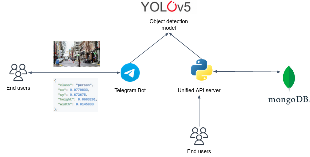
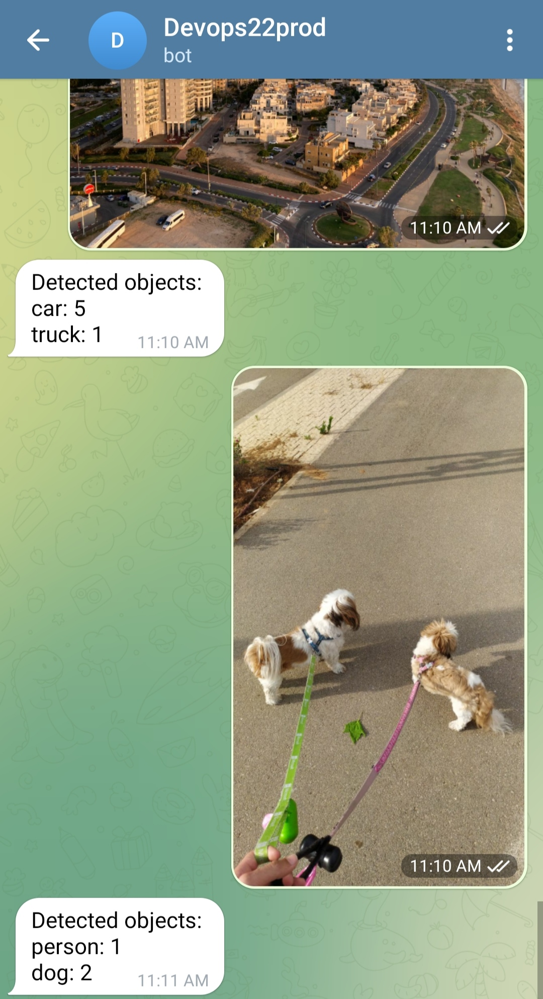

# Deploy containerized applications

## Background

In this project, you are going to design and deploy an image detection service that consists of multiple containers. 

The application allows users to upload images and respond with objects that the service detected in the image.
Users can interact with the application through a simple web UI or an interactive Telegram bot to obtain object detection results.

The service consists of 4 microservices: 

- Telegram Bot container.
- Web UI container.
- Image prediction container based on the Yolo5 pre-train deep learning model.
- MongoDB container to store clients data.



## Preliminaries

### Create a new GitHub repo 

Create a new GitHub repo for the project. 
Copy the files under `projects/docker_final_project` into the root directory of the repo.

### Create a Telegram Bot

1. <a href="https://desktop.telegram.org/" target="_blank">Download</a> and install telegram desktop (you can use your phone app as well).
2. Once installed, create your own Telegram Bot by following <a href="https://core.telegram.org/bots/features#botfather">this section</a> to create a bot. Once you have your telegram token you can move to the next step.

**Never** commit sensitive data like secrets in Git repo, even if the repo is private.
For now, save the token in a file called `.telegramToken` and add this file to `.gitignore` to exclude it completely from Git.
Later on in the course we will learn better approaches to store sensitive data.

## Guidelines

In the project repo you'll find a directory for each microservice. 

### The `frontend` service 

This is a lightweight Flask UI which allows users to upload images and be responded with the detected objects.

You can run this service locally by: 

```bash
cd frontend
python3 app.py
```

Make sure to install dependencies before by: `pip install -r requirements.txt`. 
**Tip**: It's highly recommended working with a Python virtual environment. 

Visit the app using the web browser. 
Obviously, the app wouldn't function well since you need the other microservices to be up and running. 

You are not provided with a `Dockerfile` for this service, create one.

### The `yolo5` service

[Yolo5](https://github.com/ultralytics/yolov5) is a state-of-the-art object detection model.
It is known for its high accuracy and real-time performance, allowing for efficient detection of objects in images and videos.
You'll work with a lightweight model that can detect 80 objects while it's running on your poor machines (on CPU instead GPU). 

This service files are under the `yolo5` directory. Take a look at the provided `Dockerfile`, it's already implemented for you, no need to touch. 
The built image is based on the [yolo5](https://hub.docker.com/r/ultralytics/yolov5) image, which contains most of what you need. 
The only thing we add is some Python wrapper which allows sending images for prediction over HTTP (based on Flask, again...).

The app should store client images (both original and predicted) in Amazon S3. 
In order to do so, you should implement the `TODO` specified in `app.py` file. 

Build and run this image, while publishing port `8081`. 
Once the image was built successfully, and the container is running, you can communicate with the microservice directly by:

```bash
curl -F 'file=@<path-to-image>' localhost:8081/predict
```

Replace `<path-to-image>` by a file of natural image which you want to predict objects in. 

Here is an example image, and the corresponding result:


```json
[
  {
    "class": "person",
    "cx": 0.0770833,
    "cy": 0.673675,
    "height": 0.0603291,
    "width": 0.0145833
  },
  {
    "class": "umbrella",
    "cx": 0.883854,
    "cy": 0.620658,
    "height": 0.0493601,
    "width": 0.071875
  },
  {
    "class": "car",
    "cx": 0.391146,
    "cy": 0.6883,
    "height": 0.0530165,
    "width": 0.0385417
  },
  {
    "class": "person",
    "cx": 0.555208,
    "cy": 0.799817,
    "height": 0.341865,
    "width": 0.0583333
  },
  {
    "class": "car",
    "cx": 0.434896,
    "cy": 0.718464,
    "height": 0.095064,
    "width": 0.0739583
  },
  {
    "class": "car",
    "cx": 0.717188,
    "cy": 0.765996,
    "height": 0.16819,
    "width": 0.159375
  }
]
```

The model detected 3 cars, 2 persons and 1 umbrella. Try it yourself with different images.

### The `mongo` service

For the mongo service we will utilize the pre-built official [MongoDB image](https://hub.docker.com/_/mongo) without any custom modifications.

Please note that the mongo service should be configured **to persist the data that was stored in it**.

### The `polyBot` service 

The Telegram bot service is responsible for providing a chat-based interface for users to interact with the service. 
It utilizes the Telegram Bot API to receive user images and respond with detected objects. 



In this microservice we will practice some Python :-)
You'll implement the bot functionality. 

### Running a simple "echo" Bot - the `Bot` class

Under `polybot/app.py` you are given a class called `Bot`. This class implements a simple telegram bot, as follows.

The constructor `__init__` gets `token` arg which is the bot token you have just received from Telegram. Inside the constructor, a `TeleBot` object is created. This object is an interface to Telegram API, it allows you to conveniently receive and send messages to/from Telegram.
The function `self._bot_internal_handler()` is registered as an internal message handler.
**This function is getting called whenever a new message will be sent to the bot via Telegram app.**

The default behavior of Bot class is to "echo" the incoming messages.

Run the program and send a message to the bot via Telegram app, observe the response and get an idea of how `_bot_internal_handler` and `handle_message` are functioning (it's recommended to run in debug mode with breakpoints).

### Extending the echo bot - the `QuoteBot` class

In `app.py` you are given a class called `QuoteBot` which **inherits** from `Bot`.
Upon incoming messages, this bot echoing the message while quoting the original message, unless the user is asking politely not to quote.

Run this bot and check its behavior.

### Build your object detection bot - the `ObjectDetectionBot` class

In `app.py` you are given a class called `ObjectDetectionBot` which **inherits** from `Bot`, again.
Upon incoming messages, this class downloads incoming images from users, and requests the `yolo5` service to detect objects in the image. 
The bot will then send the detected objects to the user, in any form you like.
A few notes:

- Inside the `ObjectDetectionBot` class, override `handle_message` method and implement the needed functionality.
- Remember that by inheriting the `Bot` class, you can use all of its methods (such as `send_text`...). 
- Specifically, utilize `download_user_photo`, it will save you a lot of work.
- Take a look at the way the `upload_file` function was implemented in the `frontend` service. It will help you to understand how to use the `requests` library to communicate with the `yolo5` service.   

## Make it run locally

At the end, you should have 4 running microservice up and running on your local machine.
You should be able to detect objects in images sent from the Telegram Bot service, as well as the web UI. 

Note that the web UI stores client detections in mongoDB (different clients are identified by their IP address).
In the web UI, you can click the **View your recent detection** button to retrieve the last detected results. The microservice queries the information from mongoDB. 

## Wrap up everything as a Docker Compose project

To complete the task, you should create a Docker Compose project. 
Define the services for the Telegram bot, Web UI, YOLO5 image detection, and MongoDB in a `docker-compose.yaml` file.

Please decide on the different networks that will be used within the project, ensuring proper isolation services.
E.g. the user facing services can reside in a network considered as "public", while the internal services can reside in the "private" network. 

## Free images from security vulnerabilities. 

When submitting the project, your images should be clean from `CRITICAL` and `HIGH` security vulnerabilities. 
Use Snyk to scan the images.


## Deploy your app 

Push the `frontend`, `yolo5` and `polybot` to your account in Dockerhub.

Deploy your app in a single EC2 instance in a public subnet.
Make sure the service is working as expected by communicating with it via the instance's public IP. 

## Good luck
