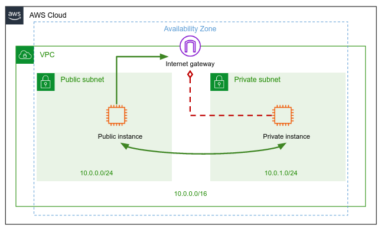
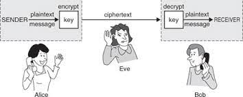

# Bash, Networking and Security Project 

## Preliminaries 

Fork our shared GitHub repo (if you haven't done it before).
Make sure you are synced with branch `main` of the original repo.

Implement your exercise solution in branch `networking_ex/<your-alias>`. e.g. `networking_ex/alonit`.

## Submission

Before submitting your solution, it's highly recommended to test your solution locally (see how at the end of this document).

Commit and push the solution to your forked repo.
In your forked repo, [create a Pull Request](https://docs.github.com/en/pull-requests/collaborating-with-pull-requests/proposing-changes-to-your-work-with-pull-requests/creating-a-pull-request) from your solution branch `<your-github-username>:networking_ex/<alias>` into our shared repo `alonitac:main`.

**Note**: You need to create the Pull request (PR) **only once**. If you update your solution, no need to open another PR, just push your fixes and the PR will be updated automatically. 

Make sure your PR is passing the automated tests.


## Build VPC in AWS (Amazon Web Services)

AWS VPC (Virtual Private Cloud) is a service that allows users to create a logically isolated virtual network within the AWS cloud infrastructure. 
Users can define their own IP address range, subnets, and network gateways, and configure security rules to control access to their resources.

### Create a VPC

1. Open the Amazon VPC console at [https://console\.aws\.amazon\.com/vpc/](https://console.aws.amazon.com/vpc).

2. In the navigation pane, choose **Your VPCs**, **Create VPC**\.

3. Under **Resources to create**, choose **VPC only**\.

4. Specify the following VPC details\.
    + **Name tag**: Provide a name for your VPC, e.g. `<my-alias>-vpc` (change `<my-alias>` to your alias). 
    + **IPv4 CIDR block**: Specify an IPv4 CIDR block of `10.0.0.0/16` for your VPC\. The CIDR block size must have a size between /16 and /28\. More information can be found in [RFC 1918](http://www.faqs.org/rfcs/rfc1918.html).
    + **Tenancy**: Choose the `default` tenancy option for this VPC\.

5. Choose **Create VPC**\.

Great! Enter the main page of your VPC and explore the details. Especially, note the DHCP option set, the main route table, and the network ACL that AWS was allocated for your VPC. 

**DHCP option set**

No any good reason to touch it, AWS done all for you!

**network ACL**

A network access control list (ACL) is an optional layer of security for your VPC that acts as a firewall for controlling traffic in and out of one or more subnets.

**main route table**

The main route table contains a single rule that allows traffic to flow freely within the VPC, but does not allow traffic to flow in or out of the VPC.
The main route table is applied by default to all subnets in the VPC that are not explicitly associated with a different route table.
Thus, by default, machines that will be part of the VPC would not be able to access the public internet, unless otherwise defined. 

### Create the public subnet in your VPC

To add a new subnet to your VPC, you must specify an IPv4 CIDR block for the subnet from the range of your VPC\.
You can specify the Availability Zone in which you want the subnet to reside\.

1. In the navigation pane, choose **Subnets**\.

2. Choose **Create subnet**\.

3. For **VPC ID**: Choose the VPC for the subnet\.

4. For **Subnet name**, enter a name for your subnet: `<my-alias>-public-subnet`. 

5. For **Availability Zone**, you can choose a Zone for your subnet, or leave the default **No Preference** to let AWS choose one for you\.

6. For **IPv4 CIDR block**, enter an IPv4 CIDR block for your subnet\: `10.0.0.0/24`\.

7. Choose **Create subnet**\.

### Create a custom route table

To allow traffic to flow out of the VPC (to the public internet), a new custom route table needs to be created and associated with the above created subnet.

We will turn now to create the custom route table that would allow traffic flow to the public internet. 

1. In the navigation pane, choose **Route Tables**\.

2. Choose **Create route table**\.

3. For **Name**, enter a name for your route table. E.g. `<my-alias>-public-rt`.

4. For **VPC**, choose your VPC\.

5. Choose **Create**\.

### Create and attach an internet gateway

In a real, physical network, the way computers are able to connect to the internet is by a device called **a router**. But since we are building virtual network, the way of AWS to provide us a "router", is by a resource called **Internet Gateway**.
We can say that **Internet Gateway** serves as a virtual router to connect your VPC to the internet.

You'll now create an internet gateway and attach it to your VPC.

1. In the navigation pane, choose **Internet Gateways**, and then choose **Create internet gateway**\.

2. Name your internet gateway, e.g. `<my-alias>-igw`.

3. Choose **Create internet gateway**\.

4. Select the internet gateway that you just created, and then choose **Actions, Attach to VPC**\.

5. Select your VPC from the list, and then choose **Attach internet gateway**\.

### Add Internet Gateway as a target in a custom route table

When you create a subnet, AWS automatically associate it with the main route table for the VPC\.
By default, the main route table doesn't contain a route to an internet gateway\.
The following procedure uses your custom route table and creates a route that sends traffic destined outside the VPC to the internet gateway, and then associates it with your subnet\.

1. Select the custom route table that you just created\. The details pane displays tabs for working with its routes, associations, and route propagation\.

2. On the **Routes** tab, choose **Edit routes**, **Add route**, and add the following routes as necessary\. Choose **Save changes** when you're done\.
    + For IPv4 traffic, specify `0.0.0.0/0` in the **Destination** box, and select the internet gateway ID in the **Target** list\.

3. On the **Subnet associations** tab, choose **Edit subnet associations**, select the check box for the subnet, and then choose **Save associations**\.

### Auto assign public IP for every machine that will be connected to the public subnet

Each subnet has an attribute that determines whether machines launched into that subnet are assigned a public IP address by default.
Your created subnet has this attribute set to false. We would like to enable this property, so we would be able to connect to machines in this subnet from our local machine. 

1. In the navigation pane, choose **Subnets**\.

2. Select the public subnet that you just created, and then choose **Actions, Edit subnet settings**\.

3. For **Auto-assign IP settings**, check the **Enable auto-assign public IPv4 address** box. 

4. Choose **Save**\.

### Launch a virtual machine (EC2 instance) in the public subnet

Amazon EC2 (Elastic Compute Cloud) is a web service that provides resizable compute capacity in the cloud. 
It allows users to create and manage virtual machines, commonly referred to as "instances", which can be launched in a matter of minutes and configured with custom hardware, network settings, and operating systems.


1. Open the Amazon EC2 console at [https://console\.aws\.amazon\.com/ec2/](https://console.aws.amazon.com/ec2/).

2. From the EC2 console dashboard, in the **Launch instance** box, choose **Launch instance**, and then choose **Launch instance** from the options that appear\.

3. Under **Name and tags**, for **Name**, enter a descriptive name for your instance\.

4. Under **Application and OS Images \(Amazon Machine Image\)**, do the following:

   1. Choose **Quick Start**, and then choose **Ubuntu**\. This is the operating system \(OS\) for your instance\.
   
5. Under **Instance type**, from the **Instance type** list, you can select the hardware configuration for your instance\. Choose the `t2.micro` instance type, which is selected by default. In Regions where `t2.micro` is unavailable, you can use a `t3.micro` instance.

6. Under **Key pair \(login\)**, choose **create new key pair** the key pair that you created when getting set up\.

   1. For **Name**, enter a descriptive name for the key pair\. Amazon EC2 associates the public key with the name that you specify as the key name\.

   2. For **Key pair type**, choose either **RSA**.

   3. For **Private key file format**, choose the format in which to save the private key\. Since we will use `ssh` to connect to the machine, choose **pem**.

   4. Choose **Create key pair**\.
   
     **Important**  
     This step should be done once! once you've created a key-pair, use it for every EC2 instance you are launching. 

   5. The private key file is automatically downloaded by your browser\. The base file name is the name you specified as the name of your key pair, and the file name extension is determined by the file format you chose\. Save the private key file in a **safe place**\.
      
      **Important**  
      This is the only chance for you to save the private key file\.

   6. Your private key file has to have permission of `400`, `chmod` it if needed.

7. Next to **Network settings**, choose **Edit**\. 

   1. From **VPC** choose your VPC.
   2. From **Subnet** choose your public subnet. 

8. Keep the default selections for the other configuration settings for your instance\.

9. Review a summary of your instance configuration in the **Summary** panel, and when you're ready, choose **Launch instance**\.

10. A confirmation page lets you know that your instance is launching\. Choose **View all instances** to close the confirmation page and return to the console\.

11. On the **Instances** screen, you can view the status of the launch\. It takes a short time for an instance to launch\. When you launch an instance, its initial state is `pending`\. After the instance starts, its state changes to `running` and it receives a public DNS name\.

12. It can take a few minutes for the instance to be ready for you to connect to it\. Check that your instance has passed its status checks; you can view this information in the **Status check** column\.

### Connect to your instance 

Open the terminal in your local machine, and connect to your instance by: 

```shell
ssh -i "</path/key-pair-name.pem>" ubuntu@<instance-public-dns-name-or-ip>
```

- Make sure your instance has public access to the internet.
- Use `route -n` and the information under `/etc/resolv.conf` to determine the IP addresses of your **local DNS server**, and the **default gateway**. Copy the IPs into `SOLUTION` file in the appropriate place.
- Search in `/var/log/syslog` logs that indicate the communication of the instance with the DHCP server (`grep` may be useful...). 
  Specifically, find and indication for the 4 phases of DHCP IP allocation (DORA). Copy the relevant logs into `SOLUTION` file in the appropriate place. 

## Extending your VPC

Extend your VPC according to the below architecture: 



**Note:** No need to create **NAT gateway** in any way you choose to build the above VPC architecture.   

Create an EC2 instance in your **private subnet**.
Can you connect it from your local machine? no... it has no public IP, and it is not accessible at all

Use the public instance to connect to the private instance.
Once you're in the private instance, try to access the internet and make sure you don't have access.

Fill in the variables in `projects/bash_networking_security/vpc.sh`, e.g.:

```bash
REGION="eu-north-1"
VPC_ID="vpc-0b0a99ab119eb0cf7"
PUBLIC_INSTANCE_ID="i-0a3348dc225308c83"
PRIVATE_INSTANCE_ID="i-0b0cf0d94e141be6b"
``` 

Add the course staff public key to your `~/.ssh/authorized_keys` file of your **public instance**.
This way we can connect to your instance and perform the automatic test.

```text
ssh-rsa AAAAB3NzaC1yc2EAAAADAQABAAABgQC32uHSDe2GZAGSczIiRGpBo92Se61o6I2D2cVh5rwk7xikQXL8/ODhRgk2sB7xcLEWFbK/80SSFWaZDc+6YRv5zI0JFHpU4lxXYo83u268w12o74pjxBRQoKloJJd0cJWvFgfkbsdZp/G/qeF3hv6yzIfGjRMw+1TxEXX6Lo7JP7q2u1L7W/FoGkX+P3P7kdI9F2F+35YGmzDvZSdvqa6BzDiQxXkiCDppt2LpjV91hmn6alPhwetDIuuAg0w2lkJqkQmzo9As16i//+7hUANGKqAiUXkicDaj1qRNp1NcWFd3G+oEcv+18MncEf5hCJo5DIYau86qC7sg+ceAtl6OAKiQg7T3Md9QVvlY/7tprz0bew/Pof447YMHsCiNlJvlEQ2cFOb3BSp3N6ub72w+xK4i7E/3jB9YCi6ocqzvl5+7wcUtr8pJ5Yr/APck/crTUxK+C+RvG5maPHuvY3vhj77r0I2fAexbDPYywE6gavDSbuFPM8RRyW4792sKuZM= alon@alon-ThinkPad-E450
```

**Note**: your EC2 instances should be running while the automated test is performed. **Don't forget to turn off the machines when you're done**.


## SSH bastion host

Before you answer the below two questions, please read [the tutorials about the SSH protocol](../../tutorials/networking_ssh.md). 

SSH jump host (also known as SSH **bastion** host or SSH gateway) is a special type of server that allows users to access other servers in a private network through it. 
It acts as an intermediary host between the client and the target server. 
By using a jump host, users can securely connect to remote servers that are not directly accessible from the internet or from their local machine.
The jump host acts as a secure entry point to the private network, enforcing authentication and access controls, and reducing the attack surface of the servers behind it.

Implement a bash script in `bastion_connect.sh` that connects to the private instance using the public instance. 
Your script should not use an explicit path to the `.pem` ssh key file, instead, it reads an environment variable called `KEY_PATH`.
If the variable doesn't exist, print an error message and exit with code `5`. 

Here is how your script will be tested: 

**Case 1** - connect to the private instance from your local machine

```console
myuser@hostname:~$ export KEY_PATH=~/key.pem
myuser@hostname:~$ ./bastion_connect.sh <public-instance-ip> <private-instance-ip>
ubuntu@private-instance-ip:~$ 
```

**Case 2** - connect to the public instance

```console
myuser@hostname:~$ export KEY_PATH=~/key.pem
myuser@hostname:~$ ./bastion_connect.sh <public-instance-ip>
ubuntu@public-instance-ip:~$ 
```

**Case 3** - run a command in the private machine

```console
myuser@hostname:~$ export KEY_PATH=~/key.pem
myuser@hostname:~$ ./bastion_connect.sh <public-instance-ip> <private-instance-ip> ls
some-file-in-private-ec2.txt 
```

**Case 4** - bad usage

```console
myuser@hostname:~$ ./bastion_connect.sh
KEY_PATH env var is expected
Please provide bastion IP address
myuser@hostname:~$ echo $?
5
```

## SSH keys rotation

**Key rotation** is a security practice that involves regularly replacing cryptographic keys used for encryption, authentication, or authorization to mitigate the risk of compromise.
It helps to ensure that compromised keys are not used to gain unauthorized access and that any data that has been encrypted with the old keys is no longer accessible.
Key rotation is typically used in many security-related systems such as SSH, SSL/TLS, and various forms of encryption, and is a key component of maintaining a secure environment.

In your public EC2 instance, create a bash script under `~/ssh_keys_rotation.sh` that automatically rotates the keys of the **private instance**.

Here is how your script will be tested:

**Case 1** - rotate keys

```console
ubuntu@<public-ip-host>:~$ ./ssh_keys_rotation.sh <private-instance-ip>
...
ubuntu@<public-ip-host>:~$ ls
new_key
new_key.pub
```

At the end of the run, there are 2 files in the instance home directory:

- `new_key` is the new private key that you should be used to connect to the private instance.
- `new_key.pub` is the new public key that its value was stored in `~/.ssh/authorized_keys` file in the private instance.

Make sure you are able to connect to the machine after the rotation:

```console
ubuntu@<public-ip-host>:~$ ssh -i <new_key> ubuntu@<private-ip-host>
ubuntu@<private-ip-host>:~$
```

You should not be able to connect using the old SSH key:

```console
ubuntu@<public-ip-host>:~$ ssh -i <old_key> ubuntu@<private-ip-host>
ubuntu@<private-ip-host>: Permission denied (publickey).
```

**Case 2** - bad usage

```console
ubuntu@<public-ip-host>:~$ ./ssh_keys_rotation.sh
Please provide IP address
```

**Note**: make sure the rotation process doesn't break the `bastion_connect.sh` script from the previous question. The script should work fluently after rotation. 

In any case that you break the private instance, feel free to delete your EC2 instance and create a new one instead.

## (Optional) VPC Peering 

Work with a classmate to connect between his and your VPC, as if you are sharing a single VPC. 

https://docs.aws.amazon.com/vpc/latest/peering/what-is-vpc-peering.html

## TLS Handshake 



As you may know, the communication in HTTP protocol is insecure, and since Eve is listening on the channel between you (Alice) and the web server (Bob), you are required to create a secure channel.
This is what HTTP does, using TLS protocol. The process of establishing a secure TLS connection involves several steps, known as TLS Handshake.

TLS security protocols use a combination of **asymmetric** and **symmetric** encryption:

##### Step 1 - Client Hello (Client -> Server).

First, the client sends a **Client Hello** message to the server.
The message includes:

- The client's TLS version
- A list of supported ciphers

##### Step 2 - Server Hello (Server -> Client)

The server replies with a **Server Hello**. A Server Hello includes the following information:

- Server Version - a confirmation for the version specified in the client hello).
- Session ID - used to identify the current communication session between the server and the client.
- Server digital certificate - the certificate contains some details about the server, as well as a public key with which the client can encrypt messages to the server. The certificate itself is signed by Certificate Authority (CA).


##### Step 3 - Server Certificate Verification

Alice needs to verify that she's taking we Bob, the real Bob.
Why should she suspect? Since Eve is controlling every message that Bob sends to Alice,
Eve can impersonate Bob, talk with Alice on behalf of Bob without Alice to knowing that. 

Here the CA comes into the picture. CA is an entity (e.g. Amazon Web Services, Microsoft etc...) trusted by both sides (client and server) that issues and signs digital certificates, so the ownership of a public key can be easily verified.

In this step the client verifies the server's digital certificate. Which means, Alice verifies Bob's certificate.

##### Step 4 - Client-Server master-key exchange

Cert was verified successfully? great we can move on...

Now, the client and the server should agree on a **symmetric key** (called **master key**) with which they will communicate during the session.
The client generates a 32-bytes random master-key, encrypts it using the server's certificate and sends the encrypted message in the channel.

In addition to the encrypted master-key, the client sends a sample message to verify that the symmetric key encryption works.

**Note**: The real TLS protocol doesn't use the master key for direct communication. Instead, other different session keys are generated and used to communicate symmetrically. 
Both the client and the server's generate the keys each in his own machine.  

##### Step 5 - Server verification message

The server decrypts the encrypted master-key. From now on, every message between both sides will be symmetrically encrypted by the master-key.
The server encrypts the sample message and sends it to the client.

##### Step 6 - Client verification message

The Client verifies that the sample message was encrypted successfully.


#### Let's get started...

Use the `scp` command to copy the directory `tls_webserver` into your home directory of your public EC2. 
This Python code implements an HTTP web server that represents Bob's side.
You will communicate with this server (as Alice), and implement a handshake process manually, over an insecure HTTP channel. 

Before you run the server on your public EC2 instance, you should install some Python packages:

```shell
sudo apt update && sudo apt install python3-pip
pip install aiohttp
```

The server can be run by:

```bash
python3 app.py
```

Note that the server is listening on port `8080`, but by default, the only allowed inbound traffic to an EC2 instance in port 22 (why?).
[Take a look here](https://docs.aws.amazon.com/AWSEC2/latest/UserGuide/authorizing-access-to-an-instance.html#add-rule-authorize-access) how to open port `8080` on your public EC2 instance. 

After the server is running and port 8080 is allowed, you can test the server by executing the below command from your local machine:

```console
myuser@hostname:~$ curl <public-ec2-instance-ip>:8080/status
Hi! I'm available, let's start the TLS handshake
```

Your goal is to perform the above 6 steps using bash script, and establish a secure channel with the server.

Below are some helpful instructions you may utilize in each step. Eventually, all your code should be written in `tlsHandshake.sh`.

Make your script robust and clean, use variable, in every step, check if the commands have succeeded and print informational messages accordingly. 

Use `curl` to send the following **Client Hello** HTTP request to the server:
```json lines
POST /clienthello
{
   "version": "1.3",
   "ciphersSuites": [
      "TLS_AES_128_GCM_SHA256",
      "TLS_CHACHA20_POLY1305_SHA256"
   ], 
   "message": "Client Hello"
}
```

`POST` is the request method, `/clienthello` is the endpoint, and the json is the body.

**Server Hello** response will be in the form:
```json
{
   "version": "1.3",
   "cipherSuite": "TLS_AES_128_GCM_SHA256", 
   "sessionID": "......",
   "serverCert": "......"
}
```
The response is in json format. You may want to keep the `sessionID` in a variable, and the server cert in a file called for later usage.
Use the `jq` command to parse and save specific keys from the JSON response.

Assuming the server certificate was stored in `cert.pem` file, you can verify the certificate by:
```shell
openssl verify -CAfile cert-ca-aws.pem cert.pem
```

While `cert-ca-aws.pem` is a file belonging to the Certificate Authority (in our case Amazon Web Services) who issued and signed the server cert. 
You can safely download it from **https://devops-feb23.s3.eu-north-1.amazonaws.com/cert-ca-aws.pem** (`wget`...).

Upon a valid certificate validation, the following output will be printed to stdout:
```text
cert.pem: OK
```

If the verification fails, `exit` the program with exit code `5`, and print informational message, e.g.:

```text
Server Certificate is invalid.
```

Given a valid cert, generate 32 random bytes base64 string (use `openssl rand`). This string will be used as the **master-key**, save it somewhere for later usage.

Got tired? refresh yourself with some [interesting reading](https://www.bleepingcomputer.com/news/security/russia-creates-its-own-tls-certificate-authority-to-bypass-sanctions/amp/).

This line can help you to encrypt the generated master-key secret with the server certificate:
```shell
openssl smime -encrypt -aes-256-cbc -in <file-contains-the-generated-master-key> -outform DER <file-contains-the-server-certificate> | base64 -w 0
```

When you are ready to send the encrypted master-key to the server, `curl` again an HTTP POST request to the server endpoint `/keyexchange`, with the following body:
```
POST /keyexchange
{
    "sessionID": "'$SESSION_ID'",
    "masterKey": "'$MASTER_KEY'",
    "sampleMessage": "Hi server, please encrypt me and send to client!"
}
```

Note that `$SESSION_ID` is a variable containing the session ID you've got from the server's hello response, you need to create this variable once you have the sessions ID from the server.
Also, `$MASTER_KEY` is your **encrypted** master key, again, you need to create this variable.

The response for the above request would be in the form:
```json
{
  "sessionID": ".....",
  "encryptedSampleMessage": "....."
}
```

All you have to do now is to decrypt the sample message and verify that it's equal to the original sample message.
This will indicate that the server uses successfully the master-key.

Please note that the `encryptedSampleMessage` is encoded in base64, before you decrypt it, encode it to binary, as following:
```shell
echo <encryptedSampleMessage-variable> | base64 -d > encSampleMsgReady.txt

# file encSampleMsgReady.txt is ready now to be used in "openssl enc...." command 
```

Recall the symmetric encryption demo the [networking and security](../../tutorials/networking_security.md) tutorial, see how to decrypt a message.

You should `exit` the program upon an invalid decryption with exit code `6`, and print informational message, e.g.:
```text
Server symmetric encryption using the exchanged master-key has failed.
```

If everything is ok, print me positive message, e.g.: 
```text
Client-Server TLS handshake has been completed successfully
```

Well Done! you've manually implemented a secure communication over HTTP! Thanks god we have TLS in real life :-)

## Run tests locally (recommended)

You are highly encouraged to test your solution locally before pushing it to GitHub.
To run tests, `cd` to `projects/bash_networking_security/test` and execute the relevant test file:

### Test bastion

```bash
export PUBLIC_EC2_IP=<fill me>
export PRIVATE_EC2_IP=<fill me>
export KEY_PATH=<fill me>

bash test_bastion_locally.sh
```

### Test keys rotation

```bash
export PUBLIC_EC2_IP=<fill me>
export PRIVATE_EC2_IP=<fill me>
export KEY_PATH=<fill me>

bash test_rotation_locally.sh
```

## Good luck
