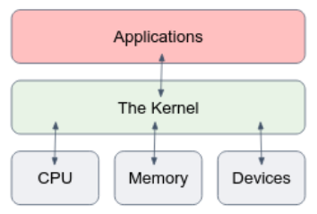
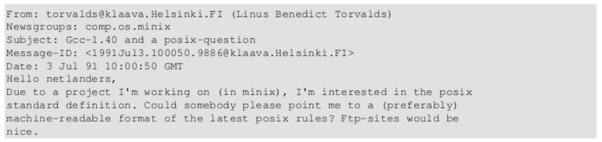
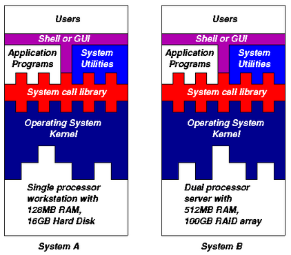
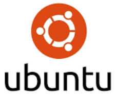

[comment]: # (mdslides presentation.md --include media)

[comment]: # (THEME = white)
[comment]: # (CODE_THEME = base16/zenburn)
[comment]: # (The list of themes is at https://revealjs.com/themes/)
[comment]: # (The list of code themes is at https://highlightjs.org/)

[comment]: # (controls: true)
[comment]: # (keyboard: true)
[comment]: # (markdown: { smartypants: true })
[comment]: # (hash: false)
[comment]: # (respondToHashChanges: false)
[comment]: # (width: 1500)
[comment]: # (height: 1000)

DevOps Bootcamp - UPES University

# Linux Operating System Introduction

[comment]: # (!!!)

### Today’s agenda

- The concept of an operating system
- The history of UNIX and Linux
- Linux architecture and distributions

[comment]: # (!!!)

## What is an Operating System (OS)?

- An OS is a software program that manages hardware and software resources in a computer system.
- Responsible for allocating resources, scheduling tasks, managing memory, and handling input/output operations.
- Ensure that the system runs in a **safe**, **efficient** and **abstract** way.

[comment]: # (|||)

## Safe

An OS ensures safe access to a disk by allowing only one application program to write data to a given file at any one time
on your keyboard or swipe down.

[comment]: # (|||)

## Efficient

An OS encourages efficient use of the CPU by suspending programs that are waiting for I/O operations to complete to make way for programs that can use the CPU more productively

[comment]: # (|||)

## Abstract

An OS provides convenient abstractions which isolate application programmers and users from the details of the underlying hardware

[comment]: # (!!!)

## History of UNIX

In order to understand the popularity of Linux, we need to travel back in time, about 50 years ago...

Imagine computers as big as houses, while every computer had a different way of operation.

[comment]: # (!!!)

### History of UNIX

- Software for one given system didn't run on another system
- Software communicates directly with the hardware
- You can run only one software on a piece of hardware

  
In 1969, a team of developers in the Bell Labs laboratories started working on a solution for the software
problem, to address these issues.

[comment]: # (!!!)

The Bell Labs developers named their project "**UNIX**."

[comment]: # (!!!)

### The UNIX Kernel

Until UNIX time, all commercially available computer systems were written in a code specifically developed for one system.

 

- UNIX, on the other hand, needed only a small piece of that special code, which is now commonly named the **kernel**.
- This kernel is the only piece of code that needs to be adapted for every specific system and forms the base of the UNIX system.
- The operating system and all other functions were built around this kernel and written in a higher programming language, C.

[comment]: # (!!!)

By the beginning of the 90s home PCs were finally powerful enough to run a full blown UNIX.

[comment]: # (!!!)

### Linus Torvalds

**Linus Torvalds**, a young man studying computer science at the university of Helsinki, thought it would be a good idea to have some sort of freely available academic version of UNIX, and promptly started to code

[comment]: # (!!! data-auto-animate)

### Linux Today

Two years after Linus' post, there were 12000 Linux users… but this was just the beginning

- **Open**-source: its source code is available for anyone to view, modify, and distribute.
- **Security**: Linux has a reputation for being more secure than other operating systems.
- **Stability**: Linux is known for its stability and reliability, making it an ideal choice for servers and mission-critical systems that require constant uptime.
- **Flexibility**: Linux is highly customizable and can be configured to meet the specific needs of different users and applications.
- **Scalability**: Linux can scale from embedded devices to supercomputers, making it a versatile choice for a wide range of applications.
- **Cloud compatibility**: Linux is widely used in cloud computing due to its flexibility, security, and scalability, making it an ideal choice for virtualization and containerization.
- **Large community and support**

[comment]: # (!!!)

### Architecture of the Linux

- **Kernel**: The Linux kernel includes device driver support for a large number of PC hardware devices (graphics cards, network cards, hard disks etc.), advanced processor and memory management features, and support for many different types of filesystems
- **Shells and GUIs**: Linux supports two forms of command input: through textual command line shells similar to those found on most UNIX systems (e.g. sh, bash) and through graphical interfaces (GUIs)
- **System Utilities**: System utilities are designed to be powerful tools that do a single simple task extremely well (e.g. creating a directory, search text in a file). Users can often solve problems by interconnecting these tools instead of writing a large monolithic application program.
- **Application programs**: Linux distributions typically come with several useful application programs as standard. Examples include the text editor, image viewer, C compiler etc...

[comment]: # (!!!)

### Architecture of the Linux

[comment]: # (!!!)

### Linux Distributions

A Linux distribution, or "distro," is a version of the Linux operating system (the Linux kernel) that is packaged with a specific set of software and configurations.

 

- Different Linux distributions are optimized for different use cases, such as desktop, server, or embedded systems, and come with different software packages and tools.
- Some popular Linux distributions include Ubuntu, Debian, CentOS, Fedora, and Arch Linux.
- Full list can be found <a href="https://en.wikipedia.org/wiki/List_of_Linux_distributions">here</a>

[comment]: # (!!!)

# Thanks

[comment]: # (!!! data-background-color="aquamarine")
