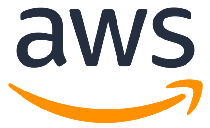
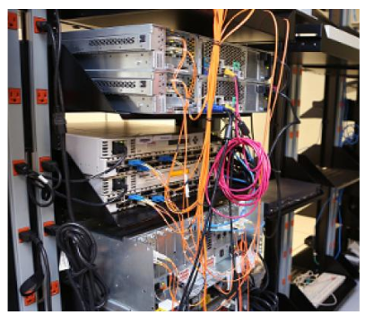
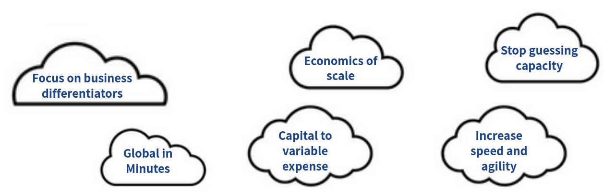
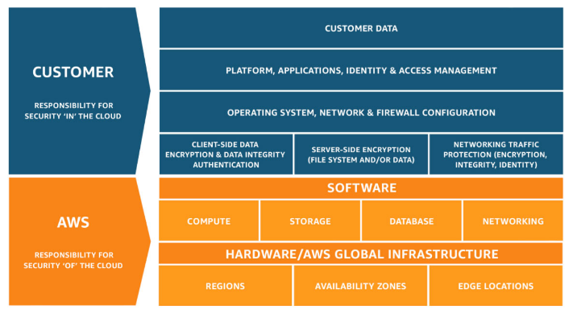
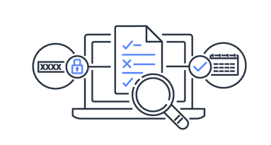
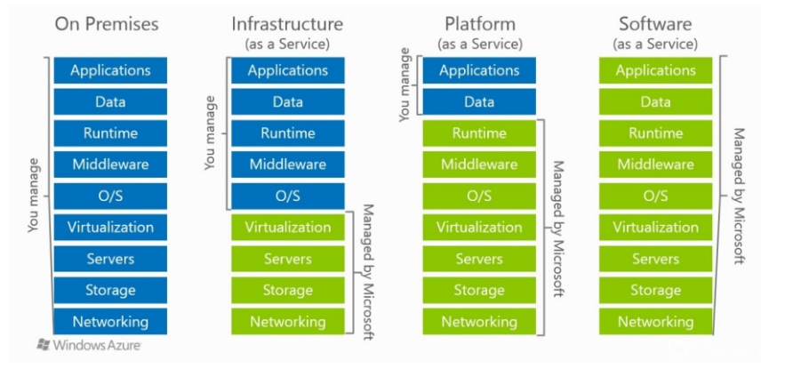
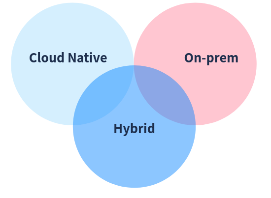

[comment]: # (mdslides presentation.md --include media)

[comment]: # (THEME = white)
[comment]: # (CODE_THEME = base16/zenburn)
[comment]: # (The list of themes is at https://revealjs.com/themes/)
[comment]: # (The list of code themes is at https://highlightjs.org/)

[comment]: # (controls: true)
[comment]: # (keyboard: true)
[comment]: # (markdown: { smartypants: true })
[comment]: # (hash: false)
[comment]: # (respondToHashChanges: false)
[comment]: # (width: 1500)
[comment]: # (height: 1000)

   

DevOps Bootcamp - INT College & UPES University

# Introduction to Cloud Computing

[comment]: # (!!!)

### Today's agenda

- On-premise vs Cloud environments
- Amazon Web Services introduction
- Regions and Availability zones
- AWS shared responsibility model
- Compliance
- Different service models - IaaS, PaaS, SaaS

[comment]: # (!!!)

### About this course

- In-depth knowledge about the core services: AZs, Amazon Virtual Private Cloud (VPC), Amazon EC2 servers, ELB, AWS Auto Scaling, storage, networking, databases, AWS IAM, and security.
- For the other services: what that service does, what the common use cases are for that service.

[comment]: # (!!!)

### The bad old days

- Purchase your own infrastructure (weeks to months to be global)
- Army of IT employees
- Dealing with cooling, hardware failure, disaster recovery
- Dealing with physical security
- Dealing with real estate
- Hidden costs (how much servers should I purchase?)

[comment]: # (!!!)

### Overview of Cloud Computing

- [Amazon Web Services (AWS) provides a highly reliable, scalable, and low-cost infrastructure platform](https://docs.aws.amazon.com/whitepapers/latest/aws-overview/aws-overview.pdf?did=wp_card&trk=wp_card)
- Pay-as-you-go pricing model
- No need to make large up-front investments in hardware and spend a lot of time managing that hardware
- More than 200 services

[comment]: # (!!! data-auto-animate)

### Overview of Cloud Computing

While each organization experiences a unique journey to the cloud with numerous benefits, six advantages become apparent time and time again

[comment]: # (!!!  data-auto-animate)

### Global Infrastructure

- AWS provides a highly available technology infrastructure platform with multiple locations worldwide.
- These locations are composed of **Regions** and **Availability Zones**.
- Each region has multiple, isolated locations known as Availability Zones.
- Each AZ is also isolated, but the AZs in a region are:
  - Physically separated within a typical metropolitan region
  - Located in lower-risk flood plains
  - Connected through low-latency links
  - On-site backup generators
  - Fed via different grids from independent utilities (when available)
- By placing resources in separate AZ, your service is protected from a disruption impacting a single location

[comment]: # (!!!)

### AWS the Shared Responsibility Model

- Cloud security at AWS is the number one priority.
- Built-in security architecture for visibility, auditability, controllability, and agility.
- AWS are responsible for the security **of** the cloud, while allow to secure anything you deploy **in** the cloud. This called the [Shared Responsibility Model](https://aws.amazon.com/compliance/shared-responsibility-model/).

[comment]: # (!!!)

### Compliance

- Organizations retain complete control and ownership over the region in which their data is physically located, allowing them to meet regional compliance and data residency requirements.
- https://aws.amazon.com/compliance/programs/

[comment]: # (!!!)

### Service Models

- Infrastructure as a Service (IaaS)
- Platform as a Service (PaaS)
- Software as a Service (SaaS)

[comment]: # (!!!)

### Deployment Models

- Cloud-based application
- On-premises applications
- A hybrid deployment is a way to connect infrastructure and applications between cloud-based resources and existing resources that are not located in the cloud.

[comment]: # (!!!)

### Accessing the Platform

- [AWS Management Console](https://signin.aws.amazon.com/signin) - a simple and intuitive user interface.
- [AWS Command Line Interface (CLI)](https://docs.aws.amazon.com/cli/latest/userguide/getting-started-install.html) - a unified tool to manage your AWS services from the terminal.
- [Software Development Kits (SDKs)](https://aws.amazon.com/sdk-for-python/) - using AWS services in your applications tailored to your programming language or platform.

[comment]: # (!!!)

# Thanks

[comment]: # (!!! data-background-color="aquamarine")

