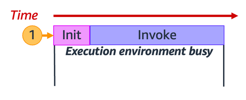
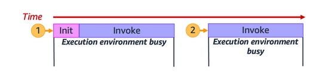
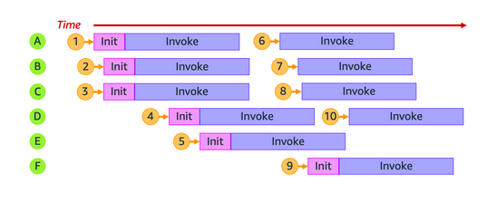
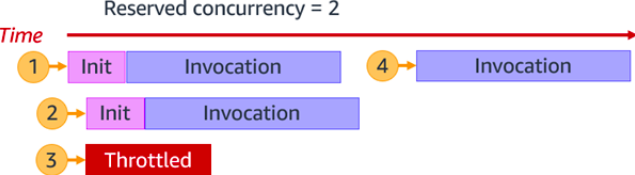
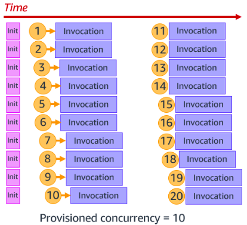
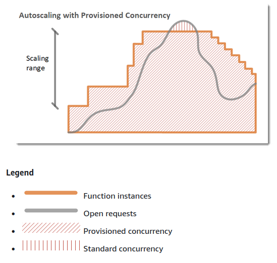
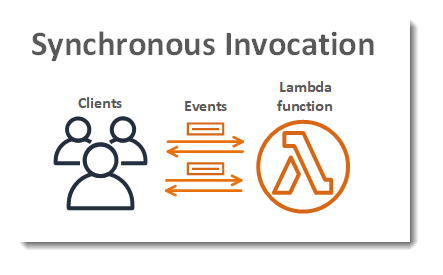
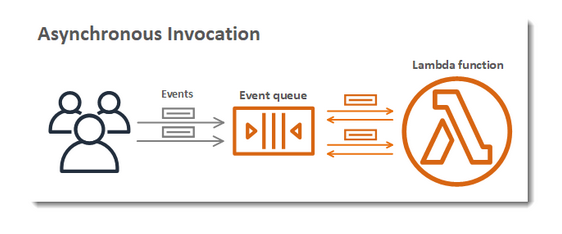
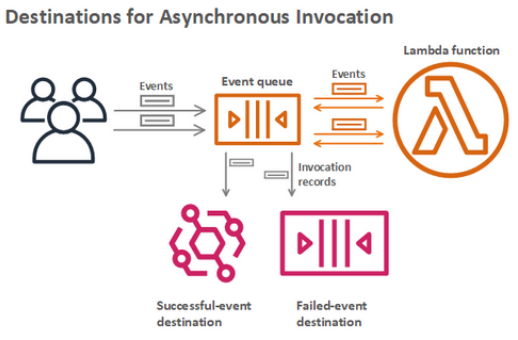

[comment]: # (mdslides presentation.md --include media)

[comment]: # (THEME = white)
[comment]: # (CODE_THEME = base16/zenburn)
[comment]: # (The list of themes is at https://revealjs.com/themes/)
[comment]: # (The list of code themes is at https://highlightjs.org/)

[comment]: # (controls: true)
[comment]: # (keyboard: true)
[comment]: # (markdown: { smartypants: true })
[comment]: # (hash: false)
[comment]: # (respondToHashChanges: false)
[comment]: # (width: 1500)
[comment]: # (height: 1000)

---

---

   

DevOps Bootcamp - INT College & UPES University

# AWS Lambda

[comment]: # (!!!)

### Today's agenda

- What is AWS Lambda?
- Scaling Lambda
- Lambda Invocations

[comment]: # (!!!)

### What is AWS Lambda?

- Lambda is a compute service that lets you run code without provisioning or managing servers.
- Performs all of the administration of the compute resources: scaling, monitoring, logging
- Supported runtimes: Node.js, Python, Ruby, Java, Go, .NET
- Pay only for the compute time that you consume
- Invoke the Lambda functions using an API, or in response to events from other AWS services.

[comment]: # (!!!)

### Lambda concepts

- **Deployment package** - Your source code. Lambda supports two types:
  - A .zip file archive that contains your function code and its dependencies.
  - A container image (e.g. Docker)
- **Runtime** - provides a language-specific environment that runs in an execution environment.
- **Scale concurrency** - the number of requests that your function is serving at any given time.
- **Destination** - an AWS resource where Lambda can send events from an invocation. You can configure a destination for events that fail processing.

[comment]: # (!!! data-auto-animate)

### Scaling

The first time you invoke your function, Lambda creates an instance of the function and run it.

[comment]: # (!!! data-auto-animate)

### Scaling

When the function returns a response, it stays active and waits to process additional events.

[comment]: # (!!! data-auto-animate)

### Scaling

If you invoke the function again while the first event is being processed, Lambda initializes another instance, and the function processes the two events concurrently.

[comment]: # (!!! data-auto-animate)

### Scaling

As more events come in, Lambda routes them to available instances and creates new instances as needed

[comment]: # (!!! data-auto-animate)

### Scaling

When the number of requests decreases, Lambda stops unused instances to free up scaling capacity for other functions

The default regional concurrency quota starts at 1,000 instances.

[comment]: # (!!! data-auto-animate)

### Scaling - Reserved concurrency

You can configure a **Reserved concurrency** setting for your Lambda functions to allocate a maximum concurrency limit for a function.

[comment]: # (!!! data-auto-animate)

### Scaling - Provisioned Concurrency

You can reduce invocation latency by configuring **Provisioned Concurrency** for a function version or alias.

[comment]: # (!!! data-auto-animate)

### Scaling - Bust limit

[comment]: # (!!! data-auto-animate)

### Lambda Invocation

With [synchronous invocation](https://docs.aws.amazon.com/lambda/latest/dg/invocation-sync.html), you wait for the function to process the event and return a response.

[comment]: # (!!! data-auto-animate)

### Lambda Invocation

With [asynchronous invocation](https://docs.aws.amazon.com/lambda/latest/dg/invocation-async.html), Lambda queues the event for processing and returns a response immediately. For asynchronous invocations, Lambda handles retries if the function returns an error or is throttled.

[comment]: # (!!! data-auto-animate)

### Destinations

- For asynchronous invocation, you can configure Lambda to send invocation records to a queue, topic, function, or event bus.
- You can configure separate destinations for successful invocations and events that failed processing.
- The invocation record contains details about the event, the function's response, and the reason that the record was sent.

[comment]: # (!!!)

# Thanks

[comment]: # (!!! data-background-color="aquamarine")

