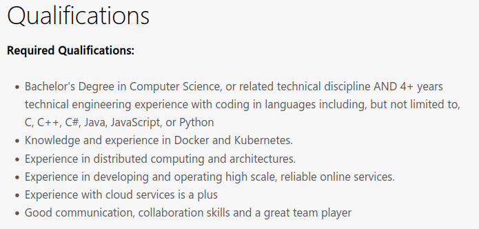
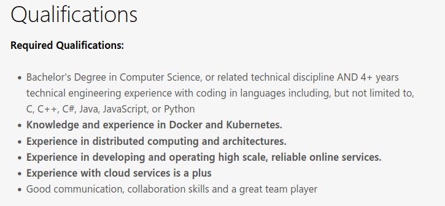
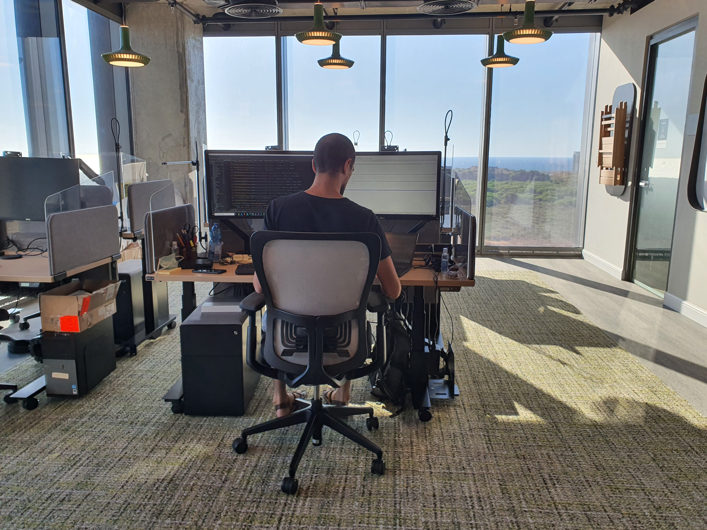

[comment]: # (mdslides presentation.md --include media)

[comment]: # (THEME = white)
[comment]: # (CODE_THEME = base16/zenburn)
[comment]: # (The list of themes is at https://revealjs.com/themes/)
[comment]: # (The list of code themes is at https://highlightjs.org/)

[comment]: # (controls: true)
[comment]: # (keyboard: true)
[comment]: # (markdown: { smartypants: true })
[comment]: # (hash: false)
[comment]: # (respondToHashChanges: false)
[comment]: # (width: 1500)
[comment]: # (height: 1000)

    

UPES University & iNT College

# Welcome to the DevOps Bootcamp 

[comment]: # (!!!)

### Today's agenda

- Course logistics
- You
- Us
- What is DevOps?

[comment]: # (!!!)

## Course logistics

- **Daily session**: Monday-Friday, 11am-3pm (Dehradun time).
- **In person session**: 1-2/6 and 4-14/7.
- **Teachers**: Alon Itach, Tsadok Levi, Osher Atiyas, Arthur Garmider
- **TAs**: Mohammed Khalil, Nahshon Paz
- **Communication**: via [Slack channel](https://join.slack.com/t/devopsbc-upesint/shared_invite/zt-1vtb7n7yb-FrdnGk1RIk2RFdR5tDRM9A).

[comment]: # (!!!)

## Course logistics

All materials, exercises, slides and projects will be delivered via this shared GitHub repo: https://github.com/alonitac/DevOpsBootcampUPES (fork it!).

[comment]: # (!!!)

# This course

- Very intensive and technical
- Aimed to prepare **(the diligent)** students for the industry of software engineering
- 8 modules, mini project at the end of each
- Massive amount of practical exercises
- Self-paced tutorials
- Final project
- You are expected to work after the official session hour!

[comment]: # (!!! data-auto-animate)

# This course

- **Recap**: Linux and networking
- **App development**: webservers, infrastructure on AWS cloud
- **Containers**: Docker
- **App deployment**: AWS resources
- **Orchestration**: Kubernetes
- **CI/CD pipelin**e: Jenkins
- **IaaC**: Terraform and Ansible
- **Observability**: Grafana, Prometheus, Elasticsearch

[comment]: # (!!! data-auto-animate)

## You

- 3rd year CS 👏 👏 👏
- Probably know many data structures, greedy algorithms, and complex probabilistic methods in statistical learning
- Proved that P=NP
- But...

[comment]: # (!!!)

## But...

When taking a closer look on a typical position requirements...

(Junior Software Engineer position at Microsoft)

[comment]: # (!!! data-auto-animate)

## But...

Microsoft requires you to be qualified with skills and knowledge you may not have acquired in your degree 

(Junior Software Engineer position at Microsoft)

[comment]: # (!!! data-auto-animate)

# The missing semester 

- How does it look like out there in the industry?
- How can you turn your code into a real-world product? 
- How does a public cloud (e.g. AWS, Azure, GCP) look like?
- How are developers delivering their work to existed production systems? 

    

This course is your missing semester before start your career!

[comment]: # (!!!)

## Us

[comment]: # (|||)

## Us

### Alon Itach

- ex-Software Engineer in Microsoft Healthcare group in R&D Israel
- Senior DevOps engineer
- Highly interested about student's training and high quality content development 

[comment]: # (|||)

## Us

Tsadok TBD

[comment]: # (|||)

## Us

### Osher Atias

Osher, with 16 years of experience in programming and software development, is an accomplished DevOps specialist. 

He has a proven track record of implementing effective DevOps practices in large organizations and startups, driving improved collaboration and efficiency throughout the software development lifecycle.

[comment]: # (|||)

## Us

Arthur TBD

[comment]: # (|||)

## Us

Nash TBD

[comment]: # (|||)

## Us

Mohammed TBD

[comment]: # (!!!)

# Let's get started!

[comment]: # (!!! data-background-color="aquamarine")

