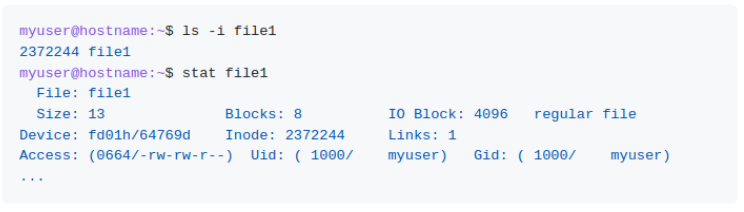
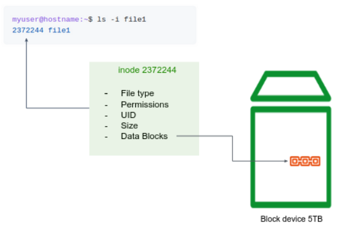

[comment]: # (mdslides presentation.md --include media)

[comment]: # (THEME = white)
[comment]: # (CODE_THEME = base16/zenburn)
[comment]: # (The list of themes is at https://revealjs.com/themes/)
[comment]: # (The list of code themes is at https://highlightjs.org/)

[comment]: # (controls: true)
[comment]: # (keyboard: true)
[comment]: # (markdown: { smartypants: true })
[comment]: # (hash: false)
[comment]: # (respondToHashChanges: false)
[comment]: # (width: 1500)
[comment]: # (height: 1000)

DevOps Bootcamp - UPES University

# Linux File System

[comment]: # (!!!)

### Today’s agenda

- Understand block storage layout in higher level
- Introducing inodes
- Important Linux directories

[comment]: # (!!!)

### Block Storage Layout

The standard linux file systems organize storage on hard disk drives. Disks are usually accessed in physical blocks, rather than a byte (8 bits) at a time. Block sizes may range from 512 bytes to 4K or larger.

A file is represented by an **inode**, a kind of serial number containing information about the actual data that makes up the file: to whom this file belongs, and where is it located on the hard disk.

[comment]: # (!!!)

## Block Storage Layout

[comment]: # (!!!)

"On a UNIX system, everything is a **file**; if something is not a file, it is a **process**."

[comment]: # (!!!)

## Important directories

| Directory      | Meaning |
| -----------   | ----------- |
| `/bin`        | Common programs, shared by the system, the system administrator and the users.       |
| `/dev`        | Contains references to all the CPU peripheral hardware, which are represented as files with special properties.       |
| `/etc`        | Most important system configuration files are in `/etc`, this directory contains data similar to those in the Control Panel in Windows      |
| `/home`       | Home directories of the common users.        |
| `/proc`       | A virtual file system containing information about system resources.        |
| `/tmp`        | Temporary space for use by the system, cleaned upon reboot.      |
| `/var`        | Storage for all variable files and temporary files created by users, such as log files, space for temporary storage of files downloaded from the Internet.      |

[comment]: # (!!! width: 2000)

# Thanks

[comment]: # (!!! data-background-color="aquamarine")
