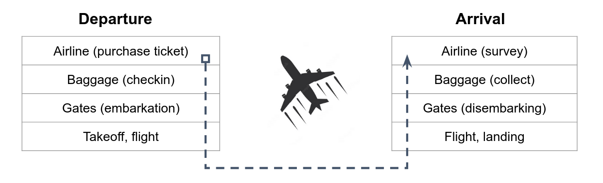

[comment]: # (mdslides presentation.md --include media)

[comment]: # (THEME = white)
[comment]: # (CODE_THEME = base16/zenburn)
[comment]: # (The list of themes is at https://revealjs.com/themes/)
[comment]: # (The list of code themes is at https://highlightjs.org/)

[comment]: # (controls: true)
[comment]: # (keyboard: true)
[comment]: # (markdown: { smartypants: true })
[comment]: # (hash: false)
[comment]: # (respondToHashChanges: false)
[comment]: # (width: 1500)
[comment]: # (height: 1000)

DevOps Bootcamp - UPES University

# The OSI Model

[comment]: # (!!!)

### Today's agenda

- Networking protocols
- The OSI simplifies 4-layered model
- The aireplan system as an analogy

[comment]: # (!!!)

## The OSI Model

- In order to get data over the network, lots of different hard- and software needs to work and communicate together via a well-defined **protocols**.
- All these different types of communication protocols are classified in 7 layers, which are known as the **Open Systems Interconnection Reference Model**.

  

| Layer Name      | Used protocol  |
| ----------- | ----------- |
| Application Layer     | HTTP, DNS, SMTP, SSH       |
| Transport Layer     | TCP, UDP       |
| Network Layer     | IP, ICMP       |
| Network Interface Layer     | Ethernet       |

[comment]: # (!!!)

# Networking Protocol

A protocol is, simply put, a set of rules for communication

[comment]: # (!!!)

## Human analogy - the airline system

The airline system can be used as an analogy to the OSI model to help understand how the different layers of a network work together to transmit data.

[comment]: # (!!! data-auto-animate)

## Application Layer

This layer corresponds to the various applications and services offered by the airline, such as ticket sales and flight status updates.

[comment]: # (!!! data-auto-animate)

## Application Layer

This layer corresponds to the various applications and services offered by the airline, such as ticket sales and flight status updates.

Just as the application layer in the airline system provides end-to-end services directly to passengers and customers. The application layer in the OSI model provides services directly to users or applications.

[comment]: # (!!! data-auto-animate)

## Transport Layer

This layer corresponds to the services provided to passengers, such as ticketing, baggage handling.

[comment]: # (!!! data-auto-animate)

## Transport Layer

This layer corresponds to the services provided to passengers, such as ticketing, baggage handling.

Just as the transport layer in the airline system provides end-to-end services to passengers during their journey, the transport layer in the OSI model provides end-to-end communication services between applications.

[comment]: # (!!! data-auto-animate)

## Network Layer

This layer corresponds to the routing and addressing of planes within the airline system, such as flight paths and destinations.

[comment]: # (!!! data-auto-animate)

## Network Layer

This layer corresponds to the routing and addressing of planes within the airline system, such as flight paths and destinations.

Just as the network layer in the airline system determines how planes are routed to their destinations, the network layer in the OSI model determines how data is routed through a network.

[comment]: # (!!! data-auto-animate)

## Network Interface layer

This layer corresponds to the physical infrastructure of the airline system, such as the planes, runways, and airports.

[comment]: # (!!! data-auto-animate)

## Network Interface layer

This layer corresponds to the physical infrastructure of the airline system, such as the planes, runways, and airports.

Just as the physical layer in the airline system deals with the physical transportation of passengers and cargo, the physical layer in the OSI model deals with the physical transmission of data over a network.

[comment]: # (!!! data-auto-animate)

# Thanks

[comment]: # (!!! data-background-color="aquamarine")
