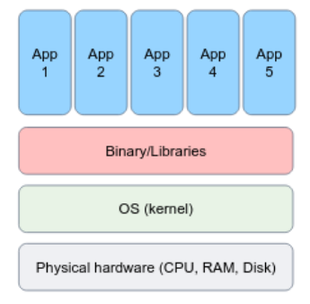
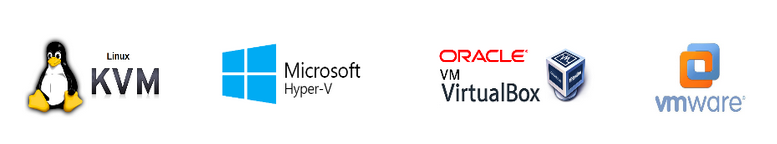
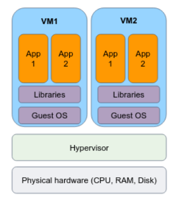
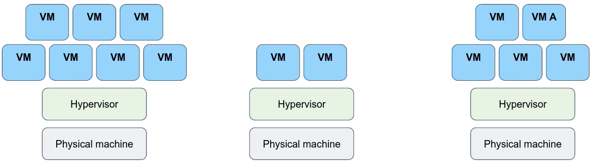
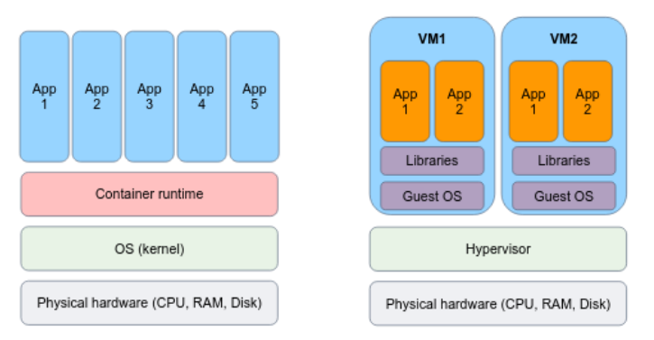

[comment]: # (mdslides presentation.md --include media)

[comment]: # (THEME = white)
[comment]: # (CODE_THEME = base16/zenburn)
[comment]: # (The list of themes is at https://revealjs.com/themes/)
[comment]: # (The list of code themes is at https://highlightjs.org/)

[comment]: # (controls: true)
[comment]: # (keyboard: true)
[comment]: # (markdown: { smartypants: true })
[comment]: # (hash: false)
[comment]: # (respondToHashChanges: false)
[comment]: # (width: 1500)
[comment]: # (height: 1000)

DevOps Bootcamp - UPES University

# Introduction to Virtualization and Containers

[comment]: # (!!!)

### Today’s agenda

- Bare metal systems
- Virtual machines
- Containers
- Building containers from scratch.
- Introducing Docker

[comment]: # (!!!)

## Bare metal systems

- Applications are typically executed directly on the OS system.
- There is no "virtualized" layer, everything is running on the same environment.
- This is how you usually work on your machine.

[comment]: # (!!!)

## Bare metal systems disadvantages

- Dependency Conflicts
- Resource Underutilization
- Limited Scalability
- Lack of Flexibility
- High Maintenance Overhead
- Limited Fault Isolation

[comment]: # (!!!)

## Virtual machines

Virtual machines (VMs) are an abstraction layer that enables the creation and operation of multiple isolated instances of virtual hardware within a single physical host.

- The **Hypervisor** partitions the host resources and allows each VM to have its own virtualized hardware.
- **Type 1** Hypervisor is loaded directly on the hardware: [Linux KVM](https://www.linux-kvm.org/page/Main_Page), [Windows Hyper-V](https://learn.microsoft.com/en-us/virtualization/hyper-v-on-windows/about/)
- **Type 2** Hypervisor loaded in an OS running  on the hardware: [VMwere](https://www.vmware.com/), [VirtualBox](https://www.virtualbox.org/)

[comment]: # (!!! data-auto-animate)

## Virtual machines

[comment]: # (!!! data-auto-animate)

## IT Challenges Before Virtualization

- Data centers are out of space
- AC power panels are out of capacity
- Backups are slow and expensive
- Server utilization is VERY LOW
- Administrators are struggling with troubleshooting
- Load balancing for all applications is nearly impossible

[comment]: # (!!!)

## VMs offer several advantages

- Isolation
- Hardware Abstraction
- Operating System Flexibility
- Resource Optimization
- Snapshotting and Rollbacks
- Scalability and Elasticity
- Migration and High Availability

[comment]: # (!!!)

[comment]: # (!!! data-auto-animate)

## But...

The fact that every VM requires its own dedicated OS is a major flaw!

Every OS consumes CPU, RAM and storage that could otherwise be used to power more applications

[comment]: # (!!!)

# Container introduced

Live demo - Container from scratch 

https://ericchiang.github.io/post/containers-from-scratch/

[comment]: # (!!!)

## Hello Containers

Instead of virtualizing at the hardware layer, containers are an abstraction at the app layer that packages code and dependencies together.

- Containers utilize native Linux features like [cgroups](https://en.wikipedia.org/wiki/Cgroups) and [namespaces](https://en.wikipedia.org/wiki/Linux_namespaces) to provide isolation while **sharing the same kernel**.
- This lightweight approach allows for faster startup times, improved resource efficiency, and easier scalability compared to traditional virtual machines.

[comment]: # (!!!)

## Containers advantages

- Lightweight and Portable
- Isolation and Resource Efficiency
- Consistent and Reproducible Builds
- Scalability and Elasticity
- DevOps and Continuous Integration/Deployment (CI/CD)

[comment]: # (!!!)

Under the hoods, containers are merely a **linux processes**

That "lives" in an **loosely** isolated environment.

[comment]: # (!!!)

## Introducing Docker

Docker is an open platform for developing, building and shipping images, and running containers.

[comment]: # (!!!)

# Thanks

[comment]: # (!!! data-background-color="aquamarine")
