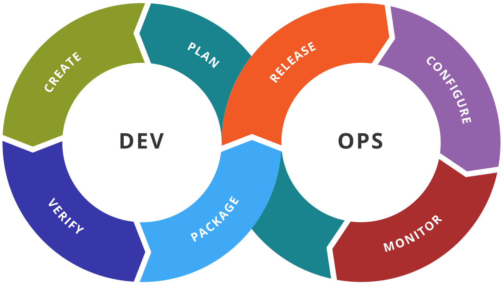
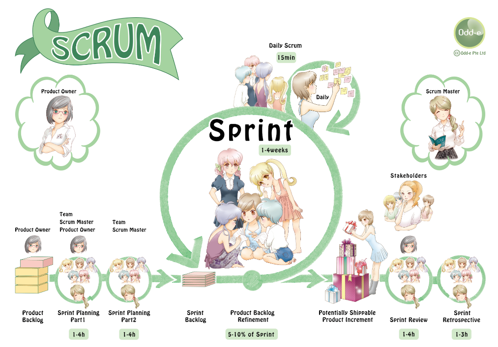
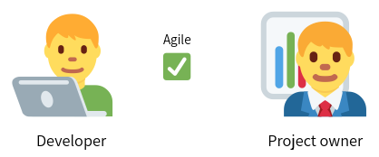
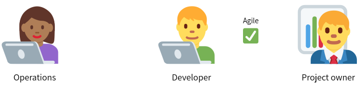
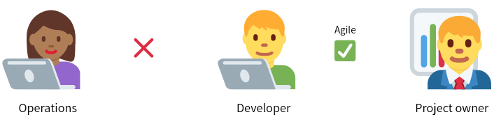
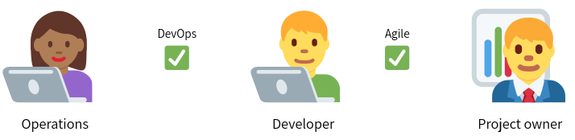

[comment]: # (mdslides presentation.md --include media)

[comment]: # (THEME = white)
[comment]: # (CODE_THEME = base16/zenburn)
[comment]: # (The list of themes is at https://revealjs.com/themes/)
[comment]: # (The list of code themes is at https://highlightjs.org/)

[comment]: # (controls: true)
[comment]: # (keyboard: true)
[comment]: # (markdown: { smartypants: true })
[comment]: # (hash: false)
[comment]: # (respondToHashChanges: false)
[comment]: # (width: 1500)
[comment]: # (height: 1000)

DevOps bootcamp - UPES University

# What is DevOps?

[comment]: # (!!!)

### Today's agenda

- Waterfall model - the bad old days
- The Agile model
- What is DevOps?
- DevOps phases

[comment]: # (!!!)

## The Waterfall model

- The traditional software development approach
- Consists of distinct phases
- Linear - each phase must be completed before proceeding to the next

[comment]: # (!!!)

## The Waterfall model

👨‍💼

The product owner

[comment]: # (!!!)

## The Waterfall model

👨‍💻

The developer

[comment]: # (!!!)

## The Waterfall model

👨‍💻 &nbsp &nbsp &nbsp &nbsp 👨‍💼 

⬅️ Product owner specify requirements to the developer

[comment]: # (!!! data-auto-animate)

## The Waterfall model

👨‍💻

The developer design, develop and test the product

[comment]: # (!!! data-auto-animate)

## The Waterfall model

🕒

Six months later...

[comment]: # (!!! data-auto-animate)

## The Waterfall model

👨‍💻 &nbsp &nbsp &nbsp &nbsp 👨‍💼 

The product is delivered ➡️

A one-off event, delivery ceremony 🎉

[comment]: # (!!! data-auto-animate)

## The Waterfall model

👨‍💼 

The product owner is not satisfied with the product 😞

- The product may not be relevant in the market - the requirements miss end-user needs
- The product owner was not involved during the development
- Some features require modifications
- New functionalities are required

⬅️ Specify list changes to the developer

[comment]: # (!!! data-auto-animate)

## The Waterfall model

👨‍💻 &nbsp &nbsp &nbsp &nbsp 👨‍💼 

The developer **re-design**, develop and test again

[comment]: # (!!! data-auto-animate)

## The Waterfall model

🕒

4 months later...

[comment]: # (!!! data-auto-animate)

## The Waterfall model

👨‍💻 &nbsp &nbsp &nbsp &nbsp 👨‍💼 

Another version of the product is delivered ➡️

[comment]: # (!!! data-auto-animate)

## The Waterfall model

#### Organizations soon came to realize

- Product requirements cannot be understood at once
- It's very expensive to make changes only after the product was delivered
- Not like traditional industries (e.g. cars), software development and delivery is an iterative process

[comment]: # (!!! data-auto-animate)

## The Agile model

[comment]: # (!!! data-auto-animate)

## The Agile model

[Agile](https://agilemanifesto.org/) model is an iterative and flexible software development approach that emphasizes collaboration, adaptability, and delivering working software in short iterations.

It allows for continuous feedback from end users and stakeholders, enabling quick adjustments and improvements throughout the development process.

[comment]: # (!!! data-auto-animate)

## The Agile model

👨‍💻 &nbsp &nbsp &nbsp &nbsp 👨‍💼 

⬅️ Product owner specify requirements

[comment]: # (!!! data-auto-animate)

## The Agile model

👨‍💻 &nbsp &nbsp &nbsp &nbsp 👨‍💼 

The developer **deploys** his work to production systems ➡️

And immediately gets feedbacks from the product owners and end-users

[comment]: # (!!! data-auto-animate)

## The Agile model

The entire process of software development is broken into small **sprints**, while each sprint (potentially) ends with **deliverables**

[comment]: # (!!! data-auto-animate)

## The Agile model

Agile addresses the gap between development to product teams

[comment]: # (!!! data-auto-animate)

## The Operations team

Let's introduce another team player:

👩🏾‍💻

**Operations and infrastructure admin (IT)**

Operations team is responsible to deploy the developer's code to production systems

[comment]: # (!!! data-auto-animate)

## The Operations team challenges

- Small pieces of code are frequently deployed to production systems 
- Operations team release a new product version every week, day, **hour**!
- Challenges in coordinating and integrating deployments

[comment]: # (!!! data-auto-animate)

## DevOps introduced

While Agile addresses the gap between **development** and **product** teams,
it creates new challenges between **development** and **operations** teams

[comment]: # (!!! data-auto-animate)

## DevOps introduced

**DevOps** (development and operations) is a set of methodologies evolved from the Agile development model, aimed to address the gap between development and operations teams.   

[comment]: # (!!! data-auto-animate)

## DevOps Toolchains

A [DevOps toolchain](https://en.wikipedia.org/wiki/DevOps_toolchain) is a set or combination of tools that aid in the delivery, development, and management of software applications throughout the systems development life cycle, as coordinated by an organisation that uses DevOps practices.

[comment]: # (!!! data-auto-animate)

## DevOps Phases - plan

 

- Release plan, timing and business case
- Production metrics, objects and feedback
- Requirements

[comment]: # (!!! data-auto-animate)

## DevOps Phases - Create

 

- Design of the software and configuration
- Coding

[comment]: # (!!! data-auto-animate)

## DevOps Phases - Verify

 

- Regression testing
- Security and vulnerability analysis
- Performance
- Configuration testing

[comment]: # (!!! data-auto-animate)

## DevOps Phases - Packaging

 

- Build
- Dependencies management
- Release staging and holding

[comment]: # (!!! data-auto-animate)

## DevOps Phases - Release

 

- Deploying and promoting applications
- Fallbacks and recovery
- Scheduled/timed releases

[comment]: # (!!! data-auto-animate)

## DevOps Phases - Configure

 

- Infrastructure storage, database and network provisioning and configuring
- Cloud resources provision and configuration

[comment]: # (!!! data-auto-animate)

## DevOps Phases - Monitor

 

- Performance of IT infrastructure
- End-user response and experience
- Production metrics and statistics
- Alerting and incident management

[comment]: # (!!! data-auto-animate)

# Thanks!

[comment]: # (!!! data-background-color="aquamarine")

