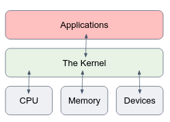

# The Linux File System

## File System fundamentals

**"On a Linux system, everything is a file; if something is not a file, it is a process."**

In linux, under the hood, everything is actually a **file**. A text file is a file, a directory is a file, your keyboard is a file (one that the system reads from only), your monitor is a file (one that the system writes to only), when you want to send data over the internet, you write it to a unique file, etc.
How could that statement be true? because there are **special files** that are more than just files (e.g. sockets, devices etc.).

```console
myuser@hostname:~$ ls -l
total 80
-rw-rw-r--  1 myuser     myuser   31744 Feb 21 17:56 intro Linux.doc
-rw-rw-r--  1 myuser     myuser   41472 Feb 21 17:56 Linux.doc
drwxrwxr-x  2 myuser     myuser   4096  Feb 25 11:50 course
```

In the above output, the first dash (`-`) represents the file type.
We can notice that `course` is a directory, since the first dash is `d`: `drwxrwxr-x`, while `Linux.doc` is a regular file, since it starts with `-`.

Here are a few common types in Linux OS:

| Symbol      | Meaning |
| ----------- | ----------- |
| -      | Regular file       |
| d    | Directory       |
| l  | Link       |
| c   | Special file        |
| s      | Socket       |
| p   | Named pipe        |
| b      | Block device      |

In this course, we will deal with plain files, executable files, directories, links, and a bit of sockets.

Another important feature of the linux file system: filename is Case Sensitive, and files has no extension, use the file command to know the content type:

```console
myuser@hostname:~$ touch file1.png
myuser@hostname:~$ echo "hi" > file1.png
myuser@hostname:~$ ls
file1.png
...
myuser@hostname:~$ file file1.png
file1.png: ASCII text
myuser@hostname:~$ file File1.png
File1: ERROR: cannot open 'File1.png' (No such file or directory)
```

In the above example, we used the `touch` command to create an empty file called `file1.png`, and the text "hi" was written into it (this command uses the `>` operator which will be discussed later on).
Then we use the `file` command to inspect the type of the file. 
We can see that even though the file extension is `.png` (which is known for images), linux recognizes the file type as a regular text file, which is the correct type.
In linux OS, file extensions are meaningless.

## User home directory

In Linux, each user has a HOME directory which serves as their default working directory when they log in.
This directory contains the user's personal files and settings, and is typically located at `/home/<username>`,  while `<username>` is the username. 
The HOME directory is protected by file permissions to ensure that only the user and authorized system administrators can access it.

Here are a few ways to access to a user's home directory in Linux:

1. Using the tilde (`~`) character. Simply use the command `cd ~` or `cd` to change to your own home directory.
2. Using the absolute path, typically `/home/username`.
3. Using the `$HOME` variable: Linux also has a built-in environment variable called `$HOME`, which contains the path to the current user's home directory. You can use the command `cd $HOME` to change to your own home directory (Variables will be discussed later on). 
 
 
## File Path

The file system under linux has an hierarchical structure.
At the very top of the structure is what's called the `root directory`. It is denoted by a single slash (`/`).
It has subdirectories, they have subdirectories and so on. Files may reside in any of these directories.

A **path** is the reference of a particular file or directory on the system.

There are 2 types of paths we can use, **Absolute** and **Relative**. We can refer to a given file either by its Absolute or Relative path, to our choice.

- Absolute paths specify a location (file or directory) in relation to the root directory, they always begin with a forward slash (`/`).
- Relative paths specify a location in relation to the current working directory.

```console
myuser@hostname:~$ pwd
/home/myuser
myuser@hostname:~$ ls Documents
file1.txt file2.txt file3.txt
...
myuser@hostname:~$ ls /home/myuser/Documents
file1.txt file2.txt file3.txt
...
```

The above example shows two different ways to reference the `Documents` dir. The first is relatively the current working directory (which is `~`), the second is using absolute path.

A few notes regarding paths:

- `~` (tilde) - is a shortcut for your home dir. e.g. if your home directory is `/home/myuser` then you could refer to the directory Documents with the path `/home/myuser/Documents` or `~/Documents`.
- `.` (dot) - is a reference to your current working directory. e.g. in the example above we could also refer to Documents by `./Documents`.
- `..` (dotdot)- is a reference to the parent directory.

Let’s see it in action:

```console
myuser@hostname:~$ pwd
/home/myuser
myuser@hostname:~$ ls ~/Documents
file1.txt file2.txt file3.txt
...
myuser@hostname:~$ ls ./Documents
file1.txt file2.txt file3.txt
...
myuser@hostname:~$ ls /home/myuser/Documents
file1.txt file2.txt file3.txt
...
myuser@hostname:~$ ls ../../
bin boot dev etc home lib var
...
myuser@hostname:~$ ls /
bin boot dev etc home lib var
...
```

## Important directories

here is a short list of important files and directories in Linux that users should be familiar with:

| Directory      | Meaning |
| ----------- | ----------- |
| `/bin`      | Common programs, shared by the system, the system administrator and the users.       |
| `/dev`    | Contains references to all the CPU peripheral hardware, which are represented as files with special properties.       |
| `/etc`  | Most important system configuration files are in `/etc`, this directory contains data similar to those in the Control Panel in Windows      |
| `/home`   | Home directories of the common users.        |
| `/lib`      | Library files, includes files for all kinds of programs needed by the system and the users.       |
| `/proc`   | A virtual file system containing information about system resources.        |
| `/root`      | The administrative user's home directory. Mind the difference between `/`, the root directory and `/root`, the home directory of the _root_ user.     |
| `/tmp`     | Temporary space for use by the system, cleaned upon reboot.      |
| `/usr`     | Programs, libraries, documentation etc. for all user-related programs.      |
| `/var`    | Storage for all variable files and temporary files created by users, such as log files, space for temporary storage of files downloaded from the Internet.      |


## Block devices and standards streams

Let’s take a closer look on the `/dev` directory:

```console
myuser@hostname:~$ ls -l /dev
brw-rw----  1 root disk    	8,   0 Apr  1 18:30 sda
brw-rw----  1 root disk    	8,   1 Apr  1 18:30 sda1
brw-rw----  1 root disk    	8,   2 Apr  1 18:30 sda2
…
lrwxrwxrwx  1 root root     	15 Apr  1 18:29 stderr -> /proc/self/fd/2
lrwxrwxrwx  1 root root      	15 Apr  1 18:29 stdin -> /proc/self/fd/0
lrwxrwxrwx  1 root root       	15 Apr  1 18:29 stdout -> /proc/self/fd/1
```

We will discuss some important files - block devices.

Note the files `sda`, `sda1`, `sda2`. Those are block device file type (the first dash is `b`).

Device files do not contain data in the same way that regular files, or even directories. Instead, the job of a device node is to act as an interface to a particular device driver within the kernel.

When a user writes to a device node, the device node transfers the information to the appropriate device driver in the kernel. When a user would like to collect information from a particular device, they read from that device's associated device node, just as reading from a file.

Block devices are devices that read and write information a chunk ("block") at a time. Block devices customarily allow random access, meaning that a block of data could be read from anywhere on the device, in any order.

In Linux, "sda," "sda1," and "sda2" are devices that refer to different **partitions** of a storage device, such as a hard drive or SSD.

The "sda" device refers to the entire storage device, while "sda1" and "sda2" are partitions of that device.

- "sda1" is the first partition on the "sda" device
- "sda2" is the second partition on the "sda" device
- etc...

```console
myuser@hostname:~$ lsblk
sda                   	8:0	0 465.8G  0 disk  
├─sda1                	8:1	0   487M  0 part  /boot
└─sda2                	8:5	0 465.3G  0 part
```

We will now discuss other important files: `stdin`, `stdout`, `stderr`.

Those are the standard input/output streams that are used by programs to read input (from your keyboard) and write output (to your screen).

Here's what each stream does:

1. **Standard Input (stdin)**: This is the stream that carries input to a program. By default, it is associated with the keyboard, so when a user types something into the terminal, it is sent to the program via the standard input file.
2. **Standard Output (stdout)**: This is the stream that carries normal output from a program. By default, it is associated with the terminal, so when a program prints something to the console, it is sent to the standard output file.
3. **Standard Error (stderr)**: This is the stream that carries error messages and other diagnostic output from a program. By default, it is also associated with the terminal, so when a program encounters an error or warning, it prints a message to standard error.

By default, these streams are connected to the terminal, but they can be redirected to files or other streams as well. This is a powerful feature of the Unix shell that allows programs to be combined and orchestrated in powerful ways.

Do you see how **"On a Linux system, everything is a file"**. Keep in mind this statement, it’ll help you to understand linux’s behavior. 

# Self check questions 


# Exercises 

## Know Your System

Change directory to **/proc**.

1. What CPU(s) is the system running on?
2. How much RAM does it currently use?
3. How much swap space do you have?
4. What drivers are loaded?
5. How many hours has the system been running?
6. Which filesystems are known by your system?

Change to `/etc`.

1. How long does the system keep the log file in which user logins are monitored?
2. How many users are defined on your system? Don't count them, let the computer do it for you using wc!
3. How many groups do you have?
4. Which version of bash is installed on this system?
5. Where is the time zone information kept?

## Kernel System Calls

The Linux Kernel was presented in our first linux lecture - the main component of a Linux OS which functions as the core interface between a computer’s hardware and its applications.



Then we moved to learn how to use the Terminal and communicate with the OS using commands such as `ls` or `chmod`.  
But how does it really work? We type a command and hit the Enter key, then what happens? This question tries to investigate this point.

Under the hood, linux commands are compiled C code (get yourself to know what is a compilation process if you don't know..). The C code contains **system calls**.
The system call is the fundamental interface between an application and the Linux kernel.

In simple words, when your application wants to use the hardware (e.g. calculate something in the CPU, or write data to the disk), you create a system call to the Linux Kernel, and the linux kernel talks with the hardware on your behalf. Read more about what System Calls are.

`strace` is a Linux command, which traces system calls and signals of a program.
It is an important tool to debug your programs in advanced cases.
In this assignment, you should follow the `strace` output of a program in order to understand what exactly it does (i.e. what are the system calls of the program to the kernel). You can assume that the program does only what you can see by using `strace`.

To run the program, open a linux terminal in an empty directory and perform:

```bash
wget <group-repo-link>/whatIdo
```

The `wget` command is able to retrieve data from the internet.

1. Give the `whatIdo` file an exec permission (make sure you don't get Permission denied when running it).
2. Run the program using strace: `strace ./whatIdo`.
3. Follow strace output. Tip: many lines in the beginning are part of the load of the
   program. The first “interesting” line comes only at the end of the output.

Try to get a general idea of what this program does by observing the sys calls and the directory you've run the program.

