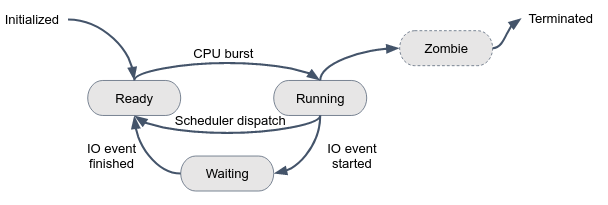

# Linux Processes

## Process Definition

A process is a currently executing program (or command). A program is a series of instructions that tell the computer what to do. When we run a program, those instructions are copied into memory and space is allocated for variables and other stuff required to manage its execution. This running instance of a program is called a **process**.

The top command can show running processes in the terminal in real-time.

```console
myuser@hostname:~$ top
...
```

## Processes state

In linux, multiple users running multiple processes, at the same time and on the same system. The CPU manages all these processes simultaneously, according to the below state diagram:



A process can be in one of several states at any given time, indicating its current status or activity. These states are important to understand for managing and troubleshooting system performance.

Here are a short description of each state:

1. **Running**: A process is currently executing on a CPU core (a.k.a process CPU burst).
2. **Waiting**: A process is waiting for some external event, such as user input, disk, or a network I/O operation to complete.
3. **Ready**: Is often used to refer to a process that is waiting to be executed on a CPU. When a process is in the ready state, it is typically placed in a queue, waiting for an available CPU to execute on. Once the CPU becomes available, the process is moved from the ready state to the running state and starts executing. The amount of time a process spends in the ready state is dependent on the scheduling algorithm and the current system load.
4. **Zombie**: A process has completed its execution but its parent process has not yet collected its exit status.
5. **Initialized**: A process that has been created but has not yet been assigned a process identifier (PID)
6. **Terminated**: Indicates that a process has finished its execution and has exited.

## The process tree

A new process is created because an existing one makes an exact copy of itself (forking). This implies a tree structure of processes:

```console
myuser@hostname:~$ pstree
systemd─┬─ModemManager───2*[{ModemManager}]
├─NetworkManager───2*[{NetworkManager}]
├─2*[SACSrv───3*[{SACSrv}]]
├─accounts-daemon───2*[{accounts-daemon}]
├─acpid
├─atd
├─avahi-daemon───avahi-daemon
.
.
.
```

This child process has the same environment as its parent, only different process id (PID). When a process ends normally (it is not killed or otherwise unexpectedly interrupted), the program returns its **exit code** (a number) to the parent. Only exit status of 0 means success.

A process has a series of characteristics, which can be viewed with the `ps` command:

```console
myuser@hostname:~$ ps -aux
USER     	PID %CPU %MEM	VSZ   RSS TTY  	STAT START   TIME COMMAND
root       	1  0.0  0.1 172752  9440 ?    	Ss   13 Feb  7:21 /sbin/init splash
root       	2  0.0  0.0  	0 	0 ?    	S	13 Feb  0:00 [kthreadd]
```

The `ps` command can display a lot of information about processes, including their PID, state (STAT column), CPU and memory usage, the user owning this process, and the command that initiated the process.


## Signals 

Processes are communicating with each other and with the kernel using **signals**. There are multiple signals that you can send to a process. Use the `kill` command to send a signal to a process.

|  Signal Name     | Signal Number      | Meaning |
| ----------- | ----------- | ----------- |
|   SIGTERM   | 15      | Terminate the process in orderly way       |
|   SIGINT   | 2      | Interrupt the process. The process can ignore this signal       |
|   SIGKILL   | 9      | Interrupt the process. The process can't ignore this signal       |
|   SIGHUP   | 1      | The parent process was terminated       |


Use `man 7 signal` for a comprehensive list of linux signals.

Let's kill a process by send it a KILL signal:

```console
myuser@hostname:~$ sleep 600
```

The above command initiates a process that just sleeps 600 seconds, and ends.

In **another terminal**, use the `ps` to get the PID of the process running the `sleep` command:

```console
myuser@hostname:~$ ps -a
PID TTY          TIME CMD
46214 pts/1    00:00:00 sleep
46445 pts/3    00:00:00 ps
...
myuser@hostname:~$ kill -9 46214
```

Observe how the process running the `sleep` command is terminated.

---

In bash, you can use keyboard shortcuts to send signals to process:

|  Shortcut     | Signal      | Meaning |
| ----------- | ----------- | ----------- |
|   CTRL+C   | SIGINT      | Terminate the process in orderly way       |
|   CTRL+Z   | SIGSTOP      | Suspend the process in the background       |


### Graceful Termination

We now demonstrate a very important concept called **Graceful Termination**.

Graceful termination refers to the process of shutting down a program (a process) in a way that allows it to complete its current tasks and close down all processes in a safe and controlled manner. This ensures that no data is lost, and all system resources are properly released.

In our shared repo, under `graceful_term_simulate/server.py` you are given a dummy Python "Server". Run this server by:

```console
# You might try 'python' instead 'python3' command
myuser@hostname:~$ python3 graceful_term_simulate/server.py
Server is running, PID=47098
```

Obviously, we can send SIGKILL (9) to the server and kill it aggressively. But we want the server to be terminated gracefully. To do so, we will first send SIGINT, which indicates to the server "you are going to be terminated soon, so take some **grace period** to terminate yourself gracefully".

The server is finishing the process clients requests, closes the connection to the database, and performs some cleanup tasks. Finally, the server terminates itself, while everything is healthy.

## Services


In Linux, services are **background processes** that run continuously and provide specific functions to the operating system or other applications. Here are some common Linux services:

1. `ssh`: A secure remote login protocol that allows users to log in to a remote computer securely.
2. `cron`: A service that executes scheduled tasks or commands at specified intervals.
3. `ufw`: An easy-to-use interface for configuring and managing firewall rules on a Linux system.
4. `apache`: A web server that serves HTML pages and other files over the internet.

The `systemctl` command is used to manage services in your system:

```console
myuser@hostname:~$ sudo systemctl status ufw
● ufw.service - Uncomplicated firewall
Loaded: loaded (/lib/systemd/system/ufw.service; enabled; vendor preset: enabled)
Active: active (exited) since Sun 2022-01-01 07:25:58 UTC; 2h 16min ago
Docs: man:ufw(8)
Main PID: 338 (code=exited, status=0/SUCCESS)
CPU: 1ms

Jan 01 07:25:58 hostname systemd[1]: Starting Uncomplicated firewall...
Jan 01 07:25:58 hostname systemd[1]: Finished Uncomplicated firewall.
myuser@hostname:~$ sudo systemctl stop ufw
myuser@hostname:~$ sudo systemctl start ufw
myuser@hostname:~$ sudo systemctl restart <service name>
```

Enable a service to start automatically at boot time by:

```console
sudo systemctl enable <service name>
```

### Who manages Linux services?
 
As can be seen in the output of `pstree`, **systemd** is the first process in many Linux distributions, which is a system and service manager that provides a way to manage and control system services. Systemd reads **unit files**, which are configuration files used by systemd to define system services.

Unit files can be found in the `/etc/systemd/system` directory:

```console
myuser@hostname:~$ ls  /etc/systemd/system/*.service
/etc/systemd/system/sshd.service
/etc/systemd/system/mysql.service
/etc/systemd/system/jenkins.service
...
```

List all your system services:

```console
myuser@hostname:~$ systemctl list-units --type=service
UNIT                                              LOAD   ACTIVE SUB     DESCRIPTION                
accounts-daemon.service                          loaded active running Accounts Service           
acpid.service                                    loaded active running ACPI event daemon          
alsa-restore.service                             loaded active exited  Save/Restore Sound Card
....
```

In the above output, UNIT represents the unit name, LOAD indicates that the unit’s configuration has been read by systemd, ACTIVE is the state of the unit.

# Self-check questions

TBD

# Exercises

## Services intro

1. How many days is the `systemd-resolved` service running?
2. Is `ufw` service active in your system? Is it running? If not, what is the exit code of the process that runs the service?
3. What is the PID of the `systemd-timesyncd` service? Restart the service, what is the PID? What is this service responsible for?
4. Check the status of service `ssh`. Send `SIGKILL` to the process ID of this service. What happened to the service? Check the status, what is the status, why?

## Run processes in the background

"Interactive processes" are processes that are initialized and controlled through a Linux terminal session. These processes can run in the foreground, occupying the terminal. Alternatively, they can run in the background. The terminal can accept new commands while the program is running.

1. Open a nes terminal session and execute `sleep 600` which initiates a process that "sleeps" 10 minutes and ends.
2. Stop the process and send into the background by `CTRL+Z`.
3. Bring the process to the foreground by `fg`.
4. Now run the same command while sending the process to the background by the `&` operator: `sleep 600 &`.
5. Bring the process to the foreground.
6. Kill the process by `CTRL+C`.

## Run your own service

Follow Pratham Patel's [great tutorial](https://linuxhandbook.com/create-systemd-services/)


## Resource Lock and Process State

**Resource locking** is a technique used in computer systems to prevent multiple processes (or users) from simultaneously accessing a shared resource such as a file, database, or piece of memory.
The general idea behind resource locking is to ensure that only one person can access the resource at any given time, to prevent **race conditions** and other synchronization issues that could lead to data corruption or inconsistencies.

As a real life example, in an airline online check-in system, resource locking may be used to prevent multiple users from simultaneously booking the same seat.
Only one user should be able to book a certain seat in the aircraft at any given time, to prevent conflicts and ensure data consistency.

Throughout the course, we will encounter resource locking in many cases.

Generally speaking, in Linux systems, two different processes cannot write to the same file concurrently (exactly at the same moment).
Each process needs to obtain an exclusive **write lock** for the file.  
That implies that all the other processes who are willing to write to this file will have to wait while one process is writing data into it.
The more I/O intensive processes you have, the longer the wait time.

In this question we will create processes which are competing on the same resource (same file), and see how some of them are changing their state from Running to Waiting.

Create a file under `~/write_to_file_sequentially.sh` contains the following code, and give it executable (`x`) permissions:

```console
#!/bin/bash

for i in $(seq 1000); do
echo "hello world" > overloaded_file
done
```

This script writes the string "hello world" to a file called "overloaded_file". It does so 1000 times **sequentially**, and so will never be competing for access to the file (why?).

Now, because we need multiple processes competing over the same resource, create the following script as well:

```console
#!/bin/bash

for i in $(seq 1000); do
./write_to_file_sequentially.sh &
done
```

Name it `~/multi_process_file_writing.sh`, make it executable. Make sure you understand what this script does.

Run the following commands, in **3 different terminal sessions**:

1. First, in terminal 1, run the program by `./multi_process_file_writing.sh`.
2. Next, run the `top` command in terminal 2. Observe the `multi_process_file_writing` process in top's view.

In the last terminal you will try to catch processes of your program in different states.
In the `ps` [man page](https://man7.org/linux/man-pages/man1/ps.1.html#PROCESS_STATE_CODES), read what each process state code means.

3. In terminal 3, run the `ps -aux` multiple times until you'll see indications that some processes are waiting (sleeping due to IO operation), and some others are running.
   While you'll find many processes in a waiting state (`D`), it may be hard to catch a process in a running state (`R`)... Use the `grep` command to filter only relevant lines.


