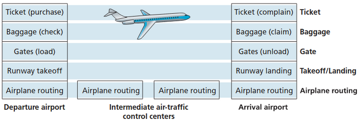
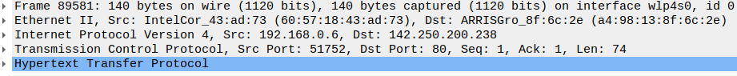

# Networking and Security 

## The OSI Model

In order to get data over the network, lots of different hard- and software needs to work and communicate together via a well-defined **protocol**.
A protocol is, simply put, a set of rules for communication. You know some of them: HTTP, SSH, TCP/IP etc...
All these different types of communication protocols are classified in 7 layers, which are known as the Open Systems Interconnection Reference Model, the OSI Model for short.

In this course we will discuss the 4-layer model, which is a simplified version of the OSI model that combines several of the OSI layers into four layers.

This model is commonly used in the TCP/IP protocol suite, which is the basis for the Internet.

The four layers of the TCP/IP model, in order from top to bottom, are:

| Layer Name      | Used protocol  |
| ----------- | ----------- |
| Application Layer     | HTTP, DNS, SMTP, SSH       |
| Transport Layer     | TCP, UDP       |
| Network Layer     | IP, ICMP       |
| Network Interface Layer     | Ethernet       |


### Human analogy - the airline system

In reality, network systems and protocols are much more complicated than discussed here. Let's see some analogy: 



The airline system can be used as an analogy to the OSI model to help understand how the different layers of a network work together to transmit data.

- Application Layer: This layer corresponds to the various applications and services offered by the airline, such as ticket sales and flight status updates. 
- Transport Layer: This layer corresponds to the services provided to passengers, such as ticketing, baggage handling. 
- Network Layer: This layer corresponds to the routing and addressing of planes within the airline system, such as flight paths and destinations. 
- Network Interface layer: This layer corresponds to the physical infrastructure of the airline system, such as the planes, runways, and airports. 

And the analogy:

- Application Layer: Just as the application layer in the airline system provides end-to-end services directly to passengers and customers. The application layer in the OSI model provides services directly to users or applications.
- Transport Layer: Just as the transport layer in the airline system provides end-to-end services to passengers during their journey, the transport layer in the OSI model provides **end-to-end** communication services between applications.
- Network Layer: Just as the network layer in the airline system determines how planes are routed to their destinations, the network layer in the OSI model determines how data is routed through a network.
- Network Interface layer: Just as the physical layer in the airline system deals with the physical transportation of passengers and cargo, the physical layer in the OSI model deals with the physical transmission of data over a network.

### Visiting google.com in the browser - it's really much more complicated

What happen when you open your web browser and type http://www.google.com? We will try to examine it in terms of the OSI model.

#### Application Layer

The browser uses HTTP protocol to form an HTTP request to Google’s servers, to serve Google's home page. The HTTP request is merely a text in a well-defined form, it may look like:

```text
GET / HTTP/1.1
Host: google.com
User-Agent: Mozilla/5.0
```

Note that we literally want to transfer this text to Google’s servers, as is. In the server side, there is an application (called "webserver", obviously) that knows how to response to this kind of texts.
Since web browser and web servers are applications that use the network, it resides in the application-layer.

The application layer is where network applications and their application-layer protocols reside. Network applications may be Web browsers, webserver, mails, and every application that send or receive data over the Internet, in any kind and form.

Do your Firefox or Chrome browsers know how exactly to transfer this kind of text over the Internet? Do Apache or Nginx servers know how to send a responses over the Internet? Hell no!
They both use the great service of the Transport layer.

#### Transport Layer

The HTTP text message is transferred, via a file of type socket (will be discussed soon), to another piece of "software" in the Linux kernel, this software ia able to transport application-layer messages from one host to another using the TCP protocol.
In simple words, TCP says: "no matter who are you, outlook, whatsup, firefox... give me a message to transfer, and a destination, and I'll be responsible to serve you and transfer this message for you. All you need is to talk with me according to my [strict rules protocol](https://www.ietf.org/rfc/rfc793.txt)".

TCP breaks long **messages** into shorter **segments**, it guarantees that the data was <u>indeed delivered</u> to the destination and controls the order in which segments are being sent.
Note that TCP only controls **how** the data is being sent and received, but it does not responsible for the actual sending of the data. To send its segments, TCP uses the service of a very close friend - IP.

The transport layer controls the transportation of application-layer messages between application endpoints.

There are two major protocols in this layer: 

- TCP (Transmission Control Protocol), which is a reliable, connection-oriented transport layer protocol that provides a guaranteed delivery of data and error detection mechanisms. 
- UDP (User Datagram Protocol), which is a lightweight, connectionless transport layer protocol, used for fast, low-latency communication and is commonly used for video streaming, online gaming, and other real-time applications.

#### Internet Layer

We continue our journey to get Google.com's homepage. 
So we have TCP segments ready to be transferred to Google's servers. 

The IP protocol is responsible for moving the TCP segments from one host to another.
Just as you would give the postal service a letter with a destination address, IP protocol sends piece of data (a.k.a packets) to address (a.k.a IP addresses).
Like TCP, IP is a piece of software resides in the linux kernel (so close to TCP, that they are frequently called TCP/IP).
In order to send **packets** over the Internet, IP communicates with a **network interface**, which is a software abstraction that represents a network physical (of virtual) device, such as an Ethernet card or a wireless adapter.

The network layer routes packets through a series of routers between the source and destination hosts.

#### Network Interface Layer

The network interface layer is the lower level component in our model. 
It provides an interface between the physical network and the higher-level networking protocols.
It handles the transmission and reception of data **frames** over the network, and it is responsible for converting **digital signals** into **analog signals** for transmission over the physical network.

In this layer, every physical (or virtual) network device has a media access control (**MAC**) address. 
MAC address is the unique identifier assigned to a network interface. 
MAC addresses are assigned at the time that a network adapter is manufactured or, if it’s a virtualized, the time that it is created.


# Self-check questions

TBD

# Exercises

## Inspecting OSI Layers via WireShark

Wireshark is a popular network protocol analyzer that allows users to capture and inspect network traffic in real time, making it a valuable tool for network troubleshooting and analysis.
Install it on Ubuntu:
https://www.wireshark.org/docs/wsug_html_chunked/ChBuildInstallUnixInstallBins.html#_installing_from_debs_under_debian_ubuntu_and_other_debian_derivatives
Run it by:

```console
myuser@hostname:~$ wireshark
```

Start capturing packets, by clicking on the  button  
In wireshark, apply() the following filter to catch only packets destined for google.com

```text
http.host == "google.com"
```

From your terminal, use the curl command to get the main page of `google.com`

```console
myuser@hostname:~$ curl google.com
```

Explore the **packet details pane**.



This pane displays the contents of the selected packet (packet here is referred to as “any piece of data that traverses down the model layers”). You can expand or collapse each layer to view the details of the corresponding layer, such as the source and destination addresses, protocol flags, data payloads, and other relevant information.

Answer the below questions. Don’t butter yourself if you are not familiar with every small detail.  Some of the concepts here will be taught soon. Based on our discussion on the OSI model, and your previous knowledge in computer networking, try to look for the relevant information.


1. How many layers does the packet cross?
2. What is the top layer, which is the lower?
3. The “network interface” layer is not part of the original OSI model. It is composed by the two lower layers of the original model, what are those two layers according to the packet details pane on your WireShark screen?
4. How does the original message to google.com (the HTTP request) look like in the top layer?
5. Is the packet sent using TCP or UDP?
6. What is the length of the transport layer segment?
7. To how many segments the original message has been segmented?
8. Which version of IP protocol did you use in the Internet layer?
9. In the Internet layer, what is the destination IP of the packets?
10. What is the MAC address of your device?
11. How many bits have been transmitted over the wire to google’s servers?
12. What is the protocol sequence that the frame (the lower level piece of data) have been composed of?  

