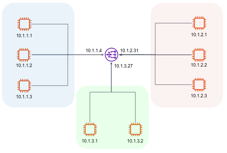
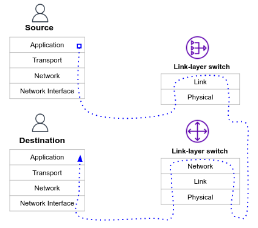
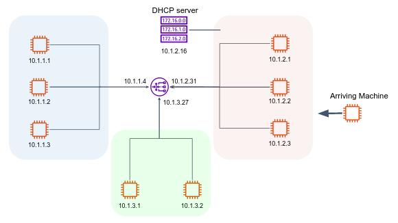
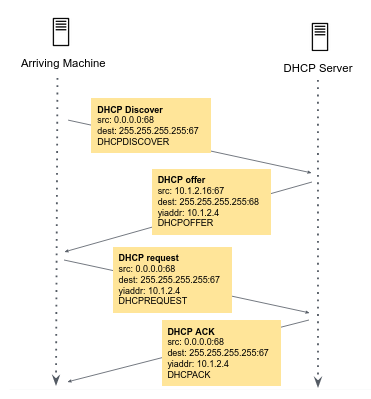
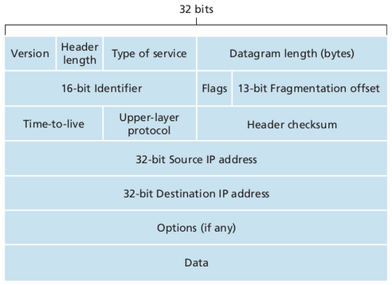

# Computer Networks

So far, we've seen simple communication between 2 standalone hosts.
In real life, computers are often arranged into "groups" to improve network performance, simplify network management, and increase network security.

In this tutorial we'll describe and investigate the components of computer networks and subnetworks. 

## Subnets

Computer networks organize machines into sub networks, or **subnets**.
All machines on a given subnet may exchange information directly.
Subnets are in turn linked to other subnets by machines acting as **routers**.




The above network consists of 3 subnets. Taking a closer look, we notice that computers under the same subnet have the same ip prefix.
For example, all computers under the leftmost subnet (and all computer that will join this subnet) have an IP address starting by `223.1.1.xxx`.
Thus, they share the same IP prefix, more precisely, the same first 24 bits in their IP address.

We will denote the IP boundaries of the leftmost subnet by:

```text
223.1.1.0/24
```

This method is known as **Classless Interdomain Routing (CIDR)**. Use [this nice tool](https://cidr.xyz/) to familiarize yourself with CIDR notation.

The `ping` command can be used to confirm IP connectivity between two hosts:

```console
myuser@223.1.1.1:~$ ping 223.1.2.2
PING 223.1.2.2 56(84) bytes of data.
64 bytes from 223.1.2.2: icmp_seq=1 ttl=51 time=3.29 ms
64 bytes from 223.1.2.2: icmp_seq=2 ttl=51 time=3.27 ms
64 bytes from 223.1.2.2: icmp_seq=3 ttl=51 time=3.28 ms
...
```

In the above example, the computer identified by the IP `223.1.1.1` sends ping frames to `223.1.2.2`. 

In order to communicate with a host on another subnet, the data must be passed to a router, which (with the help of other routers) routes the information to the appropriate subnet, and from there to the appropriate host.
Before examine that mechanism, let's introduce 3 important concepts: **Network interfaces**, **Default gateway**, **Route table**.

## Network interfaces

In the OSI model, we've seen that every bit of data being sent over the network, must pass through the lower layer - the Network Interface layer, which provides the physical and electrical interface between the networking hardware and the data being transmitted.
Linux represents every networking device attached to a machine (such as an Ethernet card, wireless card, etc...) as a **network interface**.

In linux, the `ip` command can show/manipulate network interfaces, and more...

```console
myuser@hostname:~$ ip address
1: lo: <LOOPBACK,UP,LOWER_UP> mtu 65536 qdisc noqueue state UNKNOWN group default qlen 1000
    link/loopback 00:00:00:00:00:00 brd 00:00:00:00:00:00
    inet 127.0.0.1/8 scope host lo
       valid_lft forever preferred_lft forever
    inet6 ::1/128 scope host 
       valid_lft forever preferred_lft forever
2: eth0: <BROADCAST,MULTICAST,UP,LOWER_UP> mtu 9001 qdisc mq state UP group default qlen 1000
    link/ether 0a:5c:36:18:fe:82 brd ff:ff:ff:ff:ff:ff
    inet 223.1.1.1/24 metric 100 brd 223.1.1.255 scope global dynamic eth0
       valid_lft 3559sec preferred_lft 3559sec
    inet6 fe80::85c:36ff:fe18:fe82/64 scope link 
       valid_lft forever preferred_lft forever
```

The above output shows 2 available network interfaces in the machine. 

- `lo` (loopback) is being used to facilitate communication between processes running on the same host (internal communication). 
- `eth0` is being used for connecting a computer to a wired Ethernet network.

Before an interface can be used to send or receive traffic, it must be configured with an IP address which serves as the interface's identity.
In the above output, the interface `eth0` is assigned an IP address `223.1.1.1`, which is the IP address of the "machine" (in reality, a "machine" does not have an IP address, a machine's network interfaces do).

Linux names interfaces according to the type of device it represents. 
The following table lists some of the more commonly encountered interface names used in Linux.

| Interface      | Device |
| ----------- | ----------- |
| `eth`n (sometimes `ens`n)      | Ethernet Card      |
| `lo`      | Loopback Device      |
| `wlp`n      | Wireless Device      |
| `virbr`n      | Virtual bridge      |

How does the kernel know the correct network interface for which to route packets?

### Default gateway and route table

In order to communicate with machines outside of your local subnet, your machine must know the identity of a nearby router.
A router has multiple network interfaces, usually each participating in a distinct subnet (as shown in above figure).
The router used to route packets outside of your local subnet is commonly called as a **default gateway**.

In the above network figure, `223.1.1.4` is the default gateway IP of the leftmost subnet, while `223.1.2.9` is the default gateway IP of the rightmost subnet. 

The Linux kernel maintains an internal table which defines which machines should be considered local, and what gateway should be used to help communicate with those machines which are not.
This table is called the **routing table**.

The `route` command can be used to display the system's routing table (`ip route` is more modern command).

```console 
myuser@223.1.1.1:~$ route
Kernel IP routing table
Destination     Gateway         Genmask         Flags Metric Ref    Use Iface
default         223.1.1.4       0.0.0.0         UG    100    0        0 eth0
223.1.1.0       0.0.0.0         255.255.255.0   U     100    0        0 eth0
223.1.0.2       223.1.1.4       255.255.255.255 UGH   100    0        0 eth0
223.1.1.4       0.0.0.0         255.255.255.255 UH    100    0        0 eth0
```

We will focus on the first two routes:

- The first route specifies a default gateway of `223.1.1.4`, which is used for all traffic that does not match any other route.
- The second route specifies that traffic destined for the `223.1.1.0/24` network should be sent directly to the `eth0` interface without going through a gateway.

## `traceroute`

When connecting to a machine outside of your subnet, your packet is passed from router to router as it
traverses various subnets, until finally the packet is delivered to the subnet which contains the destination
machine.



The path of the packet, as it is passed from router to router, can be traced with the `traceroute` command.
The traceroute command is generally called with a single argument, the hostname or IP address of the destination machine.

```console 
myuser@hostname:~$ traceroute google.com
traceroute to google.com (142.250.74.46), 30 hops max, 60 byte packets
 1  ec2-13-53-0-203.eu-north-1.compute.amazonaws.com (13.53.0.203)  1.665 ms * *
 2  * * 240.0.16.13 (240.0.16.13)  0.170 ms
 3  241.0.2.197 (241.0.2.197)  0.176 ms 241.0.2.200 (241.0.2.200)  0.208 ms 241.0.2.198 (241.0.2.198)  0.165 ms
 4  240.0.16.19 (240.0.16.19)  0.180 ms 242.0.124.121 (242.0.124.121)  1.926 ms 242.0.125.105 (242.0.125.105)  0.375 ms
 5  242.0.124.97 (242.0.124.97)  0.614 ms 52.93.142.149 (52.93.142.149)  3.929 ms 52.93.142.181 (52.93.142.181)  3.913 ms
 6  52.93.142.149 (52.93.142.149)  3.916 ms  3.868 ms 52.93.145.226 (52.93.145.226)  2.764 ms
 7  52.93.145.54 (52.93.145.54)  3.274 ms 52.93.143.27 (52.93.143.27)  3.920 ms 52.93.145.184 (52.93.145.184)  18.886 ms
 8  99.83.118.165 (99.83.118.165)  3.272 ms 52.93.143.69 (52.93.143.69)  11.419 ms 99.83.118.165 (99.83.118.165)  3.148 ms
 9  99.83.118.165 (99.83.118.165)  3.196 ms * *
10  * * *
11  108.170.254.33 (108.170.254.33)  4.244 ms 142.251.48.40 (142.251.48.40)  3.323 ms 108.170.254.54 (108.170.254.54)  7.028 ms
12  108.170.253.177 (108.170.253.177)  3.350 ms 142.250.239.183 (142.250.239.183)  3.142 ms 108.170.254.54 (108.170.254.54)  3.790 ms
13  142.250.239.185 (142.250.239.185)  3.611 ms  3.616 ms 108.170.253.161 (108.170.253.161)  3.833 ms
14  arn09s22-in-f14.1e100.net (142.250.74.46)  3.533 ms  3.093 ms 142.250.239.183 (142.250.239.183)  3.936 ms
```

The number of routers that your packet passes through is generally referred to as the number of **hops** the packet has made.

## New IP address allocation and the DHCP 

In order to obtain a block of IP addresses for use within a subnet, a network administrator might first contact its ISP,
which would provide addresses from a larger block of addresses that had already been allocated to the ISP. 
In general, IP addresses are managed under the authority of the Internet Corporation for Assigned Names and Numbers ([ICANN](https://www.icann.org/)).

The Dynamic Host Configuration Protocol (DHCP) allows a host to obtain an IP address automatically within a subnet.



The below diagram examines the process by which a new client receiving an IP address from a DHCP server:



## IP Address for private subnets

There are three ranges of private IP addresses defined in [RFC 1918](https://www.rfc-editor.org/rfc/rfc1918):
- 10.0.0.0/8
- 172.16.0.0/12
- 192.168.0.0/16

These addresses can be used for internal networks within an organization, but they are not routable on the public Internet.

Public IP addresses, on the other hand, are assigned by Internet authorities and are used to identify devices that are directly accessible from the Internet.

## (Optional) IP packet structure 



- **Version** - IPv4 or IPv6
- **Header** - Because an IPv4 datagram can contain a variable number of options, this field determines where in the IP datagram the data actually begins
- **Type of service** - the type of the data that is being transferred - low delay, high throughput, non-real-time, etc…
- **Datagram length** - the total length of the IP datagram (header plus data, in bytes)
- **Identifier, flags, fragmentation offset** - these fields have to do with IP fragmentation. Not all link-layer protocols can carry network-layer packets of the same size, the solution is to fragment the data in the IP datagram into two or more smaller IP datagrams
- **Time-to-live** - the TTL ensures that datagrams do not circulate forever (due to, for example, a long-lived routing loop) in the network
- **Protocol** - indicates the specific transport-layer protocol to which the data should be passed
- **Header checksum** - aids a router in detecting bit errors in a received datagram. The header checksum is computed by treating each 2 bytes in the header as a number and summing these numbers
- **Options** - allow an IP header to be extended
- **Data (payload)** - In most circumstances, the data field of the IP datagram contains the transport-layer segment (TCP or UDP) to be delivered to the destination. However, the data field can carry other types of data, such as ICMP messages

