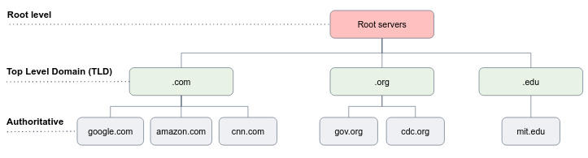
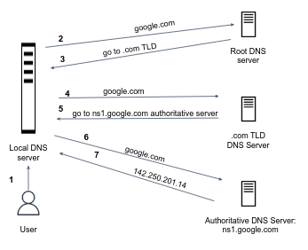

# The DNS Protocol

IP addresses are somewhat hard to remember. 
Names are much easier. google.com is much easier to remember than 16.42.0.9 but there must be some mechanism to convert the network names into an IP address.

When an application attempts to **resolve** an address to its IP address (using the `gethostbyname()` syscall), there are generally two resources available:

- The address can be statically specified in the `/etc/hosts` file (take a look on it).
- When the local `/etc/hosts` cannot provide the answer, the DNS service takes over. The client send a message over the network to publicly available DNS server, which resolves the address in response. All DNS query and reply messages are sent within **UDP** datagrams to port **53**. 

## How DNS works?

The DNS service is complex.
The protocol that specifies how the DNS servers and querying hosts communicate consisting of a large number of DNS servers distributed around the globe.

A simple design for DNS would have one DNS server that contains all the mappings (which is a bad idea! why?). 

<details>
  <summary>Answer</summary>

- Single point of failure
- High traffic volume
- Distant centralized DB
- Maintenance

</details>

In fact, the DNS is a wonderful example of how a distributed database can be implemented in the Internet. Let's delve into details.
There are three classes of DNS servers: **root** DNS servers, **top-level domain** (TLD) DNS servers, and **authoritative** DNS servers.



- **Root DNS servers** - clients first contacts one of the root servers, which returns IP addresses for TLD servers for the top-level domain. As of 2012, there are 13 root DNS servers (actually 247 after replication).
- **Top-level domain (TLD) servers** - are responsible for top-level domains such as .com, .org, .net, .edu, and .gov, and all of the country top-level domains such as uk, fr etc... Look [here](https://www.iana.org/domains/root/db) for a full list. When client reaches TLD server in order to resolve a domain name, e.g. google.com, it is **not** responded with the desired IP address of the domain, but with a list of Authoritative Servers from which to request the desired IP address.
- **Authoritative DNS servers** - every organization with publicly accessible hosts must provide publicly accessible DNS records that map the names to an IP addresses. Authoritative name servers are the source of truth in the domain name system. An organization can choose to implement its own authoritative DNS server to hold these records, alternatively, to pay to have these records stored in an authoritative DNS server of some service provider, e.g. [AWS route53](https://docs.aws.amazon.com/Route53/latest/DeveloperGuide/domain-register.html).


## Manually resolving google.com

We will resolve `google.com` step by step using the `dig` command.

2. First, get the list of the root-level DNS servers. You can get it too by:
```shell
dig . NS
```

3. Pick one of the root-level domain names. We will query this server to get the hostname of the *com* top-level domain by:
```shell
dig @<your-chosen-root-level-hostname> com NS
`````

4. Now that we have a list of *.com* TLD servers, pick one of them to query the hostname of the authoritative DNS of *google.com*:
```shell
dig @<your-chosen-TLD-hostname> google.com NS
```

5. Finally, as we know the hostname of the authoritative DNS servers of *google.com*, we can query one of them to retrieve the IP address of *google.com*:

```shell
dig @<your-chosen-authoritative-hostname> google.com A
```

## DNS record types

A resource record is a four-tuple that contains the following fields:

```text
(Name, Value, Type, TTL)
```

Below is common DNS records type

| Type      | Description |
| ----------- | ----------- |
| A record      | maps a domain name to an IPv4 address.      |
| NS record      | specifies the authoritative DNS servers for a domain      |
| CNAME record     | maps a domain name to another domain name (alias)      |

## The local DNS server 



In real life, the actual hostname resolve is done by your ISP local DNS serve. 
Every ISP maintains its own local DNS server. When a host connects to an ISP, it provides the IP addresses of its local DNS server(s).
When a host makes a DNS query, the query is sent to the local DNS server, which acts a **proxy**, forwarding the query into the DNS server hierarchy.

The IP address of your local DNS server can be found in `/etc/resolv.conf`.

## DNS caching 

**Caching** is a mechanism used to store frequently accessed data in a local storage (cache) to reduce the time and resources required to retrieve the data from the original source.
When data is requested, it is first checked in the cache, and if it is found there, it is returned quickly without accessing the original source.
If the data is not in the cache, it is retrieved from the original source, stored in the cache, and returned to the requester.
This process can help to improve the performance and scalability of applications by reducing the load on the original data source and minimizing network latency.

When a DNS server receives a DNS record, it can cache the record in its local memory. Thus, the DNS server can provide the desired IP address, even if it is not authoritative for the hostname.
A local DNS server can also cache the IP addresses of TLD servers, thereby allowing the local DNS server to bypass the root DNS servers in a query chain (this often happens).
Because hosts and mappings between hostnames and IP addresses are by no means permanent, DNS servers discard cached information after a period of time, known as **Time to Live (TTL)**.

## Registering a Domain

New domains can be registered by a **Domain Name Registrar**.
A registrar is a commercial entity that verifies the uniqueness of the domain name, enters the domain name into the DNS database.
The Internet Corporation for Assigned Names and Numbers (ICANN) accredits the various registrars. 

When you register your domain name with some registrar, you also need to provide the registrar with the names and IP addresses of your primary and secondary authoritative DNS servers (why two servers are needed?).
For each of these two authoritative DNS servers, the registrar would then make sure that a **Type NS** and a **Type A** record are entered into the TLD servers.

For example: for domain `networkutopia.com`, the registrar would insert the following two resource records into the TLD servers of `.com`:

```text
(networkutopia.com, dns1.networkutopia.com, NS)
(dns1.networkutopia.com, 212.212.212.1, A)
```

You’ll also have to make sure that the Type A record for your web server `www.networkutopia.com` is entered into your authoritative DNS servers:
```text
(networkutopia.com, 69.6.1.47, A)
```


Specific domain name information can be queried using the `whois` command:

```console 
myuser@hostname:~$ whois google.com
   Domain Name: GOOGLE.COM
   Registry Domain ID: 2138514_DOMAIN_COM-VRSN
   Registrar WHOIS Server: whois.markmonitor.com
   Registrar URL: http://www.markmonitor.com
   Updated Date: 2019-09-09T15:39:04Z
   Creation Date: 1997-09-15T04:00:00Z
   Registry Expiry Date: 2028-09-14T04:00:00Z
   Registrar: MarkMonitor Inc.
   Registrar IANA ID: 292
   Registrar Abuse Contact Email: abusecomplaints@markmonitor.com
   Registrar Abuse Contact Phone: +1.2086851750
   Domain Status: clientDeleteProhibited https://icann.org/epp#clientDeleteProhibited
   Domain Status: clientTransferProhibited https://icann.org/epp#clientTransferProhibited
   Domain Status: clientUpdateProhibited https://icann.org/epp#clientUpdateProhibited
   Domain Status: serverDeleteProhibited https://icann.org/epp#serverDeleteProhibited
   Domain Status: serverTransferProhibited https://icann.org/epp#serverTransferProhibited
   Domain Status: serverUpdateProhibited https://icann.org/epp#serverUpdateProhibited
   Name Server: NS1.GOOGLE.COM
   Name Server: NS2.GOOGLE.COM
   Name Server: NS3.GOOGLE.COM
   Name Server: NS4.GOOGLE.COM
...
```


