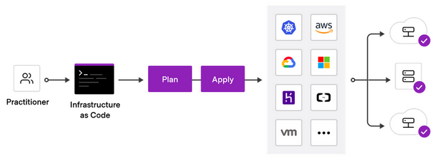
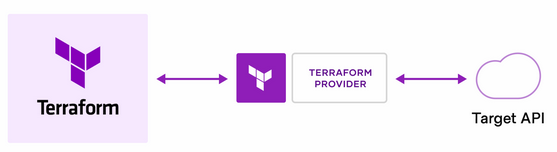

# Terraform 

HashiCorp Terraform is an infrastructure as a code (IaaC) tool that lets you define cloud resources in human-readable configuration files that you can version, reuse, and share.

<div align="center">

</div>

Terraform creates and manages resources on cloud platforms through their application programming interfaces (APIs). Providers enable Terraform to work with virtually any platform or service with an accessible API.

<div align="center">

</div>

HashiCorp and the Terraform community have already written more than 1700 providers to manage thousands of different types of resources and services.

You can find all publicly available providers on the [Terraform Registry](https://registry.terraform.io/browse/providers), including AWS, Azure, GCP, Kubernetes, Helm, GitHub, Splunk, DataDog, and many more.

## IaaC Benefits

- Automated provisioning
- Consistent environments
- Repeatable process
- Reusable components
- Versioned and Documented


## Install Terraform

### Linux

Linux users can install from: https://learn.hashicorp.com/tutorials/terraform/install-cli?in=terraform/aws-get-started

### Windows

- Got to https://www.terraform.io/downloads.
- Download the Windows Binary (386 or amd64).
- Unzip and put the `terraform.exe` file in `c:\terraform\terraform.exe`.
- Make sure that terraform binary [is available on your PATH](https://stackoverflow.com/questions/1618280/where-can-i-set-path-to-make-exe-on-windows).


## Get Started on AWS

[Tutorial reference](https://developer.hashicorp.com/terraform/tutorials/aws-get-started/aws-build) (no need to do)


### Deploy single EC2 instance

The set of files used to describe infrastructure in Terraform is known as a Terraform configuration. You will write your first configuration to define a single AWS EC2 instance.

1. Edit the configuration file in `terraform_workspace/main.tf`. This is a complete configuration that you can deploy with Terraform.
   1. `<aws-region-code>` is the region in which you want to deploy your infrastructure.
   2. `<ec2-ami>` is the AMI you want to provision (you can choose Amazon Linux).
   3. `<your-alias>` is the name of you EC2 instance.
2. When you create a new configuration — or check out an existing configuration from version control — you need to initialize the directory with `terraform init`.
   Initializing a configuration directory downloads and installs the providers defined in the configuration, which in this case is the `aws` provider.
3. You can make sure your configuration is syntactically valid and internally consistent by using the `terraform validate` command.
4. Apply the configuration now with the `terraform apply` command.

When you applied your configuration, Terraform wrote data into a file called `terraform.tfstate`. Terraform stores the IDs and properties of the resources it manages in this file, so that it can update or destroy those resources going forward.
The Terraform state file is the only way Terraform can track which resources it manages, and often contains sensitive information, so you must store your state file securely, outside your version control.

5. Inspect the current state using `terraform show`.

### (optional) Explore the `terraform.lock.hcl` file

When you initialize a Terraform configuration for the first time, Terraform will generate a new `.terraform.lock.hcl` file in the current working directory.
You should include the lock file in your version control repository to ensure that Terraform uses the same provider versions across your team and in ephemeral remote execution environments.

While initializing your workspace, Terraform read the dependency lock file and download the specified versions. If Terraform did not find a lock file, it would download the latest versions of the providers that fulfill the version constraints you defined in the `required_providers` block.

1. Change the version constrains of `aws` provider from `4.16` to `~> 4.16`.
2. Initialize the workspace with the `-upgrade` flag to upgrade the provider.

### Change the deployed infrastructure

1. Now update the `ami` of your instance. Change the `aws_instance.app_server` resource under the provider block in `main.tf` by replacing the current AMI ID with a new one.
2. Run `terraform plan` to create an execution plan, which lets you preview the changes that Terraform plans to make to your infrastructure.
3. After changing the configuration, run `terraform apply` again to see how Terraform will apply this change to the existing resources.

The prefix `-/+` means that Terraform will destroy and recreate the resource, rather than updating it in-place.
The AWS provider knows that it cannot change the AMI of an instance after it has been created, so Terraform will destroy the old instance and create a new one.

### Use Variables to parametrize your configuration

The current configuration includes a number of hard-coded values. Terraform variables allow you to write configuration that is flexible and easier to re-use.

1. In the same directory as `main.tf`, create a new file called `variables.tf` with a block defining a new `env` variable.
   ```text
   variable "env" {
   description = "Deployment environment"
   type        = string
   default     = "dev"
   }
   ```
2. In `main.tf`, update the `aws_instance.app_server` resource block to use the new variable. The `env` variable block will default to its default value ("dev") unless you declare a different value.
   ```text
    tags = {
   -    Name = "<instance-name>"
   +    Name = "<instance-name>-${var.env}"
    }
   ```

   and

   ```text
   - instance_type = "t2.micro"
   + instance_type = var.env == "prod" ? "t2.micro" : "t2.nano"
   ```

   The [conditional expression](https://www.terraform.io/language/expressions/conditionals) (among over many more [expressions](https://www.terraform.io/language/expressions)) uses the value of a boolean expression to select one of two values.

3. Apply the configuration.

### Extend your EC2

Terraform infers dependencies between resources based on the configuration given,
so that resources are created and destroyed in the correct order. Let's create a security group for our EC2:

1. Add another variable to `variables.tf`
   ```text
   variable "resource_alias" {
     description = "Your name"
     type        = string
     default     = "=<your-name>"
   }
   ```
   change `<your-name>` to your alias.

2. Create a security group
   ```text
   resource "aws_security_group" "sg_web" {
     name = "${var.resource_alias}-${var.env}-sg"
   
     ingress {
       from_port   = "8080"
       to_port     = "8080"
       protocol    = "tcp"
       cidr_blocks = ["0.0.0.0/0"]
     }
   
     tags = {
       Env         = var.env
       Terraform   = true
     }
   }
   ```
3. Add the following attributes to `aws_instance.app_server`:
   ```text
     vpc_security_group_ids = [aws_security_group.sg_web.id]
     key_name = "<your-key-pair-name>"
   ```
4. Apply.

You can use the `depends_on` meta-argument to handle hidden resource dependencies that Terraform cannot automatically infer (e.g. SQS queue should be ready before an EC2 instance can product or data).

5. Create the following S3 bucket
   ```text
   resource "aws_s3_bucket" "data_bucket" {
     bucket = "<bucket-name>"
   
     tags = {
       Name        = "${var.resource_alias}-bucket"
       Env         = var.env
       Terraform   = true
     }
   }
   ```
6. We assume that `aws_instance.app_server` put and retrieve data from `data_bucket`, which is an implicit dependency.
   Add the following `depends_on` meta-attribute to `aws_instance.app_server`:
   ```text
   depends_on = [
      aws_s3_bucket.data_bucket
   ]
   ```

### Add Outputs

Terraform output values allow you to export structured data about your resources. You can use this data to configure other parts of your infrastructure with automation tools, or as a data source for another Terraform workspace. Outputs are also necessary to share data from a child module to your root module.

1. Add the following output in `outputs.tf` file:
```text
output "instance_public_ip" {
  description = "Public IP address of the EC2 instance"
  value       = aws_instance.app_server.public_ip
}
```
2. Apply and see the output values in the stdout.

### Backend configurations

A backend defines where Terraform stores its [state](https://www.terraform.io/language/state) data files.
This lets multiple people access the state data and work together on that collection of infrastructure resources.
When changing backends, Terraform will give you the option to migrate your state to the new backend. This lets you adopt backends without losing any existing state.
Always backup your state!

1. To configure a backend, add a nested `backend` block within the top-level `terraform` block. The following example configures the `s3_backend` backend:
   ```text
   backend "s3" {
    bucket = "<bucket-name>"
    key    = "tfstate.json"
    region = "<bucket-region>"
    # optional: dynamodb_table = "<table-name>"
   }
   ```
2. Apply the changes and make sure the state is stored in S3.

This backend also supports state locking and consistency checking via Dynamo DB, which can be enabled by setting the `dynamodb_table` field to an existing DynamoDB table name.
The table must have a partition key named `LockID` with type of `String`.


### Modules

Modules help you to package and reuse resource configurations with Terraform.
Modules are containers for multiple resources that are used together, consists of a collection of `.tf` files **kept together in a directory**.

#### The root module

Every Terraform configuration has at least one module, known as its root module, which consists of the resources defined in the .tf files in the main working directory.

#### Use the Terraform Registry

1. Open the [Terraform Registry page for the VPC module](https://registry.terraform.io/modules/terraform-aws-modules/vpc/aws). Review the module **Inputs** and **Outputs**.

2. Add the following VPC `module` block:
   ```text
   module "app_vpc" {
     source  = "terraform-aws-modules/vpc/aws"
     version = "3.14.0"
   
     name = "${var.resource_alias}-vpc"
     cidr = var.vpc_cidr
   
     azs             = ["<az1>", "<az2>", "..."]
     private_subnets = var.vpc_private_subnets
     public_subnets  = var.vpc_public_subnets
   
     enable_nat_gateway = false
   
     tags = {
       Name        = "${var.resource_alias}-vpc"
       Env         = var.env
       Terraform   = true
     }
   }
   ```
   Make sure you specify a list of `azs` (availability zones) according to your region.
3. Add the following output in `outputs.tf`:
   ```text
   output "vpc_public_subnets" {
     description = "IDs of the VPC's public subnets"
     value       = module.app_vpc.public_subnets
   }
   ```
4. Edit `vpc-vars.tf` so you'll have two private, and two public subnets within your VPC.
5. Apply and inspect your VPC in AWS Console.

Let's migrate the EC2 and the security group into your VPC

5. Add the following attribute to `aws_security_group.sg_web`
   ```text
     vpc_id      = module.app_vpc.vpc_id
   ```

6. Add the following attributes to `aws_instance.app_server`:
   ```text
     subnet_id              = module.app_vpc.public_subnets[0]
   ```

### Data Sources

Data sources allow Terraform to use information defined outside your configuration files.
Cloud infrastructure, applications, and services emit data, which Terraform can query and act on using **data sources**.
A data sources fetches information from cloud provider APIs, such as disk image IDs, availability zones etc...

You will use the [`aws_availability_zones`](https://registry.terraform.io/providers/hashicorp/aws/latest/docs/data-sources/availability_zones) data source (which is part of the AWS provider) to configure your VPC's Availability Zones (AZs), allowing you to deploy this configuration in any AWS region.

1. List the AZs which can be accessed by an AWS account within the region configured in the provider.
```text
data "aws_availability_zones" "available_azs" {
  state = "available"
}
```
2. Change the following attribute in `app_vpc` module:
```text
- azs             = ["<az1>", "<az2>", ...]
+ data.aws_availability_zones.available_azs.names
```
3. Apply. Now your `app_vpc` block is region-agnostic!

The `aws_instance` configuration also uses a hard-coded AMI ID, which is only valid for the specific region. Use an `aws_ami` data source to load the correct AMI ID for the current region.

4. Add the following `aws_ami` data source to fetch AMIs from AWS API
```text
data "aws_ami" "amazon_linux_ami" {
  most_recent = true
  owners      = ["amazon"]

  filter {
    name   = "name"
    values = ["amzn2-ami-hvm-*-x86_64-gp2"]
  }
}
```
5. Replace the hard-coded AMI ID with the one loaded from the new data source.
```text
-  ami = "<your-hard-coded-ami>"
+  ami = data.aws_ami.amazon_linux_ami.id
```
6. Add the following output in `outputs.tf`:
```text
output "app_server_ami" {
  description = "ID of the EC2 instance AMI"
  value       = data.aws_ami.amazon_linux_ami
}
```
7. Apply.

### Manage resource drifts

The Terraform state file is a record of all resources Terraform manages. You should not make manual changes to resources controlled by Terraform, because the state file will be out of sync, or "drift," from the real infrastructure.
By default, Terraform compares your state file to real infrastructure whenever you invoke `terraform plan` or `terraform apply`.

If you suspect that your infrastructure configuration changed outside of the Terraform workflow, you can use a `-refresh-only` flag to inspect what the changes to your state file would be.

1. Run `terraform plan -refresh-only` to determine the drift between your current state file and actual configuration.  
   You should be synced: `No changes. Your infrastructure still matches the configuration.`
2. In the AWS Console, **manually** create a new security group within the `module.app_vpc` VPC (allow TCP access on port 22 for all IP addresses), attach this security group to `aws_instance.app_server` EC2 instance.
3. Run `terraform plan -refresh-only` again. As shown in the output, Terraform has detected differences between the infrastructure and the current state, and sees that your EC2 instance has a new security group attached to it.
4. Apply these changes by `terraform apply -refresh-only` to make your state file match your real infrastructure, **but not your Terraform configuration!!!**.

A refresh-only operation does not attempt to modify your infrastructure to match your Terraform configuration -- it only gives you the option to review and track the drift in your state file.
If you ran `terraform plan` or `terraform apply` without the `-refresh-only` flag now, Terraform would attempt to revert your manual changes.

Now, you will update your configuration to associate your EC2 instance with both security groups.

1. First, add the resource definition to your configuration by
   ```text
   resource "aws_security_group" "sg_ssh" {
    name = "<your-security-group-name>"
    description = "<your-security-group-description>"
    vpc_id      = module.app_vpc.vpc_id
   
    ingress {
        from_port   = "22"
        to_port     = "22"
        protocol    = "tcp"
        cidr_blocks = ["0.0.0.0/0"]
    }
   }
   ```
   Make sure `<your-security-group-name>` is the same as your manually created security group.
2. Add the security group ID to your instance resource.
   ```text
   - vpc_security_group_ids = [aws_security_group.sg_ssh.id]
   + vpc_security_group_ids = [aws_security_group.sg_ssh.id, aws_security_group.sg_web.id]
   ```
3. Run `terraform import` to associate your resource definition with the security group created in the AWS Console:
   ```text
   terraform import aws_security_group.sg_ssh <sg-id>
   ```
   Where `<sg-id>` is your security group id.


### Secrets and sensitive data

Let's create MySQL RDS instance:

1. Add the following resources to your configuration file:
```text
resource "aws_db_subnet_group" "private_db_subnet" {
  subnet_ids = module.app_vpc.public_subnets
}

resource "aws_db_instance" "database" {
  allocated_storage = 5
  db_name              = "${var.resource_alias}mysql"
  engine            = "mysql"
  instance_class    = "db.t2.micro"
  username          = "admin"
  password          = "password"

  db_subnet_group_name = aws_db_subnet_group.private_db_subnet.name
  skip_final_snapshot = true
}
```
2. The database username and password are hard-coded. Refactor this configuration to remove these values:
   1. Explore the variables `db-vars.tf` (comment them in!). Notice that you've declared the variables as `sensitive`.
   2.  Now update main.tf to reference these variables:
   ```text
   -  username          = "admin"
   -  password          = "password"
   +  username          = var.db_username
   +  password          = var.db_password
   ```

If you were to run terraform apply now, Terraform would prompt you for values for these new variables since you haven't assigned defaults to them. However, entering values manually is time consuming and error prone. Next, you will use two different methods to set the sensitive variable values, and learn about security considerations of each method.

**Set values with a `.tfvars` file**

Terraform supports setting variable values with variable definition (.tfvars) files. You can use multiple variable definition files, and many practitioners use a separate file to set sensitive or secret values.

3. Create a new file called `secret.tfvars` to assign values to the new variables.
   ```text
   db_username = "admin"
   db_password = "password"
   ```
4. Apply by `terraform apply -var-file="secret.tfvars"`


<details>
<summary>Read more about `.tfvars` files</summary>

To set lots of variables, it is more convenient to specify their values in a variable definitions file (with a filename ending in .tfvars) and then specify that file on the command line with `-var-file`:
```text
terraform apply -var-file="testing.tfvars"
```

A variable definitions file uses the same basic syntax as Terraform language files, but consists only of variable name assignments:

```text
image_id = "ami-abc123"
availability_zone_names = [
  "us-east-1a",
  "us-west-1c",
]
```
</details>

**Set values with variables**

Set the database administrator username and password using environment variables:

3. Define the following env vars:
   ```text
   # Linux (or Git Bash)
   export TF_VAR_db_username=admin TF_VAR_db_password=password
   
   # Powershell
   $Env:TF_VAR_db_username = "admin"; $Env:TF_VAR_db_password = "password"
   
   # cmd
   set "TF_VAR_db_username=admin" & set "TF_VAR_db_password=password"
   ```
4. Apply regularly by `terraform apply`.

#### Reference sensitive variables

Finally, you can use sensitive variables as you would any other variable.
If those variables are sensitive, Terraform will redact these values in command output and log files, and raise an error when it detects that they will be exposed in other ways.

5. Add the following output in `outputs.tf`.
6. Apply again the changes. Terraform will raise an error, since the output is derived from sensitive variables.
7. Flag the database connection string output as `sensitive`, causing Terraform to hide it.
8. Apply.

### Protect your infrastructure from being destroyed

To prevent destroy operations for specific resources,
you can add the `prevent_destroy` attribute to your resource definition.
This [lifecycle](https://www.terraform.io/language/meta-arguments/lifecycle) option prevents Terraform from accidentally removing critical resources.

1. Add the `lifecycle` meta-argument by:
   ```
   lifecycle {
      prevent_destroy = true
   }
   ```
2. Apply the change, then apply a destroying change and test the rule.


### Destroy infrastructure

The `terraform destroy` command terminates resources managed by your Terraform project.
This command is the inverse of `terraform apply` in that it terminates all the resources specified in your Terraform state.
It _does not_ destroy resources running elsewhere that are not managed by the current Terraform project.

1. Destroy the resources you created by `terraform destroy`.

The `-` prefix indicates that the instance will be destroyed.
Just like with `apply`, Terraform determines the order to destroy your resources. In this case, Terraform identified a single instance with no other dependencies,
so it destroyed the instance. In more complicated cases with multiple resources, Terraform will destroy them in a suitable order to respect dependencies.

You can destroy specific resource by `terraform destroy -target RESOURCE_TYPE.NAME`.

