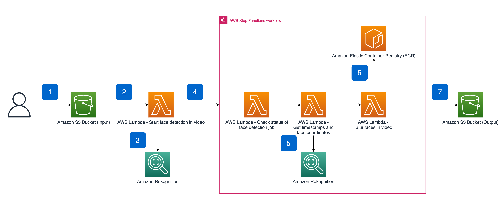

# Lambda Functions

Tutorial source: https://aws.amazon.com/blogs/machine-learning/blur-faces-in-videos-automatically-with-amazon-rekognition-video/


## Face blurring using Lambda and Step Function State Machine

Face blurring is one of the best-known practices when anonymizing both images and videos.
We will implement an event-driven system for face blurring using composition of different Lambda functions and a state machine.

Here is the high level architecture:



Let's get started.

**\* Deploy your resources in a region where [Amazon Rekognition is supported](https://docs.aws.amazon.com/general/latest/gr/rekognition.html).**

### Create the Lambda Functions

#### Create the "face-detection" function

1. Open the [Functions page](https://console.aws.amazon.com/lambda/home#/functions) of the Lambda console\.
2. Choose **Create function**\.
3. Choose **Author from scratch**.
4. Create a `Python 3.9` runtime function from scratch.
5. Copy and deploy `face-blur-lambdas/face-detection/*.py` as the function source code (use the console code editor).
6. The IAM role of this function should have the following permissions: `AmazonS3FullAccess`, `AmazonRekognitionFullAccess` and `AWSStepFunctionsFullAccess`. It's recommended to use the same IAM role for all functions!
7. Configure a trigger for an **All object create** events for a given S3 bucket on objects with `.mp4` suffix (create a bucket and enable event notification if needed).


#### Create the "check-rekognition-job-status" function

1. Create a `Python 3.9` runtime function from scratch. Choose the same IAM role as the above function.
2. Copy and deploy `face-blur-lambdas/check-rekognition-job-status/lambda_function.py` as the function source code.

#### Create the "get-rekognized-faces" function

1. Create a `Python 3.9` runtime function from scratch. Choose the same IAM role as the above function.
2. Copy and deploy `face-blur-lambdas/get-rekognized-faces/lambda_function.py` as the function source code.

#### Create the "blur-faces" function

1. Create a **Container image** Lambda function based on the Docker image built from `face-blur-lambdas/blur-faces/Dockerfile`. Use an existing Docker image, or create an ECR and build the image by:

    2. Open the Amazon ECR console at [https://console\.aws\.amazon\.com/ecr/repositories](https://console.aws.amazon.com/ecr/repositories).
    3. In the navigation pane, choose **Repositories**\.
    4. On the **Repositories** page, choose **Create repository**\.
    5. For **Repository name**, enter a unique name for your repository\.
    6. Choose **Create repository**\.
    7. Select the repository that you created and choose **View push commands** to view the steps to build and push an image to your new repository\.

2. Add the following env var to this function:
   `OUTPUT_BUCKET=<bucket-name>` where `<bucket-name>` is another bucket to which the processes videos will be uploaded (create one if needed).
3. This function is CPU and RAM intensive since it processes the video frame-by-frame. Make sure this it has enough time and space to finish (in the **General Configuration** tab, increase the timeout to 5 minutes and the memory to 2048MB).


### Create Step Function state machine

1. Open the [Step Functions page](https://console.aws.amazon.com/lambda/home#/stepfunctions) of the Lambda console\.
2. Choose **Create state machine**.
3. Choose **Write your workflow in code** and edit the JSON in the **Definition** pane as follows:
    1. Copy and paste `face-blur-lambdas/state_machine.json`
    2. Change `<check-rekognition-job-status ARN>`, `<get-rekognized-faces ARN>` and `<blur-faces ARN>` according to the corresponding Lambda functions ARN.
4. Click **Next**.
5. Enter a unique name to your state machine.
6. Under **Logging**, enable ALL logging.
7. Choose **Create state machine**.
8. Add the following env var to the **face-detection** function (the first function you've created):
   `STATE_MACHINE_ARN=<state-machine-ARN>`

### Test the system

1. Upload a sample short mp4 video to the "input" S3 bucket (you can download [this](../face-blur-lambdas/sample-video.mp4) video).
2. Observe the Lambda invocation, as well as the state machine execution flow.
3. Download the processes video from in "output" S3 bucket and watch the results.

# Self-check questions

[Enter the interactive self-check page](https://alonitac.github.io/DevOpsBootcampUPES/multichoice-questions/aws_lambda.html)

# Exercises

### :pencil2: Process new items with DynamoDB Streams and Lambda

#### Enable Streams

1. In the navigation pane on the left side of the console, choose **Tables**.
2. Choose your table from the table list.
3. Choose the **Exports and streams** tab for your table.
4. Under **DynamoDB stream details** choose **Enable**.
5. Choose **New and old images** and click **Enable stream**.

#### Create Lambda execution IAM role

1. Open the IAM console at [https://console\.aws\.amazon\.com/iam/](https://console.aws.amazon.com/iam/).

2. In the navigation pane, choose **Roles**, **Create role**\.

3. On the **Trusted entity type** page, choose **AWS service** and the **Lambda** use case\.

4. On the **Review** page, enter a name for the role and choose **Create role**\.
5. Edit your IAM role with the following inline policy
```json
{
    "Version": "2012-10-17",
    "Statement": [
        {
            "Effect": "Allow",
            "Action": "lambda:InvokeFunction",
            "Resource": "arn:aws:lambda:<region>:<accountID>:function:<lambda-func-name>*"
        },
        {
            "Effect": "Allow",
            "Action": [
                "logs:CreateLogGroup",
                "logs:CreateLogStream",
                "logs:PutLogEvents"
            ],
            "Resource": "arn:aws:logs:<region>:<accountID>:*"
        },
        {
            "Effect": "Allow",
            "Action": [
                "dynamodb:DescribeStream",
                "dynamodb:GetRecords",
                "dynamodb:GetShardIterator",
                "dynamodb:ListStreams"
            ],
            "Resource": "arn:aws:dynamodb:<region>:<accountID>:table/<dynamo-table-name>/stream/*"
        },
        {
            "Effect": "Allow",
            "Action": [
                "sns:Publish"
            ],
            "Resource": [
                "*"
            ]
        }
    ]
}
```

Change the following placeholders to the appropriate values: `<region>`, `<accountID>`, `<dynamo-table-name>`, `<lambda-func-name>`

The policy has four statements that allow your role to do the following:

+ Run a Lambda function. You create the function later in this tutorial\.
+ Access Amazon CloudWatch Logs\. The Lambda function writes diagnostics to CloudWatch Logs at runtime\.
+ Read data from the DynamoDB stream.
+ Publish messages to Amazon SNS\.

#### Create a Lambda Function

1. Open the [Functions page](https://console.aws.amazon.com/lambda/home#/functions) of the Lambda console\.

2. Choose **Create function**\.

3. Under **Basic information**, do the following:

    1. Enter **Function name**.

    2. For **Runtime**, confirm that **Node\.js 16\.x** is selected\.

    3. For **Permissions** use your created role.

4. Choose **Create function**\.
5. Enter your function, copy the content of `dynamodb_lambda_func/publishNewSong.js` and paste it in the **Code source**. Change `<TOPIC-ARN>` to your SNS topic ARN you created in the previous exercise.
6. Click the **Deploy** button.
7. On the same page, click **Add trigger** and choose your Dynamo table as a source trigger.
8. Test your Lambda function by creating new items in the Dynamo table and watch for new emails in your inbox.

