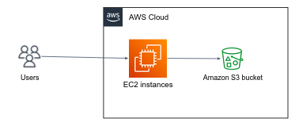

# Simple Storage Service (S3)

Amazon Simple Storage Service (Amazon S3) is an **object storage** service that offers scalability, data availability, security, and performance.
Customers of all sizes and industries can use Amazon S3 to store and protect **any amount of data** for a range of use cases, such as data lakes, websites, mobile applications, backup and restore, archive, enterprise applications, IoT devices, and big data analytics.

Amazon S3 provides management features so that you can optimize, organize, and configure access to your data to meet your specific business, organizational, and compliance requirements.

Amazon S3 is an object storage service that stores data as objects within buckets. An object is a file and any metadata that describes the file. A bucket is a container for objects.

To store your data in Amazon S3, you first create a **bucket** and specify a bucket name and AWS Region. Then, you upload your data to that bucket as **objects** in Amazon S3. Each object has a **key** (or key name), which is the unique identifier for the object within the bucket.

## Create a Bucket

1. Sign in to the AWS Management Console and open the Amazon S3 console at [https://console\.aws\.amazon\.com/s3/](https://console.aws.amazon.com/s3/)\.
2. In the left navigation pane, choose **Buckets**\.
3. Choose **Create bucket**.

   The **Create bucket** wizard opens.

4. In **Bucket name**, enter a DNS-compliant name for your bucket.

   The bucket name must:
   + Be unique across all of Amazon S3.
   + Be between 3 and 63 characters long.
   + Not contain uppercase characters.
   + Start with a lowercase letter or number.

5. In **Region**, choose the AWS Region where you want the bucket to reside.

   Choose the Region where you provisioned your EC2 instance.

6. Under **Object Ownership**, leave ACLs disabled. By default, ACLs are disabled\. A majority of modern use cases in Amazon S3 no longer require the use of ACLs\. We recommend that you keep ACLs disabled, except in unusual circumstances where you must control access for each object individually\.

8. Enable Default encryption with `SSE-S3` encryption type.

9. Choose **Create bucket**.

## Upload objects to S3 bucket from an EC2 instance

In modern cloud-based applications, S3 is often used as a central data store, while EC2 instances are used to run the application logic. When end-users interact with the application, the application processes the user input and reads or writes data to S3 on their behalf.

For instance, in a photo-sharing application like Instagram, users upload their photos via the web application. The application backend then manages the storage and retrieval of the photos from S3, allowing for efficient storage and delivery of the content.



By this means, uploading an object to S3 using the web console is useless. We are interested in communicating with S3 from within an EC2 instance, either via the `aws` cli, or Python code.

**Disclaimer:** This is not going to work. Your EC2 instance has to have permissions to operate in S3.

1. Connect to your EC2 instance over SSH.
2. Read the [examples](https://docs.aws.amazon.com/cli/latest/reference/s3api/put-object.html#examples) in AWS code and write a command to upload (`put-object`) in your S3 bucket (you may need to install the `aws` cli on your machine).
3. Got `Unable to locate credentials.` or `Access Denied`? follow the next section...

### Attach IAM role to your EC2 Instance with permissions over S3

To access an S3 bucket from an EC2 instance, you need to create an IAM role with the appropriate permissions and attach it to the EC2 instance.
The role should have policies that grant the necessary permissions to read from and write to the S3 bucket, and the EC2 instance needs to be launched with this IAM role.
IAM role will be taught soon. But for now, just follow the instructions below.

1. Open the IAM console at [https://console\.aws\.amazon\.com/iam/](https://console.aws.amazon.com/iam/)\.

1. In the navigation pane, choose **Roles**, **Create role**\.

1. On the **Trusted entity type** page, choose **AWS service** and the **EC2** use case\. Choose **Next: Permissions**\.

1. On the **Attach permissions policy** page, search for **AmazonS3FullAccess** AWS managed policy\.

1. On the **Review** page, enter a name for the role and choose **Create role**\.


**To replace an IAM role for an instance**

1. In EC2 navigation pane, choose **Instances**.

1. Select the instance, choose **Actions**, **Security**, **Modify IAM role**.

1. Choose your created IAM role, click **Save**.

## Enable versioning on your bucket

So far we've created an S3 bucket and communicate with it from within an EC2 instance.

You've probably noticed that in S3, objects can be easily lost by object override because the default behavior when uploading an object with the same key as an existing object is to replace the old object with the new one. If this happens unintentionally or due to a bug in the application code, it can result in the permanent loss of data.

The risk of data loss can be mitigated by implementing versioning in S3. When versioning is enabled, each object uploaded to S3 is assigned a unique version ID, which can be used to retrieve previous versions of the object. This allows you to recover data that was accidentally overwritten or deleted, and provides a safety net in case of data corruption or other issues.

**To enable bucket versioning**

1. Sign in to the AWS Management Console and open the Amazon S3 console at [https://console\.aws\.amazon\.com/s3/](https://console.aws.amazon.com/s3/)\.

2. In the **Buckets** list, choose the name of the bucket that you want to enable versioning for\.

3. Choose **Properties**\.

4. Under **Bucket Versioning**, choose **Edit**\.

5. Choose **Enable**, and then choose **Save changes**\.

6. Upload multiple object with the same key, make sure versioning is working.

## Create lifecycle rule to manage non-current versions

When versioning is enabled in S3, every time an object is overwritten or deleted, a new version of that object is created. Over time, this can lead to a large number of versions for a given object, many of which may no longer be needed for business or compliance reasons.

By creating lifecycle rules, you can define actions to automatically transition non-current versions of objects to a lower-cost storage class or delete them altogether. This can help you reduce storage costs and improve the efficiency of your S3 usage, while also ensuring that you are in compliance with data retention policies and regulations.

For example, you might create a lifecycle rule to transition all non-current versions of objects to `Standard-IA` storage after 30 days, and then delete them after 365 days. This would allow you to retain current versions of objects in S3 for fast access, while still meeting your data retention requirements and reducing storage costs for non-current versions.


1. Choose the **Management** tab, and choose **Create lifecycle rule**\.

1. In **Lifecycle rule name**, enter a name for your rule\.

1. Choose the scope of the lifecycle rule (in this demo we will apply this lifecycle rule to all objects in the bucket).

1. Under **Lifecycle rule actions**, choose the actions that you want your lifecycle rule to perform:
   + Transition *noncurrent* versions of objects between storage classes
   + Permanently delete *noncurrent* versions of objects

1. Under **Transition non\-current versions of objects between storage classes**:

   1. In **Storage class transitions**, choose **Standard\-IA**.

   1. In **Days after object becomes non\-current**, enter 30.

1. Under **Permanently delete previous versions of objects**, in **Number of days after objects become previous versions**, enter 90 days.

1. Choose **Create rule**\.

   If the rule does not contain any errors, Amazon S3 enables it, and you can see it on the **Management** tab under **Lifecycle rules**\.

# Self-check questions

[Enter the interactive self-check page](https://alonitac.github.io/DevOpsBootcampUPES/multichoice-questions/aws_s3.html)

# Exercises

### :pencil2: S3 pricing

Explore the [S3 pricing page](https://aws.amazon.com/s3/pricing/).

Compute the monthly cost of the below bucket characteristics:

1. us-east-1
2. S3 Standard
3. 4TB stored data
4. 40 million PUT requests.
5. 10 million GET requests.
6. 5TB inbound traffic
7. 10TB outbound traffic


### :pencil2: Objects deletion in bucket versioning enabled

In this exercise we will explore the versioning enabled bucket you've created.

1. In the **Buckets** list, choose your bucket.
2. Choose **Upload** and upload an object multiple times under the same key, such that it has non-current versions.
3. In the bucket console, choose the **Objects** tab, and delete the object you have just uploaded.
4. After the deletion action, can you see the object in the bucket's objects list?

We will examine through AWS CLI what happened.

5. From your local machine, open a command terminal with [AWS CLI](https://docs.aws.amazon.com/cli/latest/userguide/getting-started-install.html) installed.

   ```shell
   aws --version
   ```

6. List the versions of your object. Replace `<bucket-name>` by you bucket name and `<object-key>` by the object key:

   ```shell
   aws s3api list-object-versions --bucket <bucket-name> --prefix <object-key>
   ```

   Can you confirm that your object has not been deleted? Inspect `DeleteMarkers`.

7. Delete the _delete mark_ by:

   ```shell
   aws s3api delete-object --bucket <bucket-name> --key <object-key> --version-id <delete-mark-version-id>
   ```

8. Can you see the object in the bucket's object list in the AWS Web Console? Can you confirm that the object was "deleted softly"?
9. How can you **permanently** delete an object (and its non-current versions) from a version-enabled bucket?

### :pencil2: Simple UPPERCASE ETL

ETL stands for Extract, Transform, and Load, which is a process used to extract data from various sources, transform it into a more useful format, and then load it into a destination system.
Amazon S3 is often used as the source and destination for transformed data in ETL pipelines due to its durability, scalability, and cost-effectiveness.

Implement a simple ETL Python script that transforms text objects to UPPERCASE.
The script lists objects under `data/` "directory" in the bucket, processes them by changing their characters to uppercase, and uploads the processed objects to a `data_processed/` "directory" in the same bucket.

Test your script against real bucket and objects.

### :pencil2: Host static website

Follow:  
https://docs.aws.amazon.com/AmazonS3/latest/userguide/HostingWebsiteOnS3Setup.html

## Optional practice

### Create pre-signed URL

Follow (You should do it **Using the S3 console**):   
https://docs.aws.amazon.com/AmazonS3/latest/userguide/ShareObjectPreSignedURL.html

### Verify object integrity using checksum

Follow:   
https://aws.amazon.com/getting-started/hands-on/amazon-s3-with-additional-checksums/?ref=docs_gateway/amazons3/checking-object-integrity.html

### Using customer SSE

Inspired by the [following example](https://boto3.amazonaws.com/v1/documentation/api/latest/reference/services/s3.html#uploading-downloading-files-using-sse-customer-keys) from `boto3` official docs, write Python code that generates 32 bytes key and upload objects to S3 using SSE-C server-side encryption.

Try to download the object from both the web console, and your Python script.

### implement point in time restore in Python

Write Python script to perform a point-in-time restore for an object stored in a version-enabled S3 bucket.

Usage example:

```bash
python point_in_time_restore.py mybucket myobject 2023-05-01T13:45:00.000Z
```

In this specific example, the script is being run with the following arguments:

- `mybucket`: This is the name of the S3 bucket that contains the object to be restored.
- `myobject`: This is the key (or filename) of the object that needs to be restored.
- `2023-05-01T13:45:00.000Z`: This is the timestamp representing the point in time to which the object should be restored.

When the script is executed with these arguments, it will first check if versioning is enabled on the S3 bucket.
If versioning is not enabled, the script will exit and print an error message.
If versioning is enabled, the script will search for the closest previous version of the specified object based on the given timestamp.

If a previous version of the object is found, the script will perform a restore operation on that version, which will overwrite the current version of the object with the selected version.
If no previous version of the object is found, the script will exit and print a message indicating that no previous version was found.

So in this specific example, the `myobject` object in the `mybucket` S3 bucket will be restored to the version that was saved closest to May 1, 2023, at 1:45 PM (UTC).

