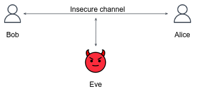
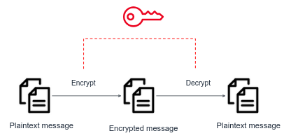
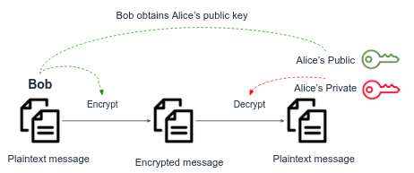
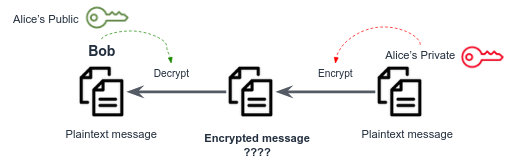

# Networking Security 

## Motivation 



Alice, Bob, and Eve are often used in cryptography to represent different entities with varying levels of trust.
Alice and Bob are usually considered trusted parties who want to communicate securely,
while Eve is an eavesdropper who wants to intercept their communication. Eve can **see and change** every message that is being sent over the channel. 

For example, Alice may represent a bank company website, while Bob is a bank customer who wants to perform some actions on his online account. 
If the communication channel is not secured (the data is sent as a plain text), Eve, as an eavesdropper, can capture the login credentials of Bob, or, change the messages that Bob sends to the Bank (e.g. send 100$ to ~~John~~ Eve's account). 

In this tutorial, we will be learning the fundamentals of network security and encryption.

## Encryption 

When Julius Caesar sent messages to his generals, he didn't trust his messengers. So he replaced every A in his messages with a D, every B with an E, and so on through the alphabet. Only someone who knew the “shift by 3” rule could decipher his messages.

And so we begin…

**Cryptography** is the science of using mathematics to encrypt and decrypt data.

A cryptographic algorithm, or **cipher**, is a mathematical function used in the encryption and decryption process.
A cryptographic algorithm works in combination with a key —a word, number, or phrase— to encrypt the plaintext.
The same plaintext encrypts to different ciphertext with different keys.

## Symmetric Key Encryption

Symmetric key encryption is a method of cryptography in which the same secret key is used for both encryption and decryption.



We'll use `openssl` to encrypt messages:

```console
myuser@hostname:~$ echo 'vv7:K0r|E[PC!JM' > .secretKey
myuser@hostname:~$ echo "I'm Bob, want to transfer 500$ to John using the following credit card number 1234 1234 1234 1234" > message.txt
myuser@hostname:~$ openssl enc -e -aes-256-cbc -salt -in message.txt -out encrypted_message.txt -pass file:.secretKey
myuser@hostname:~$ cat encrypted_message.txt
Salted__�ǝjo7....
```

The above example encrypts the content of `message.txt` using a key stored under `.secret`. 
The resulted output was create under `encrypted_message.txt`.
This file can be sent safely over any channel, since it contains Gibberish for a person who doesn't know the secret key. 

The above `openssl` command was executed with the following flags: 

- `-d`              Decrypt file
- `-aes-256-cbc`    The symmetric encryption algo name
- `-salt`           Adds a salt to the key to make it more secure.
- `-k`              User password
- `-in`             The input file
- `-out`            The output file
- `-pass`           Specifies the path to the file containing the key used for encryption (.secret in out case)

Read [openssl docs](https://www.openssl.org/docs/manmaster/man1/openssl-enc.html) for more information.  

We now want decrypt the encrypted file:

```console
myuser@hostname:~$ openssl enc -d -aes-256-cbc -salt -in encrypted_message.txt -out original_message.txt -pass file:.secretKey
myuser@hostname:~$ cat original_message.txt
I'm Bob, want to tr...
```

## Asymmetric Key Encryption

In the previous section we've seen how client and server can communicate using a shared key.
But keep in mind that this key must be agreed by both sides first. **How can both parties agree on a key if the only communication channel they have is unsecure?**
Can you come up with a way that both parties can securely exchange the secret with which they will encrypt and decrypt messages? 

We can achieve it using Asymmetric Encryption.

Asymmetric key encryption, also known as **public key cryptography**, uses a pair of related keys to encrypt and decrypt data.
One key, known as the **public key**, is shared with anyone who wants to send encrypted data to the owner of the key.
The other key, known as the **private key**, is kept secret and used to decrypt data that has been encrypted with the public key.



Let's generate a public-private key pair and encrypt messages. We will use `openssl` again.


Generate a `1024` bit length private key.
Choose an easy pass phrase for your key, so you can remember it later.

```
openssl genrsa -aes256 -out private.key 1024
```

Take a look at your private key.

Using the generated private key, generate the public key pair:

```
openssl rsa -in private.key -pubout -out public.key
```

Take a look at your private key.

Encrypt a message by:
```
openssl rsautl -encrypt -pubin -inkey public.key -in message.txt -out encrypted_message.txt
```

Can you see that only the public key has used to encrypt the message, and since public keys are not secrets, everyone can encrypt messages and send them to the owner of the public key, so he could decrypt them using his private key.

Let's decrypt the file by:
```
openssl rsautl -decrypt -inkey private.key -in encrypted_message.txt
```

## Digital Signature

Take a closer look on the below encryption scheme.
Now Alice is sending a message to Bob. She encrypts the message using her **private key**, and Bob decrypts it using Alice's **public key**.

What is wrong here?



This scheme has no meaning in terms of encryption! But it can be a useful technique to verify the **authenticity and integrity** of a message.

Remind yourself that Eve is not only able to read the transferred messages between Bob and Alice, but also to **edit** any message.
And now the parties have another concern other than privacy: how can Bob know that incoming messages from Alice are authentic? That they were not altered by Eve? 

The private key is used to **sign** the data and the recipient uses the sender's public key to verify the digital signature.

We will use the above key-pair to sign a message:

```shell
openssl dgst -sha256 -sign private.key -out signature.txt message.txt
```

Now `signature.txt` is your signature for the message `message.txt`. Alice sends **both** `message.txt` and `signature.txt` to Bob (we don't care privacy here, only authenticity!).

Bob now verifies that the message he got, `message.txt`, indeed written by Alice:

```shell
openssl dgst -sha256 -verify public.key -signature signature.txt message.txt
```

## Digital certificates

A **certificate**, simple put, is the server's public key, accompanied by some other attributes such as Organization name, Locality, Country name etc...

The certificate is **digitally signed by Certificate Authority** (CA), an entity that stores, signs, and issues digital certificates.
CA acts as a trusted 3rd party both by the client and the server.

Common CA are [DigiCert](https://en.wikipedia.org/wiki/DigiCert), [Let's Encrypt](https://en.wikipedia.org/wiki/Let%27s_Encrypt), AWS and the public cloud providers.

Why do we need that? 

When Alice first sends her public key to Bob, there is real risk that Bob receive Eve's public key, but b
When Alice first sends her public key to Bob, Bob wants to be sure that the key actually belongs to Alice and has not been tampered with or replaced by Eve. 

In a typical scenario, Alice would generate a public-private key pair and send her public key to a trusted CA along with some identifying information, such as her name or email address.
The CA would then verify Alice's identity and issue a digital certificate that contains Alice's public key and identifying information, as well as the CA's own digital signature. 
This certificate serves as proof that Alice's public key belongs to her and has not been tampered with.

Bob can then verify the certificate using the CA's public key (which is typically included in his web browser or operating system) and be reasonably sure that the key actually belongs to Alice and has not been tampered with.

## Putting it all together - HTTPS protocol and the TLS Handshake 

**Although we will be focusing on the HTTPS and TLS protocols, the discussed security techniques are widely used in many other protocols and systems.**

HTTPS (HyperText Transfer Protocol Secure) is an encrypted version of the HTTP protocol usually running on **port 443**.
It uses SSL or TLS protocol to encrypt all communication between a client and a server.
This secure connection allows clients to safely exchange sensitive data with a server, such as when performing banking activities or online shopping.

Consider the above mentioned banking scenario: Bob sends to its Bank website (represented by Alice) an HTTP request which essentially says "I'm Bob, want to transfer 500$ to John using the following credit card number....".
If no security measures are taken, Bob could be surprised in a few ways, as detailed below:

- If no **encryption** is used, an intruder (man-in-the-middle) could intercept Bob’s request and use Bob's credit card details.
- If no **data integrity** is used, an intruder could modify Bob’s transaction (e.g. change "John" to "Eve").
- Finally, if no **server authentication** is used, Bob may believe that that server he is talking with, is the original Bank website, while actually he talks with a faked website maintained by Eve, who is impersonating as the bank website. After receiving Bob’s transaction, Eve could take and use Bob’s information.

We now want to build security mechanism that provide: Privacy (encryption), Data Integrity, and Authenticity.

TLS handshake is the initial process that occurs between a client and a server when establishing a secure connection using the Transport Layer Security (TLS) protocol. It involves a series of steps including encryption negotiation, authentication, and key exchange. As detailed below: 

1. **Client hello**: The "Client hello" message is a request to the server to begin a TLS handshake.
   This message includes the TLS version supported by the client, a random value known as the client random, and a list of supported cipher suites and compression methods.
2. **Server Hello**: The server responds with a Server Hello message, which includes the TLS version selected for the connection, a random value known as the server random, and the chosen cipher suite and compression method from the client's list.
3. **Certificate**: The server sends its digital certificate, which includes its public key and other identifying information, to the client.
4. **Client Key Exchange**: The client generates a secret key (called pre-master key), encrypts it using the server's public key from the certificate, and sends the encrypted pre-master key to the server.
5. **Finished**: Both the client and server exchange "Finished" messages to confirm that they have successfully completed the handshake process.
   These messages include a hash of all the previous handshake messages, encrypted using the secret key.
6. **Secure Communication**: Once the handshake is complete, the client and server use a shared session key to symmetrically encrypt and decrypt data transmitted between them.
   The session key(s) were derived from the pre-master key. 

This process is a **simplified version** of what called the *TLS Handshake*.

## Hash functions 

A hash function is a mathematical function that takes in data of any size and produces a fixed-size output.
A simple example of a hash function is the MD5 algorithm, which generates a 128-bit hash value.
`md5sum` is a Linux command line utility used to generate and verify MD5 checksums of files.

```console
myuser@hostname:~$ echo "hello world" | md5sum
6f5902ac237024bdd0c176cb93063dc4
myuser@hostname:~$ echo "let it be" | md5sum
90b1d29ca90dac03f168407e4cd8fc15
myuser@hostname:~$ cat 5GB_file | md5sum
b638d7f49a67fe9b4c982ca3bc70066d
```

The hash function is designed to be a one-way function, which means that it is easy to compute the hash of a given input, but it is **computationally infeasible** to compute the input given its hash.
Hash functions are **deterministic**, which means that the same input data will always produce the same hash output:

```console
myuser@hostname:~$ X=$(echo "hello world" | md5sum)
myuser@hostname:~$ Y=$(echo "hello world" | md5sum)
myuser@hostname:~$ test "$X" = "$Y"
myuser@hostname:~$ echo $?
0
```

The distribution of hashed values is designed to be **uniform**, which means that different input values should produce very different hash values.
Even small changes in the input should produce significant changes in the output hash value:

```console
myuser@hostname:~$ echo "hello world" | md5sum
6f5902ac237024bdd0c176cb93063dc4
myuser@hostname:~$ echo "hello worln" | md5sum
a10a0af8e9b486a707aaccb7a752d37e
```

However, it is possible for different input values to produce the same hash value, which is called a **hash collision**.

Hash functions are commonly used to store passwords securely. 
Instead of storing the actual passwords, the hash of the password is stored in the database. 
When a user attempts to log in, the password entered is hashed and compared to the hashed password in the database. 
If they match, the user is granted access.

# Self-check questions

TBD

# Exercises

## Exercise 1 - Playing with symmetric encryption

1. Encrypt some file using `openssl`
2. Try to decrypt the encrypted file using a different secret you've used to encrypt. What happened?
3. Add some text to the encrypted file, then try to decrypt it. What happened? [Read here](https://security.stackexchange.com/questions/9437/does-symmetric-encryption-provide-data-integrity) about how openssl provides data integrity in symmetric encryption.
4. Encrypt the same file, but using a different key. Make sure different encryption is generated for different keys.

## Exercise 2 - Self-signed Certificate

In this exercise you will generate an SSL certificate. In real life, a trusted authority (like Amazon, DigiCert) should sign on your certificates, which gives them validity. But just for the learning, you will generate a certificate and sign it yourself (a.k.a. self-signed certificate). In the public Internet, there is no value for self-signed certificates, but organizations do sign their own certificates for internal usage. We will be using, right guess, `openssl`:

```bash
openssl req -x509 -newkey rsa:1024 -keyout key.pem -out cert.pem -sha256 -days 365
```

The program will ask you some identifiable information: who are you? What is the organization you belong to? your country, your mail etc... All these details, including a public key, will be encoded into a file called `cert.pem`. Note that this certificate has an expiration time of 365 days.

`cat cert.pem` to see how a certificate may look like. In the simplified TLS handshake model you’ve learned, the server's certificate is the first thing that was sent to the client.

## Exercise 3 - Authenticity verification

Under `signature_verification` in our shared repo, you are given 5 signatures and the corresponding messages. Determine which of the signatures are authentic.

## Exercise 4 - Verify the integrity of apt-get packages

Debian package verification works by checking the cryptographic hash of the package against the expected value in the package metadata. The package metadata includes the SHA-256 hash of the package contents and is signed by the package maintainer's GPG key.

In our shared repo, under `package_integrity_verification/Packages`, you are given the metadata of 2 Debian packages, visit the docker binaries server: https://download.docker.com/linux/ubuntu/, download the binaries (the .deb file) to your machine according to the path specified in `Filename:`, and verify the package integrity using the `SHA512` value.

