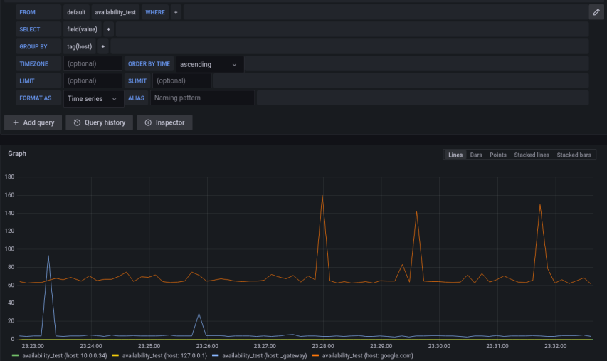

# Containers 

## Running your first container

Run the [`nginx`](https://hub.docker.com/_/nginx) container by: 

```bash 
docker pull nginx
docker run nginx
```

When you run this command, the following happens (assuming you are using the default DockerHub registry configuration):

1. Docker pulls the `nginx` image from DockerHub. 
2. Docker creates a new container from the `nginx` image. The `nginx` image is a ready-to-run container image that encapsulates the [NGINX web server](https://www.nginx.com/resources/glossary/nginx/) software, along with its dependencies and configuration. When the image is used to create a container, it provides a fully functional NGINX server environment, without the need to install and configure nginx on your machine.
3. Docker allocates a dedicated read-write filesystem to the container (which is completely different and isolated from the host machine fs). This allows a running container to create or modify files and directories in its local filesystem.
4. Docker creates a **virtual network interface** to connect the container to the network. This includes assigning an IP address to the container. By default, containers can connect to external networks using the host machine's network connection.
5. Docker starts the container.
6. When you type `CTRL+c` the container stops but is not removed. You can start it again or remove it. When a container is removed, its file system is deleted. 

## Container management and lifecycle

To see your **running** containers, type  

```bash
docker container ls 
```

or add  `-a` flag to list also stopped containers:

```console
$ docker container ls -a
CONTAINER ID   IMAGE     COMMAND                  CREATED              STATUS                      PORTS     NAMES
d841a2fe07f9   nginx     "/docker-entrypoint..."   About a minute ago   Exited (0) 14 seconds ago             funny_blackburn
```

In the above output: 

- `d841a2fe07f9` is the **container ID** - a unique identifier assigned to each running container in Docker.
- `/docker-entrypoint...` is the (beginning) of the actual linux command that has run to initiate the process of the container. 
- `funny_blackburn` is a random alphabetical name that docker assigned to the container. 


### Try it yourself

Pull and run the container [`hello-world`](https://hub.docker.com/_/hello-world).

1. What is the status of the container after some moments  of running?
2. Use `docker images hello-world` to get some information about the image from which the container has run. What is the image size?
3. What is the command used to launch the container `hello-world`? 


### Override the default command 

When the nginx image was built (we will build our own images soon), Docker allows us to specify a default command that defines what is executed when a container is started from the image.
However, you can override the default execution command by providing a new command as arguments when running the `docker run` command.

To override the default command, simply append the desired command to the **end** of the `docker run` command.

Let's say you want to run the same above `nginx` container, but you want to modify the default command so nginx is running in debug mode. You can override the default command by:

```bash 
docker run nginx nginx-debug -g 'daemon off;'
```

In the above example, the `nginx` container will be initiated using the command `nginx-debug -g 'daemon off;'`. 

Here is another very useful example: 

```bash 
docker pull ubuntu
docker run -it ubuntu /bin/bash
```

The command starts a new Docker container using the [Ubuntu image](https://hub.docker.com/_/ubuntu) and launches an interactive terminal session within the container.

Here's what each part of the command does:

1. `docker run` instructs Docker to create and start a new container.
2. `-it` is a combination of two flags: `-i` keeps STDIN open for the container, and `-t` allocates a pseudo-TTY to allow interaction with the container's terminal.
3. `ubuntu` refers to the Ubuntu image, which is pulled from Docker Hub if not already available locally.
4. `/bin/bash` specifies the command to be executed within the container, in this case, launching a Bash shell.

When you run this command, a new container based on the Ubuntu image is created, and you are provided with an interactive, fresh and beloved `bash` terminal session inside the container.
This allows you to directly interact with the Ubuntu environment, run commands, and perform operations within the isolated containerized environment.

Feel free to go wild, you are within a container :-)

> ### :pencil2: Playing with the running container
> 
> In your open Ubuntu container terminal session:
> 
> 1. What is the current user?
> 2. What is the hostname? 
> 3. Is the container connected to the internet? Can you ping `google.com`? Oh, don't have the `ping` command? Install it inside the container!
> 4. What is the user's home directory? 
> 5. How many processes are running in the container? What could that indicate? 
> 6. Do you have `docker` installed in the container? 


### Interacting with containers

In addition to starting a new container with an interactive terminal session using docker run `-it`, you can also interact with **running** containers using the `docker exec` command.

The `docker exec` command allows you to execute a command inside a running container. Here's the basic syntax:

```bash 
docker exec [OPTIONS] CONTAINER COMMAND [ARG...]
```

Let's see it in action...

Start a new `nginx` container and keep it running. Give it a meaningful name instead the one Docker generates: 

```bash 
docker run --name my-nginx nginx 
```

Make sure the container is up and running. Since the running container occupying your current terminal session, open up another terminal session and execute:

```console
$ docker container ls
CONTAINER ID   IMAGE     COMMAND                  CREATED              STATUS              PORTS     NAMES
89cf04f27c04   nginx     "/docker-entrypoint.…"   About a minute ago   Up About a minute   80/tcp    my-nginx
```

Now say we want to debug the running `nginx` container, and perform some maintenance tasks, or executing specific commands within the containerized environment, we can achieve it by:

```bash 
docker exec -it my-nginx /bin/bash
```

And you're in... You can execute any command you want within the running `my-nginx` container. 

**Tip**: if you don't know the container name, you can `exec` a command also using the container id:

```bash 
docker exec -it 89cf04f27c04 /bin/bash
```

> ### :pencil2: Playing with the Nginx container
> 
> How many running processes does the container run? Hint:  you can use the `docker top` command.
> The first process is the nginx master process, and the rest are workers that should serve incoming requests to the webserver. 
> 
> You are told that the nginx configuration file is located under `/etc/nginx/nginx.conf`.
> 
> Install `nano` in the container, and edit the `nginx.conf` as follows:
> 
> ```text
> - worker_processes  auto;
> + worker_processes  1;
> ```
> 
> Save the file. Stop and start the container again, waa the number of workers changed?


### Inspecting a container 

The `docker inspect` command is used to retrieve detailed information about Docker objects such as containers, images, networks, and volumes. It provides a comprehensive JSON representation of the specified object, including its configuration, network settings, mounted volumes, and more.

The basic syntax for the docker inspect command is:

```bash 
docker inspect [OPTIONS] OBJECT
```

Where `OBJECT` represents the name or ID of the Docker object you want to inspect.


Inspect your running container by:

```console
$ docker inspect my-nginx
....
```


### Running containers in the background 

When running containers with Docker, you have the option to run them in the background, also known as **detached mode**. This allows containers to run independently of your current terminal session, freeing up your terminal for other tasks.

To run a container in the background, you can use the `-d` or `--detach` flag with the docker run command. 

Let's run another nginx container: 

```console
$ docker run -d --name my-nginx-2 nginx
310f1c48e402648ce4db41817dd76027d4528e481b25e985296fccc83421ddcb
```

When a container is running in the background, Docker assigns a unique container ID and displays it as output. You can use this ID to reference and manage the container later.

To view the list of running containers, you can use the `docker ps` command.
This command lists all the running containers along with their respective container IDs, names, and other information.

Since `my-nginx-2` is running in the background, the `docker logs` command can help you to view the logs generated by a running Docker container.
It allows you to retrieve and display the standard output (stdout) and standard error (stderr) logs generated by the container's processes.


```console
$ docker logs my-nginx-2
/docker-entrypoint.sh: /docker-entrypoint.d/ is not empty, will attempt to perform configuration
/docker-entrypoint.sh: Looking for shell scripts in /docker-entrypoint.d/
....
```

If you want a real-time view, add the `-f` (`--follow`) flag. 

```console
$ docker logs my-nginx-2 -f
...
```

### Killing, stopping and removing containers 

The `docker container stop` command is used to stop one or more running containers in Docker.
It **gracefully stops** the containers by sending a `SIGTERM` signal to the main process running inside each container and then waits for a specified timeout (default is 10 seconds) before forcefully terminating them with a `SIGKILL` signal if needed.

```bash
docker container stop my-nginx-2
```

The `docker container kill` command is used to forcefully terminate one or more running containers in Docker. It immediately sends a `SIGKILL` signal to the main process running inside each container, causing them to stop abruptly without any graceful shutdown.

Stopped or killed containers can be restarted using the `docker container start` command, which resumes their execution from the point where they were stopped or killed. 


#### Restarting a stopped container

When you restart a stopped container using the docker container start command, it resumes execution from the point where it was previously stopped.
The container retains its configuration and any changes made inside the container's file system prior to stopping.


#### Restarting a killed container (you'll barely use it...)

When you restart a killed container using the docker container start command, it starts fresh from the beginning, as if it were a newly created container.
It's essentially starting a new instance of the container based on the original image and configuration.
The container does not retain any previous state or changes made inside the container before it was killed.


It's worth noting that the state of a container (stopped or killed) does not affect the Docker images associated with it. Docker images remain unchanged and can be used to create and start new containers as needed.

The `docker container rm` command is used to remove one or more stopped or killed containers from Docker. 
It allows you to delete containers that are no longer needed, freeing up disk space and cleaning up resources.
It's important to note that the containers you wish to remove must be in a stopped state. If you attempt to remove a running container, you will encounter an error. 

```bash
docker container stop my-nginx my-nginx-2
docker container rm my-nginx my-nginx-2
docker contianer ls -a 
```

**Tip**: The `--rm` flag in the `docker run` command is used to automatically remove the container when it exits or stops running. It can be handy when you don't want to retain the container after it has served its purpose.

```bash
docker pull busybox
docker run --rm busybox wget google.com
```

### Start containers automatically

In Docker, the container restart policy determines the actions to be taken by the Docker daemon when a container exits or encounters an error. 
The restart policy can be specified during container creation using the `--restart` flag with the `docker run` command.

| Flag             | Description                                                                                     |
|:-----------------|:------------------------------------------------------------------------------------------------|
| `no`             | Do not automatically restart the container. (the default)                                       |
| `on-failure[:max-retries]`     | Restart the container if it exits due to an error, which manifests as a non-zero exit code.  Optionally, limit the number of times the Docker daemon attempts to restart the container using the `:max-retries` option.   |
| `always`         | Always restart the container if it stops. If it is manually stopped, it is restarted only when Docker daemon restarts or the container itself is manually restarted. (See the second bullet listed in [restart policy details](#restart-policy-details)) |
| `unless-stopped` | Similar to `always`, except that when the container is stopped (manually or otherwise), it is not restarted even after Docker daemon restarts. |

The following example starts a `nginx` container and configures it to always
restart unless it is explicitly stopped or Docker is restarted.

```console
$ docker run -d --restart unless-stopped nginx
```

### Published ports

By default, when you run a container using the `docker run` command, the container doesn't expose any of its ports to the outside world.
To make a port available to services outside of Docker, or to Docker containers running on a different network, use the `--publish` or `-p` flag. 
This creates a firewall rule in the container, mapping a container port to a port on the host machine to the outside world.

Here are some examples:

| Flag value                      | Description                                                                                                                                           |
| ------------------------------- | ----------------------------------------------------------------------------------------------------------------------------------------------------- |
| `-p 8080:80`                    | Map TCP port 80 in the container to port `8080` on the host machine.                                                                                   |
| `-p 192.168.1.100:8080:80`      | Map TCP port 80 in the container to port `8080` on the host machine for connections to host IP `192.168.1.100`.                                        |
| `-p 8080:80/udp`                | Map UDP port 80 in the container to port `8080` on the host machine.                                                                                   |
| `-p 8080:80/tcp -p 8080:80/udp` | Map TCP port 80 in the container to TCP port `8080` on the host machine, and map UDP port `80` in the container to UDP port `8080` on the host machine. |


To run an `nginx` container with port `80` exposed (the default port in which nginx is listening port incoming requests), you can use the `docker run` command with the `-p` or `--publish` option.
Here's the command:

```bash
docker run --name nginx3 -p 8080:80 nginx
```

`-p 8080:80` maps port 80 **in the container** to port 8080 **in the host machine**. 

You can then access the nginx web server by opening a web browser and navigating to `http://localhost:8080`.

More docker networking topics will be covered in next chapters. 

Explore the running nginx container logs, can you see a log indicating your request you've just performed from the web browser? 
Try to run the container without the `-p` flag and check that the nginx container is not accessible.  


### Set environment variables for containers

When running a container using the `docker run` command, you can specify environment variables using the `-e` or `--env` flag.
For example:

```bash
docker run -d -e MY_VAR=my_value --name nginx4 nginx
```

### Container configuration files 

Under the `/var/lib/docker/containers` directory, you will find subdirectories corresponding to each container running on your host machine. Each container has its own unique directory, named after the container ID. Inside each container's directory, you can find the following files and directories:

1. `config.v2.json`: This file contains the configuration settings for the container, including details like the image used, environment variables, container networking, and more.
2. `hostconfig.json`: This file stores the configuration settings related to the container's host-specific configuration, such as port bindings, volume mounts, resource limits, and more.
3. `hostname`: This file contains the hostname assigned to the container.
4. `resolv.conf`: This file represents the container's DNS configuration (will be discussed in further modules).
5. `mounts/`: This directory contains information about the mounted volumes associated with the container (will be discussed in further modules). 
6. `networks/`: This directory stores information about the container's network interfaces, such as IP addresses, network settings, and more (will be discussed in further modules).
7. `*.log`: Depending on your container's logging configuration, you may find log files in this directory. By default, Docker uses the JSON-file logging driver, and log files are stored in `/var/lib/docker/containers/<container_id>/<container_id>.log`.

# Self-check questions

[Enter the interactive self-check page](https://alonitac.github.io/DevOpsBootcampUPES/multichoice-questions/docker_containers.html)


# Exercises

### :pencil2: Communication between containers and the internet

Run two [`ubuntu`](https://hub.docker.com/_/ubuntu) containers named `ubuntu1` and `ubuntu2`.
Use the `-it` flags to make an interactive interaction with the running containers using a tty terminal.

Your goal is to be able to successfully `ping` the `ubuntu1` container from `ubuntu2`, i.e. to verify communication between the two containers.
Install ping if needed, `inspect` the containers to discover their IP addresses.


### :pencil2: Availability test service

In this exercise, you will run a bash script which continuously monitor the availability of a pre-determined set of servers using the `ping` command.
It sends the ping results to an [InfluxDB database](https://www.influxdata.com/) and displays results in [Grafana dashboard](https://grafana.com/grafana/dashboards/).

InfluxDB is a time-series database designed to handle high volumes of timestamped data.
The database is listening on port `8086`, which should be published to the host machine.

Grafana is an open-source platform for data visualization and monitoring
The server is listening on port `3000`, which should be published to the host machine as well.

No need to install the InfluxDB or Grafana on your system, as they will be run as containers in pre-built images.
Before you run the availability test script, let's run the [InfluxDB container](https://hub.docker.com/_/influxdb) and the [Grafana container](https://hub.docker.com/r/grafana/grafana-oss).

1. Run the InfluxDB container first. **You should run a specific image version:** `influxdb:1.8.10`.
   In the `docker run` command, define the `INFLUXDB_ADMIN_USER` and `INFLUXDB_ADMIN_PASSWORD` with a custom admin user and password of your choice.
   Furthermore, define `INFLUXDB_HTTP_AUTH_ENABLED` to be equal to `true`.

2. In order to write data to InfluxDB, we need to create a database first. In another new terminal session, create a database named `hosts_metrics` in which the test data will be stored. To do so, perform the following POST HTTP request:

```shell
curl -X POST 'http://localhost:8086/query' -u <your-username>:<your-password> --data-urlencode "q=CREATE DATABASE hosts_metrics"
```
Upon successful creation, you'll get the following output: `{"results":[{"statement_id":0}]}`.

3. Next, run the Grafana container: `docker run -d --name=grafana -p 3000:3000 grafana/grafana`.
   After initialization, visit your server in [http://localhost:3000](http://localhost:3000).
    1. Default username and password is `admin`.
    2. Now we want to integrate InfluxDB as a data source in Grafana. On the left menu, under **Configuration** button, click **Data sources**.
    3. In the opened configuration console, choose **Add data source**, then choose **InfluxDB**.
    4. In the data source setting page, under **HTTP** section **URL** field, enter influxDB url: `http://<influc-db-container-ip>:8086`.
    5. In **Auth** section, turn on the **Basic auth** toggle, and enter the InfluxDB username and password in the appropriate fields below.
    6. In **InfluxDB Details** section, under **Database** enter your db name: `hosts_metrics`.
    7. Finally, click **Save & Test**, and make sure you get the _Data source is working_ message.

4. Now you are read to run the availability test script. The code is available under `availability_agent/agent.sh` in our shared repo.
   In the `agent.sh` file, change the variables according to your username and password:
   ```bash
   DB_USERNAME="<your-username>"
   DB_PASSWORD="<your-password>"
   ```
5. Run the script by:
   ```bash
   cd availability_agent
   bash agent.sh
   ```

The running script should start to monitor the hosts specified in the `hosts` file, and write the results into InfluxDB.

6. Let's visualize the results in Grafana:
7. In the grafana server, click the **Explore** button. In the exploration panel, build a graph of the test results over time. Your graph should look similar to the bellow screenshot.   
   

