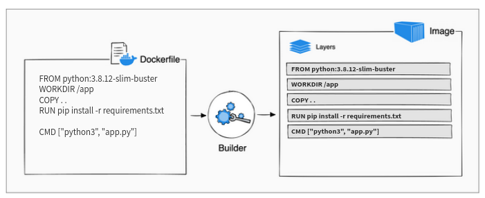
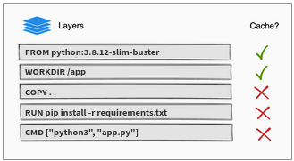

# Docker images

## Docker registry

Where do the images we've run in the previous module come from?

The images used in Docker, including the ones you've run in the previous module, typically come from **Docker registries**.
A Docker registry is a centralized repository for storing and distributing container images.
It serves as a hub where you can find pre-built container images created by others or upload and share your own images.

By default, Docker pulls images from the [DockerHub registry](https://hub.docker.com/), which is a public registry provided by Docker. 
Docker Hub hosts a vast collection of official and community-contributed images for a wide range of applications and operating systems.
It is a popular source for finding and sharing container images.

However, Docker also allows you to work with **private registries**. Organizations often set up private registries to store proprietary or sensitive container images.
Private registries offer control over image distribution, access control, and integration with other deployment pipelines or processes.

## Image tags 

In Docker, **image tags** are labels attached to container images that help identify specific versions, variations, or configurations of an image.
They allow users to differentiate and reference different image versions or variations based on the tags assigned to them.

By default, when pulling an image without specifying a tag, Docker assumes the `latest` tag.
This tag represents the most recent version of the image available in the repository.

```console
$ docker pull python
Using default tag: latest
latest: Pulling from library/python
4eedd9c5abf7: Pull complete 
9cdadd40055f: Pull complete 
2a12d0031f3f: Pull complete 
24685c45a066: Pull complete 
6ba57ec00f34: Pull complete 
71bcc9787aa7: Pull complete 
Digest: sha256:30f9c5b85d6a9866dd6307d24f4688174f7237bc3293b9293d590b1e59c68fc7
Status: Downloaded newer image for python:latest
docker.io/library/python:latest
```

The above command pulls the latest version of the `python` docker image. 

We can also notice the image SHA digest, and the full URI address:

- **Image SHA digest** is a unique identifier calculated from the contents of a Docker image. It represents the specific version and content of the image, providing a reliable reference for ensuring image integrity, version control, and reproducibility.
- The image full **URI address** is `docker.io/library/python:latest`.

It's important to note that relying solely on the `latest` tag may lead to unexpected behavior or compatibility issues, as it may change over time as new versions are released.
Alternatively, you want to explicitly specify a version tag:

```console
$ docker pull python:3.9.16
3.9.16: Pulling from library/python
918547b94326: Already exists 
5d79063a01c5: Already exists 
4eedd9c5abf7: Already exists 
9cdadd40055f: Already exists 
2a12d0031f3f: Already exists 
cea461a97d87: Pull complete 
a48c72dfa8c4: Pull complete 
c343b921680a: Pull complete 
Digest: sha256:6ea9dafc96d7914c5c1d199f1f0195c4e05cf017b10666ca84cb7ce8e2699d51
Status: Downloaded newer image for python:3.9.16
docker.io/library/python:3.9.16
```

## Semantic version for image tags 

While the image creator can decide the way she tags her images, many organizations (including the above `python` image you've pulled) follow specific tagging method called [**semantic version**](https://semver.org/), or **SemVer**. 

Take a look on the `python` image version: `3.9.16`. Each component has a specific meaning, given a version number `MAJOR.MINOR.PATCH`:

1. Increment the `MAJOR` version when you make **incompatible** API changes.
2. Increment the `MINOR` version when you **add functionality** in a backward compatible manner.
3. Increment the `PATCH` version when you make backward compatible **bug fixes**.

> ### :pencil2: Test yourself
> 
> Assume you have an app exposing an API for your clients. For each of the following changes, decide the increment:
> 
> Given version `1.14.0`:
> 
> 1. What is the next version after a variable name refactor?
> 2. What is the next version after adding a new endpoint to the api?
> 3.  What is the next version after changing the api endpoint from `/uploading` to `/upload`.


## Image manipulations 

You can manage docker images is a similar way you've managed containers. 
List available images with `docker images`, pulling images from a registry using `docker pull`, pushing images to a registry with `docker push`, removing images using `docker image rm`, and inspecting image details with `docker inspect`, among others.

## Build images 

It's time to learn how to build your own images.
In the below example, we will build the Flask application under `simple_flask_webserver`. 

A **Dockerfile** is a text document in which you tell docker how to containerize an application.

Assume you start with a clean version of Ubuntu and want to run a Python application.
The natural approach might involve manual installation steps such as using `apt-get` to update the system, installing Python, install app dependencies using `pip`, setting up the application environment, and configuring runtime settings.

A Dockerfile provides a declarative and automated way to define all these steps as instructions for docker to build. 
The final result after building an image according to a Dockerfile is a self-contained and portable artifact that encapsulates the application code, its dependencies, and the runtime environment. 
This image can be run as a container on any system that has Docker installed, ensuring consistent behavior and eliminating the need for manual setup and configuration.

Here's the Dockerfile you'll use as the starting point in order to pack our app into an image:

```dockerfile
FROM python:3.8.12-slim-buster
WORKDIR /app
COPY . .
RUN pip install -r requirements.txt

CMD ["python3", "app.py"]
```

Under `simple_flask_webserver`, create a file called `Dockerfile` (note the capital `D`) and copy the above content. We will explain each line soon.
For now, let' build an image out of it.

Open up a terminal where the current working directory is `simple_flask_webserver`. Then build the image using the `docker build` command:

```bash
docker build -t my_flask_app:0.0.1 .
```

The working directory from which the image is built is called the **Build context**.
In the above case, the `.` at the end of the command specifying to docker that the "current working directory", is the build context. 
The docker daemon looks by default for a file called `Dockerfile` and builds the image according to the instructions specified in the Dockerfile. 

Run a container based on your built image, the image name is `my_flask_app:0.0.1`.
The app listens to port `8080`, publish this port to the host machine, so you can visit the app from your web browser. 

## The Dockerfile

A Docker build consists of a series of ordered build instructions.

### Base image - the `FORM` instruction

All Docker images start with a **base image**, and as changes are made and new content is added to the image, new layers are added on top of the base image.
The [`FROM` instruction](https://docs.docker.com/engine/reference/builder/#from) uses the official [`python:3.8.12-slim-buster`](https://hub.docker.com/layers/library/python/3.8.12-slim-buster/images/sha256-a5a7a63d6493977b0f13b1cb3a3764dba713a49baf6b87d3a53d547c41f90b2c?context=explore) image as the base image upon which our image will be built.
This base image is a docker image itself (based on the [`debian`](https://hub.docker.com/_/debian) image), which provides a lightweight and minimalistic version of the Python runtime environment, allowing developers to build and run Python applications without the need to install Python in the image from scratch.

So, our image is based on a Python base image, which in turn based on a Debian base image. 
What is the Debian image based on?

Based on [Hindu mythology](https://en.wikiquote.org/wiki/Turtles_all_the_way_down), the Debian image rest on the back of an elephant which rested in turn on the back of a turtle,
what did the turtle rest on? Another turtle. And that turtle? 'Ah, Sahib, after that it is turtles all the way down.'.

Back to the Docker world... all images are based on the [`scratch`](https://hub.docker.com/_/scratch) "image". 
The `FROM scratch` is a special instruction used in a Dockerfile to indicate that you are starting the image from scratch, without using any existing base image.
When `FROM scratch` is specified, it means you are creating the image from the bare minimum, without including any pre-built operating system or runtime environment.

### Working dir - the `WORKDIR` instruction

The [`WORKDIR` instruction](https://docs.docker.com/engine/reference/builder/#workdir) in a Dockerfile is used to set the working directory for any subsequent instructions within the Dockerfile. 
It allows you to define the directory where commands such as `RUN`, `CMD`, `COPY`, and `ADD` will be executed.

In our example, we set the working directory inside the container to `/app`.

By setting the working directory, you avoid having to specify the full path for subsequent instructions, making the Dockerfile more readable and maintainable.

### Copying files from the build machine into the image - the `COPY` instruction

The `COPY <src> <dst>` instruction copies new files or directories from the `<src>` path in the host machine, and adds them to the filesystem of the image at the path `<dst>`.

In our example, we copy the file under the `.` path, which is the current working directory **relative to the build context**, into the image's filesystem working directory, which is `/app` according to what specified in `WORKDIR`.

### The `.dockerignore` 

The `.dockerignore` file is used to specify which files and directories should be excluded from the Docker build context when building an image.
It works similarly to `.gitignore`, where you can list patterns to match files and directories that should be ignored.

### Execute commands in the image - the `RUN` instruction

The [`RUN` instruction](https://docs.docker.com/engine/reference/builder/#run) in a Dockerfile is used to execute commands during the image build process. 
It allows you to run any valid command or script inside the image that is being created.

Naturally, after you've copied the application files, you need to install the Python dependencies specified in the `requirements.txt` file. 
The `RUN pip install -r requirements.txt` instruction does so. 

Note that `pip` is already available for you as part of the Python base image. 

### Define the command to run a container - the `CMD` instruction

The [`CMD` instruction](https://docs.docker.com/engine/reference/builder/#cmd) in a Dockerfile is used to specify the default command to run when a container based on the image is started. 
It defines the primary executable or process that should be executed within the container.

In our example, we specify the command to run when the container starts, which is `python3 app.py`.

## Image layers

Roughly speaking, each instruction in a Dockerfile translates to an **image layer**.
The following diagram illustrates how a Dockerfile translates into a stack of layers in a container image.



Let's inspect our built image to see how many layers it is composed by:

```bash
$ docker inspect my_flask_app:0.0.1
...

"Layers": [
    "sha256:e5baccb54724b971f73bbfa46d477b947c9066e4040d0e002e8f04314f58b58f",
    "sha256:5d5d684babe65e924137de0350bce27de63e020f36f90df2df3945b815da987a",
    "sha256:469c8dbcb08a7df265edd06cbf957468d3fd73d3add2c9019c18489eae25b0e7",
    "sha256:e41449df8276a577a88196e62e8c5d6d5dc563d5a3f492df2f286d644e514e5c",
    "sha256:6fafa3f6471656dc070c41adb6871731228515ba93f665c0b1c021ac66aeb27d",
    "sha256:40182d322937358effd2025643dc18ef2cb4d3fdd57817db23dcad0b62bd213f",
    "sha256:ae7b28ccc5a71e49f37d8a616b0f759d65a4fb6355e0802f019030f76bcdf903",
    "sha256:61752aa4479e659cdf4e448734c799bcb8d06622ccc939bf0f6188bb98512219"
]

...
```

The above example shows the 8 layers that the `my_flask_app:0.0.1` image is composed with.

Further inspection can discover that the first 5 layers belongs to the base image:

```bash
$ docker inspect python:3.8.12-slim-buster
...
"Layers": [
    "sha256:e5baccb54724b971f73bbfa46d477b947c9066e4040d0e002e8f04314f58b58f",
    "sha256:5d5d684babe65e924137de0350bce27de63e020f36f90df2df3945b815da987a",
    "sha256:469c8dbcb08a7df265edd06cbf957468d3fd73d3add2c9019c18489eae25b0e7",
    "sha256:e41449df8276a577a88196e62e8c5d6d5dc563d5a3f492df2f286d644e514e5c",
    "sha256:6fafa3f6471656dc070c41adb6871731228515ba93f665c0b1c021ac66aeb27d",
]
...
```

The rest 3 layer are the ones create by the `COPY`, `RUN` and `CMD` instructions in our Dockerfile. 

### Layer caching 

When you run a build, docker attempts to reuse layers from earlier builds. 
If a layer of an image is unchanged, then docker picks it up from the build cache.
If a layer has changed since the last build, that layer, **and all layers that follow**, must be rebuilt.

The Dockerfile from the previous section copies all project files to the container (`COPY . .`) and then downloads and installs application dependencies in the following step (`RUN pip install -r requirements.txt`).
If you were to change any of the project files, that would invalidate the cache for the `COPY` layer.
It also invalidates the cache for all of the layers that follow.



The current order of the Dockerfile instruction make it so that the builder must download and install the Python dependencies again, despite none of the packages having changed since last time.

You can avoid this redundancy by reordering the instructions in the Dockerfile.

Try to redesign your Dockerfile to utilize Docker's caching system better. 
Don't hesitate to add more `COPY` instructions as needed. 

## Image size is matter 

When it comes to Docker images as part of [microservices architecture](https://microservices.io/), big is bad!
Images should be as small as possible. Big images are hard to work with by means of the time it takes to pull an image and run it as a container. 

Another critical reason is potential vulnerabilities. 
Containers are designed to run just one application or service, so they only include the necessary code and dependencies for that specific purpose. 
The bigger your images are, a larger your attack surface, because your image contains more binaries and packages that can potentially have security vulnerabilities. 

The [official Alpine Linux](https://hub.docker.com/_/alpine/tags) Docker image is about 3.25MB in size and is an extreme example of how small Docker images can be.

Built your images only with what you need to run the application. 

## More Dockerfile instructions 

Let's see some other useful instructions: 

### The `ADD` instruction

The [`ADD` instruction](https://docs.docker.com/engine/reference/builder/#add), similarly to `COPY`, copies new files, directories from the host machine to the built image. 
`ADD` has more advanced functionality that `COPY` doesn't have. 

For example, `ADD` allows `<src>` to be a URL:

```dockerfile
ADD --checksum=sha256:24454f830cdb571e2c4ad15481119c43b3cafd48dd869a9b2945d1036d1dc68d https://mirrors.edge.kernel.org/pub/linux/kernel/Historic/linux-0.01.tar.gz /
```

The instruction downloads the file located at the specified URL and add it to the root directory (`/`) of the Docker image.
The `--checksum` option ensures that the downloaded file's SHA256 checksum matches the specified value before adding it to the image.

### Executable containers - the `ENTRYPOINT` instruction

The [`ENTRYPOINT` instruction](https://docs.docker.com/engine/reference/builder/#entrypoint)) is used to specify the main executable for the container.
You can optionally provide additional arguments using the `CMD` instructions.

For example, the Nginx official Dockerfile specifies: 

```dockerfile
FROM debian:11-slim

# ...

ENTRYPOINT ["/docker-entrypoint.sh"]
CMD ["nginx", "-g", "daemon off;"]
```

In the above configurations, the executed command when running an nginx container is:

```bash
/docker-entrypoint.sh nginx -g daemon off;
```

In such way, `ENTRYPOINT` sets the primary command that cannot be easily overridden, while `CMD` provides default arguments to the `ENTRYPOINT`.
Since `CMD` can be overridden by the user running the `docker run`, using them together allows for defining a default behavior for the container, while still providing flexibility for customization.

Images built with the `ENTRYPOINT` instruction are commonly referred as **executable containers** that can be run consistently across different environments, ensuring the application runs as intended without the need for manually specifying the command every time the container is started.

That's all for Dockerfile instructions. 

While there are several [instructions available](https://docs.docker.com/engine/reference/builder/) to use within Dockerfiles, it's not necessary to learn every single instruction in detail, as familiarity with the commonly used instructions is sufficient for creating and customizing Docker images.

## Docker image vulnerabilities

Sometimes, docker images can contain security vulnerabilities, either by using vulnerable base image, or install insecure package.
Docker image security scanning is a process of identifying known security vulnerabilities in the packages listed in your Docker image.
This gives you the opportunity to find vulnerabilities in container images and fix them before deploying image to production environments.

The [Snyk](https://docs.snyk.io/products/snyk-container/snyk-cli-for-container-security) Container command line interface helps you find and fix vulnerabilities in container images on your local machine.

1. You must first to [Sign up for Snyk account](https://docs.snyk.io/getting-started/create-a-snyk-account).
2. Install [Snyk CLI](https://docs.snyk.io/snyk-cli/install-the-snyk-cli).
3. Get your API token from your [Account Settings](https://app.snyk.io/account) page.
4. Use `sync auth` to authenticate in Snyk API. Alternatively, set the `SNYK_TOKEN` environment variable with the API token as a value.
5. You can easily [scan docker images](https://docs.snyk.io/products/snyk-container) for vulnerabilities:

```shell
# will scan ubuntu docker image from DockerHub
snyk container test ubuntu 

# will alarm for `high` issues and above 
snyk container test ubuntu --severity-threshold=high
 
# will scan a local image my-image:latest. The --file=Dockerfile can add more context to the security scanning. 
snyk container test my-image:latest --file=Dockerfile
```

## Multi-stage builds 

Docker multi-stage builds are used to create optimized Docker images by copying artifacts you build in other images into your main image.
Here's a simple example demonstrating the use of multi-stage builds:

```dockerfile
FROM golang:1.17 AS builder
WORKDIR /app
COPY . .
RUN go build main.go

FROM alpine:latest
WORKDIR /app
COPY --from=builder /app/main .
ENTRYPOINT ["./main"]
```

In the first build stage (the `builder` image), we use the `golang:1.17` image which contains the Go programming language and its development tools pre-installed.
We then copy our source code and compile our app using the `go build` build tool. 
We ended up with a single binary (also known as **Build Artifact**), which contains all we need to run our app.

Now that our app is compiled and packed into a single artifact, we have nothing to do with the Go compiler and other Go-specific tools that were needed to compile and build our Go application, which are part of the `golang:1.17` image.
Instead of working hard to clean and minimize our original image, we are starting **another build stage** using the `alpine:latest` base image and copy into it only what we need - the compiled `/app/myapp` artifact from the previous build image. 

At the end, Docker discards any intermediate build and keep only the final stage image.
By using multi-stage builds, we can take advantage of the build stage to compile and build the application, and then copy only the necessary artifacts into the final stage, resulting in a smaller and more optimized Docker image.

# Self-check questions

[Enter the interactive self-check page](https://alonitac.github.io/DevOpsBootcampUPES/multichoice-questions/docker_images.html)

# Exercises

### :pencil2: Push to DockerHub

[Create a free account](https://docs.docker.com/docker-id/) in DockerHub

Push the built `my_flask_app:0.0.1` image to your registry.

### :pencil2: Image build

The "Build with Docker" is a great official tutorial that covers basic topics as image build, as well as advanced topic as multi-stage builds.

Follow it and complete steps 1 (Introduction), 2 (Layers), 3 (Multi-stage):   
https://docs.docker.com/build/guide/

### :pencil2: Reduce image size using multi-stage builds

In our shared repo, you'll find a simple "Hello World" under `hello_world_go`.

Build an image while the build context is this directory.

Once without utilizing multistage builds:

```dockerfile
FROM golang:1.17
WORKDIR /app
COPY . .
RUN go build main.go
ENTRYPOINT ["./main"]
```

Then build the image as specified in the multi-stage example.
Compare the image size.

### :pencil2: fix vulnerability scanning

Use the `snyk container test` command to perform vulnerabilities scan to your `my_flask_app` image.

How many issues were found in total? How critical, high, medium, low?
Follow the **Recommendations for base image upgrade:** section in Snyk's report to build another version of `my_flask_app` image with another base image to mitigate critical and high vulnerabilities.

## Optional practice

### Build the 2048 game

The 2048 game source code is available in this git repo: https://github.com/gabrielecirulli/2048

Use the `nginx:1.23.3-alpine-slim` base image to pack this game in a docker image.
Run a container from the newly built image, and make sure you can play the game:

```bash
docker run -p 8080:80 my-2048-game
```

### Parametrized build

The [ARG instruction](https://docs.docker.com/engine/reference/builder/#arg) in Dockerfile allows you to define variables that users can pass at build-time to customize the build process.
These variables can be used during the build to define defaults, or pass values into the image at build-time.
`ARG` variables are not persisted in the final image and are only available during the build process.

Use `ARG` to generalize the build process of the `my_flask_app` image you've built in the last module.
Allow to specify a dynamic python value in the build command, for example:

```bash
docker build -t my_flask_app:0.0.1 --build-arg PY_VERSION=3.9.16 .
```

Will build the app image with a base Python image `python:3.9.16`. Another exmaple:

```bash
docker build -t my_flask_app:0.0.1 --build-arg PY_VERSION=3.8.0-slim-buster .
```

Will build the app image with a base Python image `python:3.8.0-slim-buster`.


