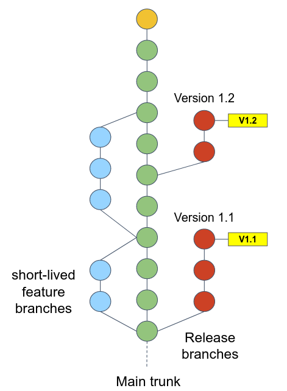
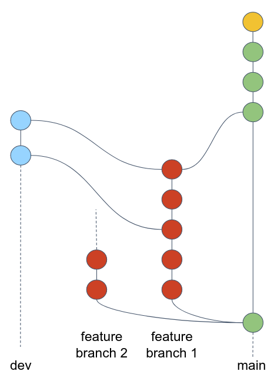

# Git Workflows 

Git workflows refer to the different approaches or strategies that teams can adopt when using Git in their software development projects.

## GitFlow

Gitflow is a git branching model that involves the use of feature branches and multiple primary branches. 

Let's review the [original publication](https://nvie.com/posts/a-successful-git-branching-model/) of GitFlow model by Vincent Driessen at nvie.

## Trunk-based

The Trunk Based Git Workflow is a development approach where all developers work on a single branch called the `trunk` or `main` branch.
It encourages small, frequent commits and emphasizes **continuous integration and delivery** (CD).
This workflow promotes collaboration and reduces integration issues but requires strong automated testing and a high level coding skills of team members.

Here is the workflow:

1. Developers commit their changes directly into `main`, then push their work to remote. Developers _may_ create a short-lived feature branch to test their work locally. The `main` branch is **always** assumed to be stable, without any issues, ready to be released in any moment. 
2. At some point, developers release a new version by branching out from `main` into to `release` branch. A few more changes might be committed before the release is ready.

## Our workflow

It's important to be flexible when choosing a Git workflow and not be overly rigid with specific methodologies like Gitflow or Trunk Based Development. 
As a DevOps engineer you will be entitled to design the workflow that suits the specific needs and dynamics of your team, project, and development processes.

Let's see another workflow that combined both Gitflow and trunk-based, we call it **env-based**. This is the workflow that will be used in course's projects.

Here is the workflow:

1. Developers branching our from an up-to-date `main` branch into their feature branch. 
2. They commit changes into their feature branch.
3. At some point, they want to test their changes in development environment. They merge the feature branch into `dev` branch, and push to remote.
4. After the changes have been tested in development environment and a few more fixes has been committed, the developer merge theur feature branch into `main` (not directly, but through a Pull Request).
5. The `main` branch can be deployed to production environment directly after the merge. 

