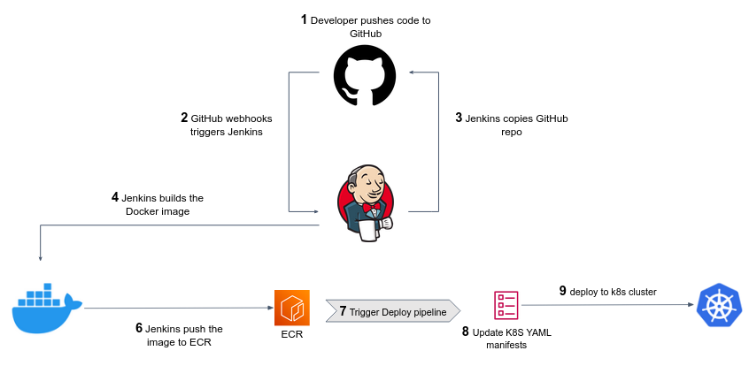

# The Build and Deploy pipelines

## Configure a pipeline

A **Jenkins pipeline** is a set of automated steps defined in a `Jenkinsfile` (usually as part of the code repository, a.k.a. **as Code**) that tells Jenkins what to do in each step of your CI/CD pipeline. 

The `Jenkinsfile`, written in Groovy, has a specific syntax and structure, and it is executed within the Jenkins server.
The pipeline typically consists of multiple **stages**, each of which performs a specific **steps**, such as building the code as a Docker image, running tests, or deploying the software to Kubernetes cluster.

1. In your repository, in branch `main`, create a `build.Jenkinsfile` in the root directory as the following template:

```text
pipeline {
    agent any

    stages {
        stage('Build') {
            steps {
                sh 'echo building...'
            }
        }
    }
}
```

2. Commit and push your changes.
3. From the main Jenkins dashboard page, choose **New Item**.
4. Enter `Yolo5Build` as the project name, and choose **Pipeline**.
5. Check **GitHub project** and enter the URL of your GitHub repo.
6. Under **Build Triggers** check **GitHub hook trigger for GITScm polling**.
7. Under **Pipeline** choose **Pipeline script from SCM**.
8. Choose **Git** as your SCM, and enter the repo URL.
9. If you don't have yet credentials to GitHub, choose **Add** and create **Jenkins** credentials.
   1. **Kind** must be **Username and password**
   2. Choose informative **Username** (as **github** or something similar)
   3. The **Password** should be a GitHub Personal Access Token with the following scope:
      ```text
      repo,read:user,user:email,write:repo_hook
      ```
      Click [here](https://github.com/settings/tokens/new?scopes=repo,read:user,user:email,write:repo_hook) to create a token with this scope.
   4. Enter `github` as the credentials **ID**.
   5. Click **Add**.
10. Under **Branches to build** enter `main` as we want this pipeline to be triggered upon changes in branch main.
11. Under **Script Path** write the path to your `build.Jenkinsfile` defining this pipeline.
12. **Save** the pipeline.
13. Test the integration by add a [`sh` step](https://www.jenkins.io/doc/pipeline/tour/running-multiple-steps/#linux-bsd-and-mac-os) to the `build.Jenkinsfile`, commit & push and see the triggered job.

## The Build phase

The Build stage specifies how should the code be built before it's ready to be deployed. In our case, we want to build a Docker image.  
Let's implement the Build stage in your Jenkinsfile, will build the "Yolo5" app. 

1. The complete source code can be found under `projects/app_development_I/yolo5`. If you haven't done it before your docker project, copy the app files into your project Git repo.
2. If you don't have yet, create a private registry in [ECR](https://console.aws.amazon.com/ecr/repositories) for the app.
3. In the registry page, use the **View push commands** to implement a build step in your `build.Jenkinsfile`. The step may be seen like:

```text
stage('Build Yolo5 app') {
   steps {
       sh '''
            aws ecr get-login-pass..... | docker login --username AWS ....
            docker build ...
            docker tag ...
            docker push ...
       '''
   }
}
```

You can use the timestamp, or the `BUILD_NUMBER` or `BUILD_TAG` [environment variables](https://www.jenkins.io/doc/book/pipeline/jenkinsfile/#using-environment-variables) to tag your Docker images, but don't tag the images as `latest`.

3. Give your EC2 instance an appropriate role to push an image to ECR.
4. Use the [`environment` directive](https://www.jenkins.io/doc/book/pipeline/syntax/#environment) to store global variable (as AWS region and ECR registry URL) and make your pipeline a bit more elegant. 


## The Deploy phase

We would like to trigger a Deployment pipeline after every successful running of the Build pipeline (`Yolo5Build`).

1. In the app repo, create another `Jenkinsfile` called `deploy.Jenkinsfile`. In this pipeline we will define the deployment steps for the Yolo5 app:
```shell
pipeline {
    agent any
    
    stages {
        stage('Deploy') {
            steps {
                sh '# kubectl apply -f ....'
            }
        }
    }
}
``` 

2. Create another Jenkins **Pipeline** named `Yolo5Deploy`, fill it similarly to the Build pipeline, but **don't trigger** this pipeline as a result of a GitHub hook event (why?).

We now want that every **successful** Build pipeline running will **automatically** trigger the Deploy pipeline. We can achieve this using the following two steps: 

1. Use the [Pipeline: Build](https://www.jenkins.io/doc/pipeline/steps/pipeline-build-step/) step that triggers the Deploy pipeline:
```text
stage('Trigger Deploy') {
    steps {
        build job: '<deploy-job-name>', wait: false, parameters: [
            string(name: 'YOLO5_IMAGE_URL', value: "<full-url-to-docker-image>")
        ]
    }
}
```

Where:
- `<deploy-job-name>` is the name of your Deploy pipeline (should be `Yolo5Deploy`).
- `<full-url-to-docker-image>` is a full URL to your built Docker image. You can use env vars like: `value: "${IMAGE_NAME}:${IMAGE_TAG}"` or something similar.

2. In the `deploy.Jenkinsfile` define a [string parameter](https://www.jenkins.io/doc/book/pipeline/syntax/#parameters) that will be passed to this pipeline from the Build pipeline:
```shell
pipeline {
    agent ..
    
    # add the below line in the same level an `agent` and `stages`:
    parameters { string(name: 'YOLO5_IMAGE_URL', defaultValue: '', description: '') }

    stages ...
}
```

## The build deploy phases - overview



# Exercises 

## :pencil2:  Clean the build artifacts from Jenkins server

As for now, we build the Docker images in the system of the Jenkins server itself, which is a very bad idea (why?).
Use the [`post` directive](https://www.jenkins.io/doc/book/pipeline/syntax/#post) and the [`docker image prune` command](https://docs.docker.com/config/pruning/#prune-images) to cleanup the built Docker images from the disk. 

## :pencil2: Security vulnerability scanning

The [Snyk](https://docs.snyk.io/products/snyk-container/snyk-cli-for-container-security) Container command line interface helps you to find and fix Docker image vulnerabilities.

You must first to [Sign up for Snyk account](https://docs.snyk.io/getting-started/create-a-snyk-account).
Make sure you've installed Snyk on your Jenkins server.

1. Get you API token from your [Account Settings](https://app.snyk.io/account) page.
2. Once you've set a `SNYK_TOKEN` environment variable with the API token as a value, you can easily [scan docker images](https://docs.snyk.io/products/snyk-container) for vulnerabilities:
```shell
export SNYK_TOKEN=mytoken

# will scan ubuntu docker image from DockerHub
snyk container test ubuntu 

# will alarm for `high` issue and above 
snyk container test ubuntu --severity-threshold=high

# will scan a local image my-image:latest. The --file=Dockerfile can add more context to the security scanning. 
snyk container test my-image:latest --file=Dockerfile
```

3. Create a **Secret text** Jenkins credentials containing the API token.
4. Implement Docker image scanning in your pipelines (where?). Use the [`withCredentials` step](https://www.jenkins.io/doc/pipeline/steps/credentials-binding/), read your Snyk API secret as `SNYK_TOKEN` env var, and perform the security testing using simple `sh` step and `synk` cli.

Sometimes, Snyk alerts you to a vulnerability that has no update or Snyk patch available, or that you do not believe to be currently exploitable in your application.

You can ignore a specific vulnerability in a project using the [`snyk ignore`](https://docs.snyk.io/snyk-cli/test-for-vulnerabilities/ignore-vulnerabilities-using-snyk-cli) command:

```text
snyk ignore --id=<ISSUE_ID>
```

**Bonus:** use [Snyk Jenkins plugin](https://docs.snyk.io/integrations/ci-cd-integrations/jenkins-integration-overview) or use the [Jenkins HTML publisher](https://plugins.jenkins.io/htmlpublisher/) plugin together with [snyk-to-html](https://github.com/snyk/snyk-to-html) project to generate a UI friendly Snyk reports in your pipeline page.

## Optional practice

## Fine tune the Deploy pipeline

Review some additional pipeline features, as part of the [`options` directive](https://www.jenkins.io/doc/book/pipeline/syntax/#options). Add the `options{}` clause with the relevant features for the Build and Deploy pipelines.
