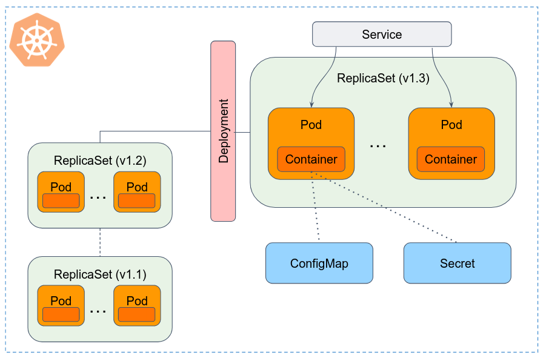

# Kubernetes core workloads and objects

A **workload** is an application running on Kubernetes.
Whether your workload is a single component or several that work together, on Kubernetes you run it inside a set of **pods**.
In Kubernetes, a Pod represents a set of running **containers** on your cluster.

## Deployments

The **Deployment** workload in manages the lifecycle of a set of **replicated Pods**, ensuring the desired number of replicas are running and handling updates and rollbacks of the application.
Within a Deployment, there is a controller object called **ReplicaSet** that acts as the underlying mechanism for managing the desired number of replicas and container version.
The ReplicaSet ensures that the specified number of Pods are running and handles scaling, rolling updates, and self-healing capabilities. 

Deployment is a good fit for managing a **stateless application** workload on your cluster, where any Pod in the Deployment is interchangeable and can be replaced if needed.

Follow:    
https://kubernetes.io/docs/tasks/run-application/run-stateless-application-deployment/

## Service

In Kubernetes, a **Service** is a method for exposing applications that is running as one or more Pods in your cluster.

### Define a service 

Applying this manifest creates a new Service named `mynginx`, which targets port 8080 on **any Pod** with the `app: nginx` label.

```yaml
apiVersion: v1
kind: Service
metadata:
  name: mynginx
spec:
  selector:
    app: nginx
  ports:
    - port: 8080
      targetPort: 80
```

The Service abstracts the Pods behind a single DNS name (simply `mynginx`) and an internal IP address. 

When performing an HTTP request to http://mynginx:8080 from within the cluster, the `mynginx` perform load balancing between the Pods that are part of the Service.
When the HTTP request is made, the Service's **load balancer** distributes the traffic across the available Pods based on the configured load balancing algorithm (usually round-robin by default).

Kubernetes also tries to distribute the Deployment's Pods across different nodes within the cluster to achieve **high availability**. 
The controller for that Service continuously scans for Pods that match its selector (a.k.a. **service discovery**),



## Use Port Forwarding to Access Applications in a Cluster

By default, applications running within the cluster are not accessible from outside the cluster.
There are various techniques available to enable external access, we will cover some of them later on.

Using port forwarding allows developers to establish a temporary tunnel for debugging purposes and access applications running inside the cluster from their local machines.

The `kubectl port-forward` command allows using resource name, such as a pod name, deployment name, or service name, to select a matching pod to port forward to.

```bash
# Change nginx-75f59d57f4-4nd6q to the name of the Pod
kubectl port-forward nginx-75f59d57f4-4nd6q 9000:8080
```
 
or 

```bash
kubectl port-forward deployment/nginx 9000:8080
```

or 

```bash
kubectl port-forward service/mynginx 9000:8080
```

# Exercises 

### :pencil2: Deploy the 2048 game

Create a **Deployment** of 2 replicas for the [2048 game dockerized image](https://hub.docker.com/r/alexwhen/docker-2048).
Expose the Deployment with a **Service** listening on port 5858. Visit the app locally using `port-forward`.


### :pencil2: Expose the nginx deployment using NodePort service type 

The default Service type in k8s is `ClusterIP`, which exposes the Service on an internal cluster IP.
This allows other resources within the cluster to access the Service using its cluster IP and the specified port, but it is not accessible from outside the cluster.

Service of type `NodePort` exposes the Service **on each Node's IP** at a static port (the NodePort), allowing external access to the Service by using the (public) node's IP address and the allocated node port.

Create a NodePort service and visit the nginx deployment from your local machine.

[//]: # (## :pencil2: Jobs and cronjobs )

[//]: # ()
[//]: # ()
[//]: # ()
[//]: # (## :pencil2: Node selector)

[//]: # ()

