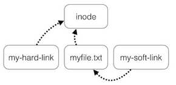

# Linux File Management

## The Linux File System

Let's review some basic commands that you can use to navigate and control the file system:

- `cd` - change directory.
- `mkdir [options] <Directory>` - create directory.
- `rmdir [options] <Directory>` - remove directory.
- `touch [options] <filename>` - create a file.
- `cp [options] <source> <destination>` - copy file to another location.
- `mv [options] <source> <destination>` - move file to another location.
- `rm [options] <file>` - remove file from the fs.
- `cat <filename>` - print the content of a given file.

**Note:** there is no undo! The Linux cli does not have an undo feature. Perform destructive actions carefully.


## Linux Text Editor

Use `nano` or `vim`.

**Note:** Although vim is a very powerful editor, throughout the course we will be using `nano`.

Complete the following tutorial: https://ryanstutorials.net/linuxtutorial/vi.php

## Hidden files

If the file or directory name begins with a `.` (full stop) then it is considered to be hidden.

```console
myuser@hostname:~$ cd ~
myuser@hostname:~$ ls -l
drwxrwxr-x   4 myuser myuser       4096 Jul 25  2022  aa
-rw-rw-r--   1 myuser myuser     191005 Feb  7  2022  aaa.pdf
-rw-rw-r--   1 myuser myuser   60085406 Oct 23 11:05  adobe.deb
...
myuser@hostname:~$ ls -la
drwxrwxr-x   4 myuser myuser       4096 Jul 25  2022  aa
-rw-rw-r--   1 myuser myuser     191005 Feb  7  2022  aaa.pdf
drwx------   3 myuser myuser       4096 Oct 23 11:21  .adobe
-rw-rw-r--   1 myuser myuser   60085406 Oct 23 11:05  adobe.deb
...
```

The above example uses the `ls` command with the `-a` flag to include hidden files in the list.
Note the directory `.adobe`, which is hidden. 
By default, `ls` doesn’t print hidden files.

**Tip!** You can combine multiple options on the same flag: `ls -l -a` is equivalent to `ls -la`.

## Wildcards

Wildcards are a set of elements that allow you to create a pattern defining a set of files or directories.

Here is the basic set of wildcards:

- `*` represents zero or more characters.
- `?` - represents a single character.
- `[]` - represents a range of characters.

```console
myuser@hostname:~$ cd /etc
myuser@hostname:/etc$ ls  
total 1664
drwxr-xr-x  3 root     root            4096 ינו  4 14:54 acpi
-rw-r--r--  1 root     root            3028 אוג  1  2017 adduser.conf
drwxr-xr-x  3 root     root            4096 ינו  4 13:29 alsa
drwxr-xr-x  2 root     root           36864 ינו  4 15:40 alternatives
...
myuser@hostname:/etc$ ls b*  
-rw-r--r-- 1 root root  2320 פבר  4  2021 bash.bashrc
-rw-r--r-- 1 root root    45 אוג 12  2015 bash_completion
-rw-r--r-- 1 root root   367 ינו 27  2016 bindresvport.blacklist
...
```

The above example prints all files starting with `b`.

## File Permissions

Permissions specify what a particular user may or may not do to a given file or directory.
On a Linux system, every file is owned by a **user**, a **group** and “**others**”.

```console
myuser@hostname:~$ ls -l
-rw-rw-r--  1   myuser  users 5 Jan 15 12:39 To_Do
-rwxr-xr-x  1   root    root 45948 Aug 9 15:01 /bin/ls*
```

In the above example, the first file is a regular file (first dash).
Users with username `myuser` or users belonging to the group `users` can read and write (change/move/delete) the file, but they can't execute it (second and third dash). All other users are only allowed to read this file, but they can't write or execute it (fourth and fifth dash).

The second example is an executable file, the difference: everybody can run this program, but you need to be `root` to change it.

On a Linux system there are only 2 people usually who may change the permissions of a file or directory. 
The owner of the file or directory and the root user. The root user is a superuser who is allowed to do anything and everything on the system.

Linux permissions dictate 3 things you may do with a file, read (`r`), write (`w`) and execute (`x`). They are referred to in Linux by a single letter each.

For every file we define 3 sets of people for whom we may specify permissions.

- user (`u`) - a single person who owns the file. (typically the person who created the file but ownership may be granted to someone else by certain users)
- group (`g`) - every file belongs to a single group.
- others (`o`) - everyone else who is not in the group or the owner.

Use the `chmod` command to change file’s permissions:

```console
myuser@hostname:~$ ls -l
-rw-rw-r--  1   myuser  users 5 Jan 15 12:39 hello
myuser@hostname:~$ chmod u+x hello
myuser@hostname:~$ ls -l
-rwxrw-r--  1   myuser  users 5 Jan 15 12:39 hello
```

The logic behind the command:

1. Who are we changing the permission for? `[ugoa]` - user (or owner), group, others, all
2. Are we granting or revoking the permission - indicated with either a plus (`+`) or minus (`-`)
3. Which permission are we setting? - read (`r`), write (`w`) or execute (`x`).

 
#### File permissions in octal form

In Unix-like operating systems, file permissions can be represented in octal form, which is `XXX`, when X is a number between 0 and 7.
To calculate the octal value of file permissions, look at every `3-tuple` (the one for the user, group and others) as a binary number. e.g.

- `rwx` - 111
- `r--` - 100
- `rw-` - 110

Now convert this number to 10-bases number:

- `rwx` - 111 = 7
- `r--` - 100 = 4
- `rw-` - 110 = 6

Now simply add up the values for each permission that is granted, and use that as the digit in the corresponding position. For example:

`rwxrw-rw-` would be represented as 766 in octal notation. 7 for `rwx` of the user, 6 for `rw-` of the group, 6 again of `rw-` for others.

#### Default permissions

- The standard file permission is determined by the mask for new file creation. The value of this mask can be displayed using the `umask` command. Before the mask is applied, a directory has permissions `777` or `rwxrwxrwx`, a plain file `666` or `rw-rw-rw-`. The umask value is subtracted from these default permissions after the function has created the new file or directory.
- A directory gets more permissions by default: it always has the execute permission. If it didn't have that, it would not be accessible. Try this out by chmodding a directory to 644!

## The root user and the `sudo` command

Sometimes, you need to execute a command as another user. For example:

```console
myuser@hostname:~$ ls -l
-rw-------  1   john  johnsfriends 5 Jan 23 12:39 phone
myuser@hostname:~$ cat phone
cat: phone: Permission denied
```

In the above example, your personal user is `myuser` (according to the name in the prompt), but the file `phone` is owned by the user `john`. Not only it is owned by `john`, according to the file’s permissions, only john (or users under the group `johnsfriends`) can read/write to the file.

The `sudo` command is short for “**switch user and do**”. In a single command, you can switch to a specific user, perform a command on behalf of that user, and “return” to your user. Here is an example:

```console
myuser@hostname:~$ sudo -u john cat phone
+91524869328
```

In the above example, we under the hood switched to the user `john`, executed `cat phone` on his behalf, then back to our user, `myuser`. In a single command, quite useful.

According to `sudo`’s help page, if you don’t specify a user (using the `-u` flag), the default user that you are switching to is `root`.

### The root user

The `root` user is the administrative user in a Linux-based operating system, including Ubuntu. The root user has complete control over the system and can perform any operation or command, including modifying system files and processes.

In Ubuntu, the `root` user is disabled by default for security reasons. Instead, administrative tasks are typically performed using the `sudo` command.  How does it work?

Every user that is a member of a special group called `sudo` (to be confused with the sudo command, there is also a group called sudo), can use the `sudo` command to execute commands on behalf of the root user, without actually login to this strong user. Your default linux user is a member of the group sudo.

It's important to exercise caution when using the root user account, as any command or operation executed with root privileges has the potential to cause significant damage to the system if performed incorrectly. It's recommended to use the root user account only when necessary and to carefully consider the potential consequences of each action before executing it.

> ### :pencil2: Exercise - Playing with permissions
> 1. Under `/etc/passwd` and `/etc/group` you’ll find a list of all your users and groups on your system, respectively. cat those files and review your users and group.
> 2. Make sure that your user is a member of the group sudo.
> 3. Use the `ls -l` command to list the files in your home dir along with their permissions.
> 4. Why are all your directories having an execute (x) permission? Use the chmod command to to revoke the x permission of some directory, what happened?
> 5. Use the `chmod` command to modify the permissions of a file.
> 6. Create a file, write some text into it. Use chmod to revoke all permissions of the file (rwx for all).
> 7. Use `sudo` to print the content of the file even though no one has permissions to do it.
> 8. Use the `chown` command to change the owner of a file or directory.


## Links

A link is nothing more than a way of matching two or more file names to the same set of file data.

**Hard link** associates two or more file names with the same inode. Hard links share the same data blocks on the hard disk, while they continue to behave as independent files.
**Soft link** or symbolic link (sometimes pronounced "symlink") is a small file that is a pointer to another file.



Use the **ln** command to create a hard/soft link:

```console
myuser@hostname:~$ touch myfile.txt
myuser@hostname:~$ ln myfile.txt my-hard-link
myuser@hostname:~$ ln -s myfile.txt my-soft-link
```

# Self check questions

[Enter the interactive self-check page](https://alonitac.github.io/DevOpsBootcampUPES/multichoice-questions/linux_file_management.html)

# Exercises

### Exercise - Wildcards

A good directory to play with is `/etc` which is a directory containing config files for the system. As a normal user you may view the files but you can't make any changes so we can't do any harm.

1. List files with only files that contain an extension.
2. List files with only a 3 letter extension.
3. List files whose name contains an uppercase letter.
4. List all python files (files with .py extension).
5. List files whose name is 4 characters long.


## Your neighbors home directory

By default, believe it or not, different linux users on the same OS can read each others’ home directory.

Modify the permissions on your home directory to make it completely private. Create a new Linux user called **foreign** and login into it.
Check that **foreign** can't access your directory.
Put the permissions back to how they were.

## Files archive

Archive the contents of your home directory (including any subdirectories) using `tar`.
Now extract the contents into a `backup` directory.

## Links

1. Create a file called test1.
1. Create a hard link called test2 to test1.
1. Are the two files sharing the same inode?
1. Change test1 content by echo "hi" >> test1
1. What does test2 look like?
1. What happens when you copy test2 to another directory? What happens when you move test2 to another directory?
1. Create a symlink for test1.
1. Remove test1, what happened to the symlink you've just created?


## Broken Symlink

Uber has an automated daily backup system. Every day another backup file is being created in the file system according to the following format:
`backup-YYYY-MM-DD.obj`. e.g. `backup-2023-03-01.obj`.

To be able to restore the system from a backup copy in a convenient way, they want to point to the last generated backup file using a static file named backup.obj.
To do so, they create a **symbolic link** pointing to the last generated backup file.

1. Let's create the daily backup file:

```bash
FILENAME=backup-$(date +"%Y-%m-%d").obj
touch $FILENAME
echo "backup data..." >> $FILENAME
```

2. Then, create a symlink (soft link) to the daily backup file:

```bash
ln -s $FILENAME backup.obj
```

At some point in the development lifecycle of the product, the DevOps team has decided to organize all backup links in a directory called `backups`. They moved the link `backup.obj` into `backups` directory:

```bash
mkdir backups
mv backup.obj backups/
```

What's wrong here? provide a fix to Uber's code.
