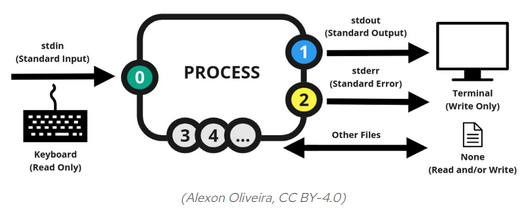

# Linux Input and Output (IO) Redirection


## The `>` and `>>` operators

Sometimes you will want to put the output of a command in a file, instead of printing it to the screen. You can do so with the `>` operator:

```console
myuser@hostname:~$ echo Hi
Hi
myuser@hostname:~$ echo Hi > myfile
myuser@hostname:~$ cat myfile
Hi
```

The `>` operator overwrites the file if it already contains some content. If you want to append to the end of the file, do:

```console
myuser@hostname:~$ echo Hi again >> myfile
myuser@hostname:~$ cat myfile
Hi
Hi again
myuser@hostname:~$ date >> myfile
myuser@hostname:~$ cat myfile
Hi
Hi again
IST 10:06:02 2020 Jan 01
```

## The `|` operator

Sometimes you may want to issue another command on the output of one command. You can do so with the `|` (pipe) operator:

```console
myuser@hostname:~$ cat myfile | grep again
Hi again
```

In the above command, the output of the `cat` command is the input to the `grep` command.
Both `>`, `>>`, and `|` are called IO redirection operators. There are [more operators](https://tldp.org/LDP/abs/html/io-redirection.html)... but the above 3 are the most common.

## Linux `grep` command and Regular Expressions

### Regex

Regular expressions (Regex) allow us to create and match a pattern in a given string. Regex are used to replace text in a string, validate string format, extract a substring from a string based on a pattern match, and much more!

Regex is out of this course’ scope, but you are highly encouraged to learn regex yourself. There are so many systems and configurations that you’ll be required for regex skills!

Learn Regex: https://regexone.com/


### `grep` - Global Regular Expression Print

A simple but powerful program, `grep` is used for filtering files content or input lines, and prints certain regex patterns.

Let's print the content of `/var/log/auth.log`. This file is a log file that records information about system authentication events. The below commands create some authentication event (by creating the `/test` directory and file in it), then printing the content of `auth.log`.

```console
myuser@hostname:~$ sudo mkdir /test
myuser@hostname:~$ sudo touch /test/aaa
myuser@hostname:~$ cd /var/log
myuser@hostname:/var/log$ cat auth.log
...
Mar  7 19:17:01 hostname CRON[2076]: pam_unix(cron:session): session closed for user root
Mar  7 19:33:10 hostname sudo:   myuser : TTY=pts/0 ; PWD=/var/log ; USER=root ; COMMAND=/usr/bin/mkdir /test
```

The above output shows information regarding the executed `sudo` command. `myuser` is the user who performed the `sudo` command, the working dir is `/var/log` and the command coming after sudo was `mkdir /test`.
Now let's demonstrate the power of the `grep` command.

Print all lines contain the word "sudo":

```console
myuser@hostname:/var/log$ grep sudo auth.log
Mar  7 19:17:01 hostname CRON[2076]: pam_unix(cron:session): session closed for user root
Mar  7 19:33:10 hostname sudo:   myuser : TTY=pts/0 ; PWD=/var/log ; USER=root ; COMMAND=/usr/bin/mkdir /test
...
```

But what if we want to print all "sudo" events while the command coming after sudo is `mkdir`? We can do it using regular expressions:

```console
myuser@hostname:/var/log$ grep -E "sudo: .*COMMAND=.*mkdir" auth.log
Mar  7 19:33:10 hostname sudo:   myuser : TTY=pts/0 ; PWD=/var/log ; USER=root ; COMMAND=/usr/bin/mkdir /test
```

The above example uses the `.*` match pattern to catch what we want. `.` means "any single character except a line break", `*` means "0 or more repetitions of the preceding symbol".

Another example - list all users that executed commands using `sudo`:

```console
# first (bad) try - the second output line is unwanted
myuser@hostname:/var/log$ grep -Eo "sudo:.*:" auth.log
sudo:   myuser :
sudo: pam_unix(sudo:session):
...

# second (success) try
myuser@hostname:/var/log$ grep -Eo "sudo:\s+\w+\s+:" auth.log
sudo:   myuser :
```

## IO Pipes under the hood

How does it work? IO redirection reveals a very interesting structure for Linux systems.



Most Linux commands read input, such as a filename, and write output to screen. By default, your keyboard is represented in linux by the standard input (**stdin**) device, and the screen or a particular terminal window is represented by the standard output (**stdout**) device. We already said that in linux everything is a file, and indeed, you can find the stdin and stdout files in the `/dev` directory.

```console
myuser@hostname:~$ ls -l /dev
...
lrwxrwxrwx 1 root root          15 Mar  7 16:45 stderr -> /proc/self/fd/2
lrwxrwxrwx 1 root root          15 Mar  7 16:45 stdin -> /proc/self/fd/0
lrwxrwxrwx 1 root root          15 Mar  7 16:45 stdout -> /proc/self/fd/1
...
```

Or even better:

```console
myuser@hostname:~$ ls -l /dev | grep "stdin\|stdout"
lrwxrwxrwx 1 root root          15 Mar  7 16:45 stdin -> /proc/self/fd/0
lrwxrwxrwx 1 root root          15 Mar  7 16:45 stdout -> /proc/self/fd/1
```

In the above `ls -l /dev` command, instead of printing the output to the screen (to stdout, as we used to see), the output is redirected **as an input** to the next command, to `grep`. Again, instead of writing the output of the left side of the pipe to the standard output, this output is redirected to the standard input of the command grep.
So `grep` is searching and filtering on the output of the `ls` command. 
In this example we are filtering lines containing the text `stdin` or `stdout`, we do it by the `stdin\|stdout` regular expressions.

# Self-check questions

[Enter the interactive self-check page](https://alonitac.github.io/DevOpsBootcampUPES/multichoice-questions/linux_io_redirection.html)

# Exercises

### :pencil2: IO redirection basics

1. Create a file called `fruits.txt` with the contents "apple banana cherry"
2. Use `>` to write the contents of `fruits.txt` to a new file called `output.txt`.
3. Use `>>` to append the contents of `fruits.txt` again to `output.txt`.
4. Use `|` to pipe the output of cat `output.txt` to grep banana. How many times does banana appear?
5. Use `grep` to search for APPLE (upper cases) in `output.txt`. Did the search succeed?
6. Use `grep` to display all lines in `output.txt` that don't contain banana.

### :pencil2: Grep on file

Create the file `~/bashusers.txt`, which contains lines from the `/etc/passwd` file which contain the text “/bin/bash”.

### :pencil2: Grep on file II

Create the file `~/rules.txt`, which contains every line from the `/etc/rsyslog.conf` file which contains the text “file”, using a case insensitive search.
(In other words, file, File, and files would all count as matches).


### :pencil2: grep with line number and pipe

Use the `grep` command and pipes only!

Create the file `~/mayhemnum.txt`, which contains only the line number of the word “mayhem” from the file `/usr/share/dict/words`.


## Optional practice


### Grep with regex

Find the number of words in `/usr/share/dict/words` that contain at least three “a”s. E.g. traumata, takeaways, salaam

### Regex

Create a file containing some lines that you think would match the regular expression: `(^[0-9]{1,5}[a-zA-Z ]+$)|none` and some lines that you think would not match.
Use `grep` to see if your intuition is correct.

### Regex II

Using `grep` command and regular expressions, list all files in your home directory that others can read or write to.

