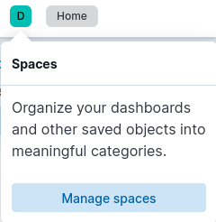
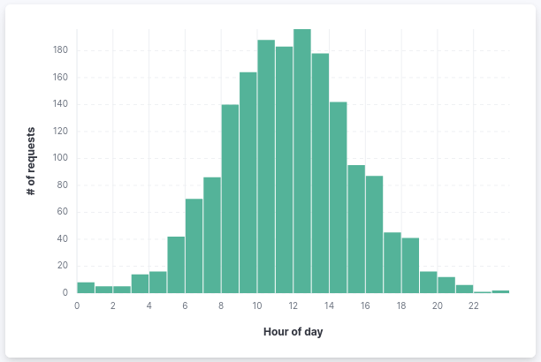
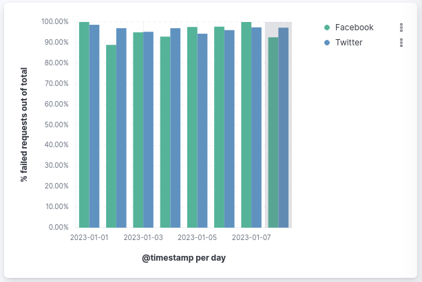

# Elasticsearch and Kibana

Let's get yourself familiar with the ELK stack:

https://www.elastic.co/what-is/elk-stack

## Working with Kibana

Visit Kibana by port-forwarding the service:

```shell
kubectl port-forward svc/<kibana-service> 5601:5601
```

Then go to `https://localhost:5601`.

Open the **Spaces** tooltip, and create your own namespace in which you will practice:



### Add the sample data

Sample data sets come with sample visualizations, dashboards, and more to help you explore before you ingest or add your own data.

1. Open the kibana server 
2. On the home page, click *Try sample data*.
2. Click *Other sample data sets*.
3. On the *Sample web logs* card, click *Add data*.

## Kibana Query Language (KQL)

Before we are experimenting with KQL, read the following [important concepts of Kibana](https://www.elastic.co/guide/en/kibana/current/kibana-concepts-analysts.html).

Then, read [the KQL short tutorial](https://www.elastic.co/guide/en/kibana/current/kuery-query.html) from Elastic's official docs.

### Try it yourself

Open the **Kibana Sample Data Logs** data view under Discover page, and search for the following information:

- Query all logs with response code 200 or 404 from the last 4 days.
- Query all successful requests from last day, referred from `twitter.com`
- All non-successful requests (both by client or server side) starting from 2023-06-20T00:00:00Z (which means UTC time).
- Search all documents where the `request` field contains the string `elasticsearch-6.3.2.deb` within the last 7 days.
- According to a bad system design, your platform has to block users from download large files (files larger than `9216` bytes \[9KB\]) during every day for 30 minutes. The product manager asks your insights regarding the hour in the day that you should apply this limitation. What hour will you advise?

### Filters

- Create a [Filter](https://www.elastic.co/guide/en/kibana/current/kibana-concepts-analysts.html#autocomplete-suggestions) that displays data when `hour_of_day` value is between the working hours (`9-17`).
- What is the maximum requested resource (highest `bytes` request) within the last 7 days, during working hours? Was it responded with `200` status code?

## Kibana Dashboards

### Try it yourself - create a new dashboard

- Open the main menu, then click **Dashboard**.

- Click **Create dashboard**.

- Set the time filter to **Last 7 days**.

- On the dashboard, click **Create visualization**.

### Panel I: Unique visitors

- Open the **Visualization type** dropdown, then select **Metric**.

- From the **Available fields** list, drag **clientip** to the workspace or layer pane.

In the layer pane, **Unique count of clientip** appears because the editor automatically applies the **Unique count** function to the **clientip** field (**Unique count** is the only numeric function that works with IP addresses).

- In the layer pane, click **Unique count of clientip**.

- In the **Name** field, enter `Unique visitors`.

- Click **Close**.

- Click **Save** to save the panel.

### Panel II: Outbound traffic over time

To visualize the **bytes** field over time:

- On the dashboard, click **Create visualization**.

- From the **Available fields** list, drag **bytes** to the workspace.

The visualization editor creates a bar chart with the **timestamp** and **Median of bytes** fields.

- To emphasize the change in **Median of bytes** over time, change the visualization type to **Line**.

- The default minimum time interval is 3 hour, but we would like to get a view over days. To increase the minimum time interval:

    - In the layer pane, click **timestamp**.

    - Change the **Minimum interval** to **1d**, then click **Close**.

- Click **Save and return**

### Panel III: Top requested pages

We will create a visualization that displays the most frequent values of **request.keyword** on your website, ranked by the unique visitors.

- On the dashboard, click **Create visualization**.

- From the **Available fields** list, drag **clientip** to the **Vertical axis** field in the layer pane.

The visualization editor automatically applies the **Unique count** function.

- Drag **request.keyword** to the workspace.

Note: The chart labels are unable to display because the **request.keyword** field contains long text fields

- Open the **Visualization type** dropdown, then select **Table**.

- In the layer pane, click **Top 5 values of request.keyword**.

- In the **Number of values** field, enter `10`.

- In the **Name** field, enter `Page URL`.

- Click **Close**.

- Click **Save and return**.

### Panel IV: Classify request size

Create a proportional visualization that helps you determine if your users transfer more bytes from requests under 10KB versus over 10Kb.

- On the dashboard, click **Create visualization**.

- From the **Available fields** list, drag **bytes** to the **Vertical axis** field in the layer pane.

- In the layer pane, click **Median of bytes**.

- Click the **Sum** quick function, then click **Close**.

- From the **Available fields** list, drag **bytes** to the **Breakdown by** field in the layer pane.

- In the **Breakdown** layer pane, click **bytes**.

- Click **Create custom ranges**, enter the following in the **Ranges** field, then press Return:

    - **Ranges** &mdash; `0` -> `10240`

    - **Label** &mdash; `Below 10KB`

- Click **Add range**, enter the following, then press Return:

    - **Ranges** &mdash; `10240` -> `+∞`

    - **Label** &mdash; `Above 10KB`

- From the **Value format** dropdown, select **Bytes (1024)**, then click **Close**.

To display the values as a percentage of the sum of all values, use the **Pie** chart.

- Open the **Visualization Type** dropdown, then select **Pie**.

- Click **Save and return**.


### Panel V: Distribution of requests along the day

Create the following visualization:




### Panel VII: Website traffic sources

- On the dashboard, click **Create visualization**.

- Open the **Visualization type** dropdown, then select **Treemap**.

- From the **Available fields** list, drag **Records** to the **Size by** field in the layer pane.

- In the layer pane, click **Add or drag-and-drop a field** for **Group by**.

Create a filter for each website traffic source:

- Click **Filters**.

- Click **All records**, enter the following in the query bar, then press Return:

    - **KQL** - `referer : *facebook.com*`

    - **Label** - `Facebook`

- Click **Add a filter**, enter the following in the query bar, then press Return:

    - **KQL** - `referer : *twitter.com*`

    - **Label** - `Twitter`

- Click **Add a filter**, enter the following in the query bar, then press Return:

    - **KQL** - `NOT referer : *twitter.com* OR NOT referer: *facebook.com*`

    - **Label** - `Other`

- Click **Close**.

- Click **Save and return**.

### Panel VI: SLA (Service-level agreement)

Assume Facebook and Twitter are your two major customers, and your company agreed to serve 99% of the incoming requests originating from Facebook or Twitter.

Create a visualization which calculates the SLA per client over a single day. The SLA is defined by the following formula:

```text
1 - [(# of failed requests)/(# of total requests)]
```

Failed requests are those with status code `>= 500`.



Tip - use thew following custom formula:

```text
1 - (count(kql='response.keyword >= 500') / count(kql='response.keyword: *'))
```

