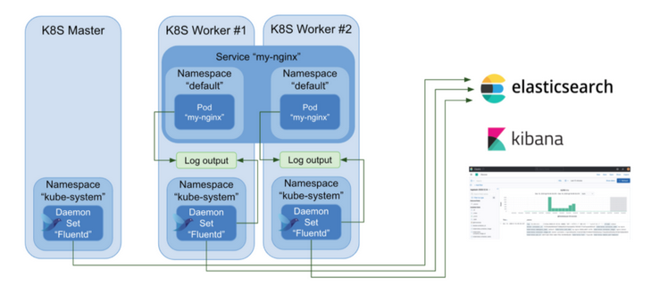

# Elasticsearch on K8S

## Install Elasticsearch on the cluster 

**Note:** this chart should be released once per k8s cluster (the same server will be shared by all students).

https://bitnami.com/stack/elasticsearch/helm

Deploy with the below minimum values:

```bash
helm install elastic bitnami/elasticsearch --set coordinating.replicaCount=0 --set ingest.enabled=false --set global.kibanaEnabled=true
```

**Bonus**: try to expose Kibana using an Ingress and our shared domain. 

## Stream Kubernetes pod logs to ElasticSearch using FluentD

### Fluentd introduced

[Fluentd](https://www.fluentd.org/) is an open source data collector for unified logging layer.
Fluent allows you to unify data collection and consumption for a better use and understanding of data.

Here is an illustration of how Fluent works in the k8s cluster:



Fluentd runs in the cluster as a [DaemonSet](https://kubernetes.io/docs/concepts/workloads/controllers/daemonset/). A DaemonSet ensures that all **nodes** run a copy of a **pod**. That way, Fluentd can collect log information from every containerized applications easily in each k8s node.

We will deploy the Fluentd chart to collect containers logs to send them to [Elasticsearch](https://www.elastic.co/what-is/elasticsearch) database.

1. Visit the Fluentd Helm chart at https://github.com/fluent/helm-charts/tree/main/charts/fluentd
2. Create a YAML file called `fluentd-values.yaml`. You should override the [following](https://github.com/fluent/helm-charts/blob/main/charts/fluentd/values.yaml#L379) default Helm values, by:
```yaml
fileConfigs:
  04_outputs.conf: |-
    <label @OUTPUT>
      <match **>
        @type elasticsearch
        host "elastic-elasticsearch"
        port 9200
        logstash_format true
      </match>
    </label>
```

3. Install the chart (**should be done once per cluster**).
4. Watch and inspect the running containers under **Workloads** -> **DaemonSet**.


### Visualize logs with Grafana

Visit grafana service (either by port forward or ingress), integrate the Elasticsearch data source, display cluster logs.

