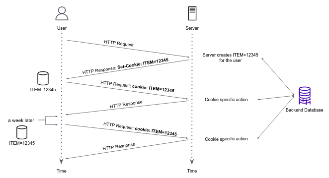

# HTTP Protocol

## Overview

The Hypertext Transfer Protocol (HTTP) is an application-level protocol that is being widely used over the Web. HTTP is a **request/response** protocol, which means, the client sends a request to the server in the form of a request method, URI, protocol version, followed by headers, and possible body content. The server responds with a status code line, a success or error code, followed by server headers information, and possible entity-body content.


Under the hood, HTTP requests and responses are sent over a TCP socket with default port 80 (on the server side). The HTTP client first initiates a TCP connection with the server, once the connection is established, the client and the server access TCP through their respective socket interfaces.

Here we see one of the great advantages of the layered architecture of the OSI model — HTTP doesn't need to worry about data loss and integrity. This is the job of TCP and other protocols in lower layers.

HTTP is said to be a **stateless protocol**. The server sends the requested content to clients without storing any information about the client. If a particular client sends the same request twice in a period of a few seconds, the server does not respond by saying that it just served the same request to the client. Instead, the server re-sends the data, as it has completely forgotten what it did earlier.

Nevertheless, although HTTP itself is stateless by design, most modern servers have a complex backend logic that stores information about logged-in clients, and by this means, we can say that those servers are **stateful**.

## HTTP Request and Response

We can learn a lot by taking a closer look on a raw HTTP request and response that sent over the network:

```text
curl -v http://httpbin.org/html
```

Below is the actual raw HTTP request sent by `curl` to the server:

```text
GET /html HTTP/1.1
Host: httpbin.org
User-Agent: curl/7.58.0
Accept: */*
```

The server response is:

```text
HTTP/1.1 200 OK
Date: Wed, 05 Apr 2023 12:43:42 GMT
Content-Type: text/html; charset=utf-8
Content-Length: 3741
Connection: keep-alive
Server: gunicorn/19.9.0
Access-Control-Allow-Origin: *
Access-Control-Allow-Credentials: true

<!DOCTYPE html>
<html>
  <head>
....
```

The MDN web docs [specify the core components of request and response objects](https://developer.mozilla.org/en-US/docs/Web/HTTP/Overview#http_flow), review this resource.

### Status code

HTTP response status codes indicate how a specific HTTP request was completed.

Responses are grouped in five classes:

- Informational (100–199)
- Successful (200–299)
- Redirection (300–399)
- Client error (400–499)
- Server error (500–599)

Try yourself to perform the below two HTTP requests, and [read](https://developer.mozilla.org/en-US/docs/Web/HTTP/Status) about the meaning of each status code.

```bash
curl -i httpbin.org/status/0
curl -v -X PUT httpbin.org/path/to/nowhere
```

### Flask webserver

So far we've seen how to communicate with a server as **clients**.

The below exercise demonstrates how a **server** might look and operate.

We'll run a simple Flask Python server, and communicate with the server locally from the same machine. The client will be the old good `curl`.

The Python server is based on a Python package called [Flask](https://flask.palletsprojects.com/en/2.2.x/quickstart/#). Let's install this package.

1. Click the **Terminal** button in the bottom bar to open a new terminal session in PyCharm.
2. Make sure that your terminal is using the Python interpreter resides in your `venv`:

```text
(venv) myuser@hostname:~/path/to/project$ which python
/home/myuser/path/to/project/venv/bin/python
^^^^^^^^^^^^^^^^^^^^--------------- path to venv dir in your project files
```

3. Install the flask package by: `pip install flask`.

In our shared repo, review the code in `simple_flask_webserver/app.py`. Above every function, you can find the server endpoint (e.g. `/upload`) and the `curl` command to request this endpoint.

4. In your terminal,` cd simple_flask_webserver`, and run the server by: `python app.py`

5. The default endpoint `/` can be accessed using your browser. Use `curl` to trigger the other endpoints as specified in `app.py`.


Take a closer look at the output you've got from the `/api/upload` endpoint, this is the so-called **JSON** format.

JavaScript Object Notation (JSON) is a standard text-based format for representing structured data based on JavaScript object syntax. It is commonly used for transmitting data in web applications. JSON can be used independently from JavaScript, and many programming environments feature the ability to read and generate JSON.

## What is API

An API (Application Programming Interface) can be thought of as a collection of all server endpoints that together define the functionality that is exposed to the client. Each endpoint typically accepts input parameters in a specific format and returns output data in a standard format such as JSON or XML.

For example, a web API for a social media platform might include endpoints for retrieving a user's profile information, posting a new status update, or searching for other users. Each endpoint would have a unique URL and a specific set of input parameters and output data.

Many platforms that we will be learning during the course, expose a rich API as well as GUI.

## Cookies

We mentioned that an HTTP server is stateless.
This simplifies server design and has permitted engineers to develop high-performance Web servers that can handle thousands of simultaneous TCP connections. However, it is often desirable for a website to remember stateful information of users. For this purpose, HTTP uses **cookies**.

An HTTP cookie is a small piece of data that a server sends to a user's web browser. The browser may store the cookie and send it back to the same server with later requests. Most major commercial websites use cookies today.



As shown in the figure above, a cookie has four components:

1. `Set-Cookie` header line in the HTTP **response** message, usually in the form of `key=value`.
2. `Cookie` header line in the HTTP **request** message.
3. A cookie file kept on the user’s end system and managed by the user’s browser.
4. A back-end database at the website.

Suppose Berta contacts Amazon.com for the first time. When the request comes into the Amazon server, the server creates a unique id and creates an entry in its back-end database that is indexed by the id. Amazon  server then responds to Berta’s browser, including in the HTTP response a `Set-cookie` header, which contains the id value. For example, the header line might be:

```text
Set-cookie: ITEM=12345
```

When Berta’s browser receives the HTTP response message, it sees the `Set-cookie` header, and appends a line to the special cookie file that it manages locally.

As Berta continues to browse the Amazon site, each time she requests a web page, her browser consults her cookie file, extracts her id value for this site, and puts a cookie header line that includes the id value in the HTTP request. Specifically, each of her HTTP requests to the Amazon server includes the header line:

```text
Cookie: ITEM=12345
```

In this manner, Amazon server is able to track Berta’s activity, it knows exactly which pages she visited, in which order, and at what times!

### The Dark Side of Cookies

Although cookies often simplify and improve user experience, they are controversial because they can also be considered as an invasion of privacy.
As we just saw, using a combination of cookies and user-supplied account information, a website can learn a lot about a user and potentially sell this information to a third party. The [GDPR](https://gdpr.eu/cookies/) website includes extensive information on cookies compliance requirements.

## Introducing Postman

Postman is a powerful and user-friendly tool for testing, debugging, and documenting APIs.    
https://learning.postman.com/docs/getting-started/overview/


# Self-check questions

TBD

# Exercises

## Exercise 1 - Accept header

Use curl to perform an HTTP GET request to `http://httpbin.org/image`. Add an Accept header to your requests to indicate to the server that you anticipate a png  image. Read carefully the Warning message written by curl at the end of the server response, follow the instructions to save the image on the file system. Execute another curl to save the image in the file system. Which animal appears in the served image?


## Exercise 2 - Status code

1. Perform an HTTP GET request to google.com
2. What does the server response status code mean? Follow the response headers and body to get the real Google's home page.
3. Which HTTP version does the server use in the above response?

## Exercise 3 - Connection close

The server of `http://httpbin.org` uses `keep-alive` connection by default, indicating that the server would like to keep the TCP connection open, so further requests to the server will use the same underlying TCP socket.

Perform an HTTP POST request to the `/anything` endpoint and tell the server that the client (you) would like to close the connection immediately after the server has responded.

Make sure the server's response contains the `Connection: close` header which means that the TCP connection used to serve the request was closed.

## Exercise - Sending data to the server


Perform an HTTP POST request to http://httpbin.org/anything. You should send the following json to the server

```json
{"test": "me"}
```

Upon success request, the response body will be a json format with a "json" key and your data as a value, as follows:

```json
"json": {
"test": "me"
}
```

Bad requests would be responded by:

```text
"json": null
```

## Exercise 4 - set cookie

Using `curl`, perform an HTTP GET request to `http://httpbin.org/cookies/set`, while adding the following query parameters to the URL:

- `color-theme=light`
- `visitor-id=59201456801`
- `lang=en`

Query parameters is the set of key-value pairs that go after the ? in a URL, separated by & characters.

e.g.:

```text
http://127.0.0.1:8000/some/endpoint?k1=value1&k2=value2
```

The `/cookies/set` is a designated endpoint that will add `Set-Cookie` headers according to the specified URL query parameters. Use the `--cookie-jar my-cookies.txt` option in order to save the cookies in the file `my-cookies.txt`.

## Exercise 5 - Send a cookie

By default, your browser will send cookies to the corresponding servers. We will use `curl` with the option `--cookie my-cookies.txt` to send cookies to the server. Perform an HTTP GET request to `http://httpbin.org/cookies`. Use the `-v` option to see how the `Cookie` header was set in the request. Upon success, the server response body-entity should be:
```json
{
"cookies": {
"color-theme": "light",
"lang": "en",
"visitor-id": "59201456801"
}
}
```

**Note:** It is uncommon for a server to attach the user cookies in the response body. Keep in mind that `httpbin.org` is a toy server that helps you learn the HTTP protocol. The /cookies endpoint was designed specifically to respond with your cookies for debugging purposes.

## Exercise 6 - Experimenting with APIs

Use Postman to retrieve data from some interesting free API:   
https://github.com/public-apis/public-apis

